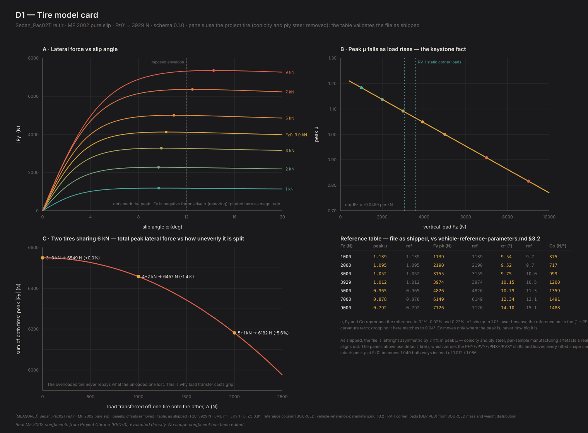
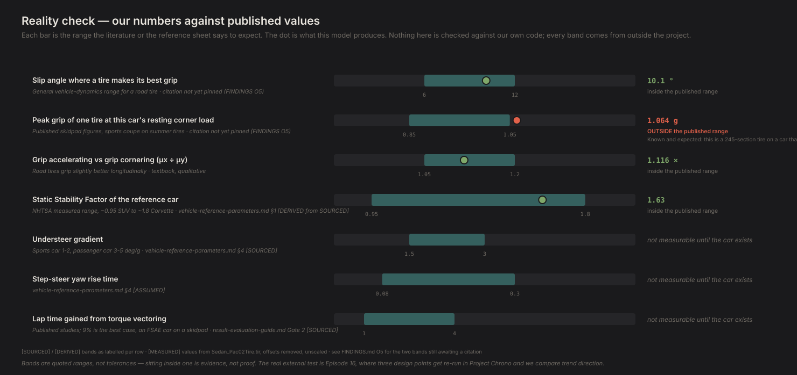

# D1 — Tire model card

*Generated by `python -m diagnostics.D1_tire_card`. Do not edit — re-run it.*

**What this checks.** Checks the rubber before any car exists. A tire model answers one question: given how hard the tire is squashed into the road, and how far the wheel is pointed away from where it is actually travelling, how much sideways force does it make? Everything downstream is built on the answer.

**PASSED** · 60/60 checks · 7 technical notes

---

## What this found

- Grip gets WORSE the harder you press. At 1 kN of load this tire pulls 1.18 g sideways; at 9 kN only 0.82 g. Press nine times harder and you get about six times the grip, not nine. Most of what this series is about traces back to that one fact.
- Two tires sharing 6 kN make the most total grip when they share it evenly. Splitting it 4+2 costs 1.4% of the pair's grip; 5+1 costs 5.6%. The overloaded tire never repays what the unloaded one gave up. That is why weight transfer is expensive, and it is the Episode 2 result.
- A tire makes its best grip while already sliding a little — 10.3 degrees off its direction of travel at typical load. Below that it has grip in reserve; past it, grip falls away again. The Episode 1 result.
- The file's tire pulled to one side, and we removed it. As shipped it made 7.4% more grip cornering one way than the other (1.012 vs 1.086) — a manufacturing artefact a real car aligns out. It is now 1.049 both ways, with every fitted curve parameter untouched.
- The code reproduces an independently computed reference for this tire file to 0.1% on grip, 0.02% on force and 0.22% on steering response, across seven loads. One column — where along the curve the peak sits — differs by up to 1 degree, because the reference left out a formula term that moves the peak sideways without changing its height. Turning that term off here matches the reference to 0.04 degrees, so nothing is unexplained.
- On our reference car this tire is good for about 1.06 g of cornering at its resting front-corner load — plausible for a GR86 on good summer tires, and mildly optimistic because it is a wider tire than the real car wears.
- Caution for later: at 7 kN and 9 kN of load, the tire's best grip happens at a slip angle beyond the limit we are willing to trust the model to, so peak grip at those loads is not reachable inside honest territory. Our car's most loaded corner sits below that — but a stiff setup could push past it.

## Figures

### technical card

Panel A the force curve family, B peak grip against load, C the load-split experiment, plus the reference table validating the implementation against the file as shipped.

`D1_tire_card.svg`

### Ep 1 · slip angle

Five copies of the same tire at the same load, differing only in how far they are pointed away from where they are going. Arrow length is grip, to one scale. The strip along the bottom is the same five points as the conventional curve.

`D1_slip_angle.svg`

### Ep 2 · load split

Two tires sharing 6 kN, split three ways. The band across each tire is its contact patch. Even sharing wins; the overloaded tire never repays what the unloaded one gave up.

`D1_load_split.svg`

### reality check

Every quantity we can measure today against a range from outside the project, with the source of each band named. Grey rows are not measurable until the vehicle model exists.

`D1_reality_check.svg`

## What was checked

| Question | Checks | |
|---|---|---|
| Does the code reproduce the reference table? | 35/35 | ok |
| Did removing the tire's built-in pull work? | 8/8 | ok |
| Does grip fall as the tire is pressed harder? | 3/3 | ok |
| Does the force curve have the right shape? | 3/3 | ok |
| Is the tire the same turning left and right? | 4/4 | ok |
| Does accelerating and braking behave? | 4/4 | ok |
| Is everything inside the range we trust? | 2/2 | ok |
| Episode 2's experiment | 1/1 | ok |

## Technical notes

*Recorded, never pass/fail. These are where the model is correct but a reference is not, or where a number is worth watching.*

### slip_at_peak_discrepancy_explained

Standard MF 2002 puts the lateral peak up to 1.00 deg below the reference table; dropping the (1 - PEY3*sgn(alpha_y)) curvature term reproduces it to 0.05 deg. The reference table was therefore generated without that term. Peak force, peak mu and cornering stiffness are unaffected by Ey, which is why only this one column disagrees. This file's PEY3=-9.99 / PEY4=-760 are degenerate camber-curvature coefficients; we keep the standard form for Chrono parity (Ep 16).

### slip_at_peak_dips_between_low_loads

Slip at peak dips 0.013 deg between 1000 and 2000 N before climbing. Real feature of the fit's Ey(dfz) term; it disappears with the simplified Ey. Not resolvable on a rig.

### slip_at_peak_band_differs_from_parameter_sheet

docs/vehicle-reference-parameters.md §5 states the D1 assertion as 'slip at peak 5-10 deg', which contradicts its own §3.2 table (13.1 deg at 7 kN, 15.1 deg at 9 kN). The table is right and the assertion text is not; D1 asserts 5-16 deg. Within RV-1's actual corner loads (~3601-6000 N) the peak sits at 10-11.5 deg.

### residual_asymmetry_is_the_Ey_term_and_is_kept_deliberately

What remains is the Ey curvature term's (1 - PEY3*sgn alpha_y) factor: the branches peak at 10.31 and 11.10 deg with the same peak force. Removing it would mean zeroing PEY3/PEY4 — an edit to the P* coefficients, which discards the fit's internal consistency (vehicle-reference-parameters.md §3.3). It is third-order in slip angle, so it vanishes at the +/-0.5 g slip angles where understeer gradient is fitted. It does grow with load — 0.27 deg at 1 kN, 0.79 deg at 3.929 kN, 2.38 deg at 9 kN — but by 9 kN both peaks are outside the imposed +/-12 deg envelope, so nothing we are willing to trust sees the wide end of it. D2's mirror test should assert peak force exactly and trajectories to a stated tolerance, not bit-equality.

### why_the_offsets_were_removed

As shipped this file is left/right asymmetric by 7.4% in peak mu (1.012 vs 1.086 at Fz0'), and declares TYRESIDE = 'LEFT'. That is conicity and ply steer — per-sample manufacturing artefacts that a real car aligns out. The split is wider than the whole 0.95-1.10 g plausibility band for max lateral g, so it would have corrupted Ep 3 and every left/right comparison from Ep 5 on. physics.tire.default_tire() therefore zeroes PHY*/PVY*/PHX*/PVX*; every fitted shape coefficient is untouched. physics.tire.as_shipped_tire() still returns the file verbatim, and section 1 above validates the implementation against it.

### lateral_peak_outside_imposed_slip_envelope_at_high_load

At 7000 N, 9000 N the lateral peak sits beyond our imposed +/-12 deg slip bound, so peak lateral force at those loads is not reachable inside the region we are willing to trust. RV-1's loaded outside front corner reaches ~6 kN, where the peak is still inside.

### grip_at_RV1_static_corner_load

At RV-1's static front corner load (3601 N) this tire peaks at mu = 1.064 at 10.1 deg. Consistent with the 0.95-1.10 g band in result-evaluation-guide Gate 2, and mildly optimistic: it is a 245-section tire on a car that wears 215s.

## Key numbers

| | |
|---|---|
| `schema_version` | 0.1.0 |
| `dmu_dkN` | -0.04590301641848028 |
| `dmu_dkN_as_shipped` | -0.043345042637138814 |
| `imposed_alpha_max_deg` | 12.000000000000002 |
| `imposed_kappa_max` | 0.2 |

Full data, including every individual assertion, in `D1_report.json`.
