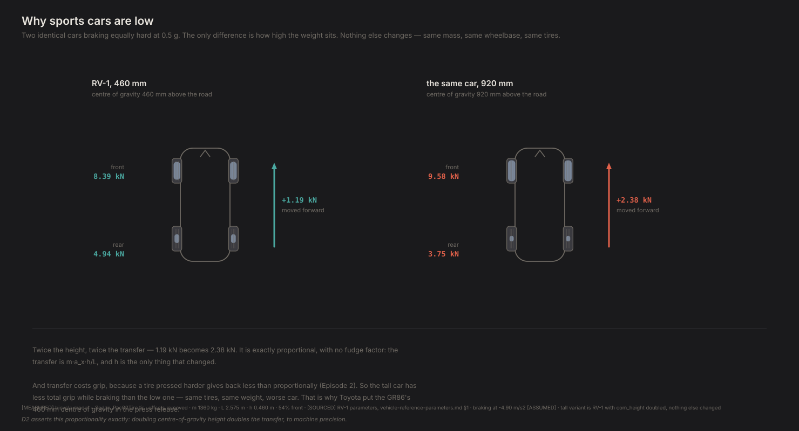
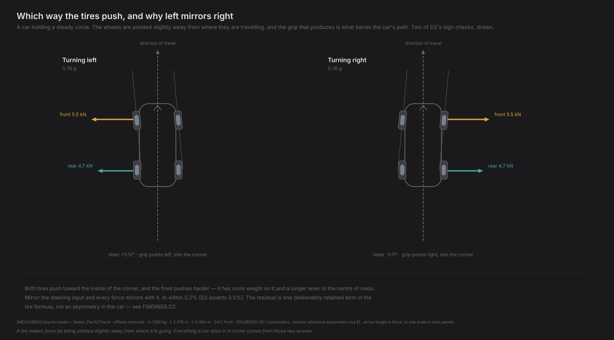
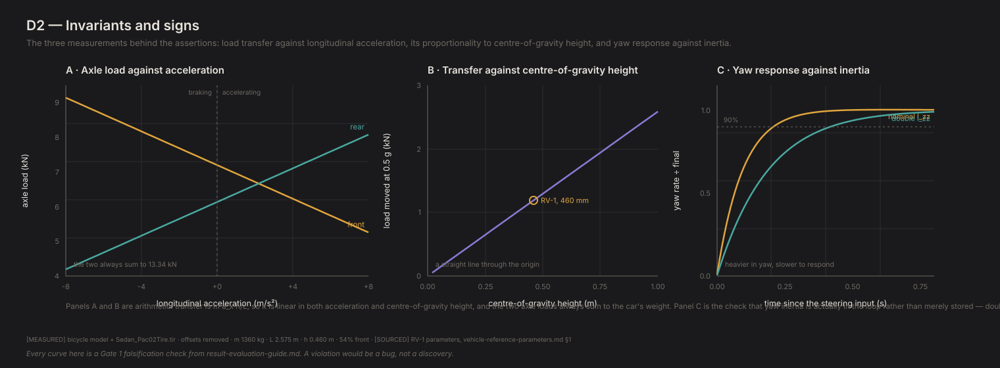

# D2 — Invariants and signs

*Generated by `python -m diagnostics.D2_invariants`. Do not edit — re-run it.*

**What this checks.** The textbook facts, as assertions. Weight moves forward under braking, tires push back against the way they are sliding, left mirrors right, and two independently written pieces of code agree about the same corner. A violation here is a bug, and nothing downstream means anything until it is fixed.

**PASSED** · 38/38 checks · 4 technical notes

---

## What this found

- Braking moves 1,215 N onto the front axle at 5 m/s² — about 17% more weight on the front tires than at rest. Double the centre-of-gravity height and you double the transfer, which is the whole reason low cars handle better.
- The steady-state solver and the step-by-step simulator are separate implementations of the same physics, and they agree to machine precision about the same corner — the equilibrium one solves for is exactly a state in which the other's accelerations vanish.
- Cornering slows a car down even with no brakes and no air resistance. At 0.76 g a coasting car loses 0.036 g, because the front tire's grip points along the wheel and the wheel is turned. A real skidpad test holds speed instead — 539 N of throttle here — and that choice changes the measured balance materially. See FINDINGS F17.
- With the manufacturing offsets removed, a car with the steering straight stays perfectly straight: zero yaw rate, zero sideways drift, to machine precision. The tire file as shipped would have pulled to one side (FINDINGS F6).
- Doubling yaw inertia slows the response from 197 ms to 397 ms — the car resists changing direction. That is the difference between a mid-engine car and a front-engine one, and it is Episode 8's subject.

## Figures

### load transfer

The same car braking, cruising and accelerating. The band across each tire is its contact patch — bigger band, more weight. The total never changes; only the split does.

`D2_load_transfer.svg`

### centre of gravity

The same car braking equally hard with its weight at two different heights. Twice the height, twice the load moved — exactly, with no fitting parameter.

`D2_cog_height.svg`

### corner forces

A steady corner taken each way, with the grip each axle produces drawn to scale. Both push into the corner; the front pushes harder. Mirroring the input mirrors every force.

`D2_corner_forces.svg`

### technical card

Axle load against longitudinal acceleration, load transfer against centre-of-gravity height, and the yaw-rate step response at two values of yaw inertia.

`D2_invariants_card.svg`

## What was checked

| Question | Checks | |
|---|---|---|
| Does weight move the right way? | 6/6 | ok |
| Do the forces point the right way? | 4/4 | ok |
| Does it go straight when you let go? | 3/3 | ok |
| Is left the mirror of right? | 2/2 | ok |
| Is the integrator converged? | 1/1 | ok |
| Do the solver and the simulator agree? | 3/3 | ok |
| Does the envelope logger actually work? | 3/3 | ok |
| Does the car go where it says it goes? | 4/4 | ok |
| Is yaw inertia wired in? | 2/2 | ok |
| Does moving weight forward add understeer? | 1/1 | ok |
| Does asymmetric drive rotate the car? | 4/4 | ok |
| Does a locking differential push the car wide? | 5/5 | ok |

## Technical notes

*Recorded, never pass/fail. These are where the model is correct but a reference is not, or where a number is worth watching.*

### mirror_error_grows_sharply_outside_the_envelope

The same test driven to 1.05 g and 7 deg of slip — well past the imposed 12 deg bound — mismatches by 0.9%, against 0.1293% inside it. Verified to be entirely the Ey term: with ey_camber_asymmetry=False the same test mismatches by 0.0000%. This is a concrete example of why the envelope discipline exists — the model's left/right symmetry is a property of the region you drive it in.

### the_skidpad_protocol_changes_the_answer

A steered front tire's grip points partly backwards, so a coasting car in this corner decelerates at -0.036 g with no brakes and no drag. Holding speed instead — which is what a real SAE J266 test does, and what trim_skidpad now defaults to — needs 539 N of drive and produces no longitudinal load transfer at all. That is not a rounding difference: coasting shifts load forward, unloads the rear, and tips the car into terminal oversteer at 86% of its grip, while holding speed keeps it understeering to 99%. See FINDINGS F17. The drive force is 7.3% of the lateral force here, so ignoring its grip cost (combined slip, open item O2) is a small omission — but it is an omission, and it grows near the limit.

### differential_parameters_are_ASSUMED

The LSD's torque bias ratio (1.5) and locking fraction (0.5) are [ASSUMED]; a real clutch pack's locking varies with torque and with coast versus drive, which this does not model. Rung 2 (rule 15): the mechanism and the ordering, not any particular hardware.

### track_width_is_only_LIKELY

Track width is [LIKELY], not measured. At +/-3% the moment moves 67 N.m either way; every torque-vectoring magnitude claim must be re-run at both bounds with the CONCLUSION intact.

## Key numbers

| | |
|---|---|
| `schema_version` | 0.1.0 |

Full data, including every individual assertion, in `D2_report.json`.
