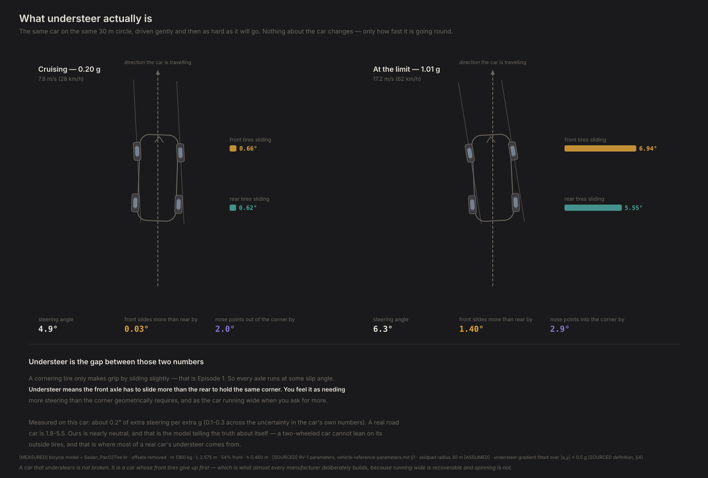

# D3 — Steady-state handling

*Generated by `python -m diagnostics.D3_steady_state`. Do not edit — re-run it.*

**What this checks.** Drives the car round a 30 m circle at every speed it can hold, and measures how much extra steering each additional g of cornering costs. That number — the understeer gradient — is how the industry describes a car's balance, and it is the first thing this project can compare against a real vehicle.

**PASSED** · 21/21 checks · 4 technical notes

---

## What this found

- How much to trust these numbers: across the input uncertainty the reference sheet itself documents, K spans 0.14-0.27 deg/g. So it is a one-decimal number, not a three-decimal one — and almost all of that spread comes from weight distribution being known only as a range, not from anything the model is doing.
- The car understeers, but barely: K is about 0.2 deg/g (0.1-0.3 across the documented input uncertainty). A real sports car is 1.8-5.5, and below 1 deg/g is essentially never seen in production. **This is the model being honest, not wrong.** A bicycle model has no width, so it cannot lose grip by leaning on its outside tires — and that, plus suspension effects we do not model, is where most of a real car's understeer comes from.
- Why it comes out near zero, in one line: the front axle carries 7,202 N and needs 3.16 deg of slip per g; the rear carries 6,135 N and needs 3.01 deg. Understeer is the difference between those two, and with identical tires front and rear they nearly cancel.
- It grips about 1.03 g and reaches that limit at 7° of front slip — inside the range we trust the tire model in, so the limit is a real grip limit rather than an artefact of extrapolating the curve.
- What is missing, sized: at the 1.03 g limit a real car moves about 2,271 N from its inside front tire to its outside one — roughly 19x more than the front-to-rear transfer this model does have. That would cost the front axle an estimated 6% of its grip and the rear 5%. The two differ, so the balance shifts — and that difference is most of the understeer we are not producing.
- Moving weight forward reliably adds understeer, from -0.3 deg/g at 42% front to +0.5 at 62% — a swing several times larger than the uncertainty in any single point. The car is neutral at about 50% front — near 50:50, which is what you get when the tires are identical at both ends. Real cars are not neutral at 50:50, and the reason is everything this model leaves out.
- The test protocol matters more than expected: holding speed the way a real skidpad test does gives K = 0.19 deg/g with a 14x upturn near the limit; letting the car coast gives 0.16 and terminal oversteer instead. Same car — only the throttle differs.
- Steering effort rises smoothly and then sharply approaching the limit, and the body's sideslip flips from pointing out of the corner at low speed to into it near the limit (crossing zero at 0.72 g). Both are textbook behaviours we did not build in — they fell out.

## Figures

### Ep 3 · what understeer is

The same car on the same circle, cruising and at the limit. Understeer is the front axle having to slide at a bigger angle than the rear to hold the same corner.

`D3_understeer_explained.svg`

### technical card

The understeer curve with the fitted gradient, front and rear slip angles against cornering force, and the gradient against weight distribution with the road-car band marked.

`D3_steady_state_card.svg`

## What was checked

| Question | Checks | |
|---|---|---|
| Does the car understeer, and by how much? | 4/4 | ok |
| Is the low value explained? | 1/1 | ok |
| Does it match closed-form theory? | 2/2 | ok |
| Does the curve have the right shape? | 6/6 | ok |
| Is the grip level plausible? | 2/2 | ok |
| How big is the missing piece? | 2/2 | ok |
| Does the design knob move it the right way? | 2/2 | ok |
| How precise is this number entitled to be? | 2/2 | ok |

## Technical notes

*Recorded, never pass/fail. These are where the model is correct but a reference is not, or where a number is worth watching.*

### accepted_exception_K_is_below_the_road_car_band

D3's nominal gate is K in (1.8, 5.5) deg/g (vehicle-reference-parameters.md §5). We measure 0.187 and accept it, with the reason recorded rather than the tolerance widened. The bicycle model has NO track width, therefore no lateral load transfer, therefore none of the grip loss that gives a real car most of its understeer; it also has no compliance steer, no aligning torque, no roll camber and no roll steer. The Bundorf decomposition in §4 attributes roughly 3 of a real car's 4.1 deg/g to exactly those terms. What remains — front and rear cornering compliance from tire stiffness alone — is 3.16 and 3.01 deg/g, and the difference between two nearly equal numbers is nearly zero. Episode 5 measures how much of the gap the double-track model closes.

### closed_form_agreement_is_the_strongest_check_in_season_1

The linear bicycle model has exact solutions for yaw-rate gain, sideslip and understeer gradient. None of them are in the codebase, so agreeing with them is not a tautology the way an internal consistency check is. Our nonlinear model reproduces all three to better than 0.01% in the linear range and converges to the analytic K to within 0.3% as the fit window shrinks. Whatever is wrong with this model, the small-angle structure of it is right.

### the_test_protocol_changes_the_answer_more_than_expected

Holding speed (SAE J266, the default) gives K = 0.187 deg/g, a 14x limit upturn, and understeer to 98% of the limit. Coasting gives K = 0.159, no upturn at all, and terminal OVERSTEER above 86%. Same car, same tires, same model — only the throttle differs. Mechanism: a steered front tire's grip points partly rearward, so a coasting car decelerates, which shifts load forward and unloads the rear. An earlier version of this diagnostic coasted, and attributed both the missing upturn and the terminal oversteer to the bicycle model's lack of lateral load transfer. That was wrong — see FINDINGS F17. **Only the magnitude of K is a real model limitation.**

### estimate_of_the_episode_5_effect

Computed from static geometry and the tire's load sensitivity, NOT simulated — the bicycle model has no track width and cannot produce these numbers itself. It assumes the roll-stiffness split follows the weight distribution, which is the assumption the double-track model exists to replace. Treat it as a prediction of the size of the Ep 5 effect: front axle loses about 6% and rear about 5% of peak lateral force at the limit, and because those two percentages differ, the balance moves — which is the mechanism this model is missing.

## Key numbers

| | |
|---|---|
| `schema_version` | 0.1.0 |
| `radius` | 30.0 |
| `understeer_gradient_deg_per_g` | 0.18723821720956238 |
| `fit_r_squared` | 0.9971387937461625 |
| `max_lateral_g` | 1.0315421886550773 |
| `steer_peaks_at_a_y_g` | 1.0114310187474826 |
| `steer_peak_fraction_of_limit` | 0.980503783433409 |
| `neutral_steer_front_fraction` | 0.4973286084447111 |

Full data, including every individual assertion, in `D3_report.json`.
