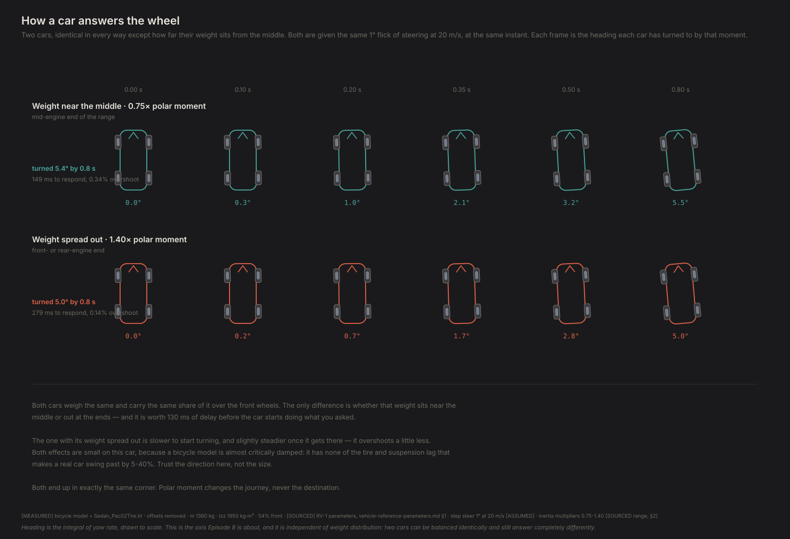
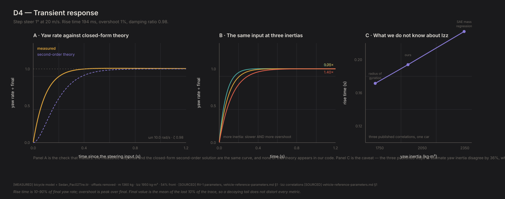

# D4 — Transient response

*Generated by `python -m diagnostics.D4_transient`. Do not edit — re-run it.*

**What this checks.** Flicks the steering and watches how the car answers. D3 measured where it ends up; this measures how it gets there — how long it takes to start turning, whether it swings past and settles back, and how all of that changes when the car's weight is spread further from its middle.

**PASSED** · 13/13 checks · 2 technical notes

---

## What this found

- Asked for a 1° step of steering at 20 m/s, the car takes about 194 ms to reach 90% of its final rate of turn, swings roughly 1% past it, and settles within 0.3 s. The rise time sits inside the published band for a road car; the overshoot does not, and that is the interesting part — see below.
- That response is a textbook second-order system, and closed-form theory predicts it: natural frequency 10.0 rad/s, damping ratio 0.98, giving 198 ms and 0% overshoot against the 194 ms and 1% measured. None of those formulas are in our code.
- Spread the weight further from the middle and the car takes longer to start turning: 149 ms at 0.75x, 198 ms at 1.00x, 279 ms at 1.40x — a 130 ms spread across the range real cars span. It also overshoots slightly less, which is the direction the reference sheet predicts.
- **But our car barely overshoots at all** — 0.82% against the 5-40% a real car shows. It is almost critically damped (ζ = 0.98). That is the bicycle model missing tire relaxation lag, suspension damping and steering dynamics — all of which add the phase lag that produces overshoot. The same kind of gap as the understeer one, and named rather than tolerated.
- How much to trust these: yaw inertia is the least certain number in the car. The three published correlations bracket 1719-2346 kg·m², which moves rise time over 172-234 ms. So it is a nearest-10-ms number, and Episode 8's comparison should lean on the direction of the effect rather than its exact size.
- Whatever the inertia, the car ends up in the same corner — final yaw rate varies by 2.34 parts in ten thousand across the sweep, which is tire nonlinearity, not inertia. Polar moment changes the journey, never the destination. That is what makes it an axis independent of weight distribution, and it is why Episode 8 can hold one fixed while sweeping the other.

## Figures

### Ep 8 · how a car answers

The same steering input given to two cars that differ only in how far their weight sits from the middle. The heavier-in-yaw car starts turning later and swings further past.

`D4_response_explained.svg`

### technical card

Yaw-rate step response against closed-form theory, the inertia sweep, and how much of the answer the uncertainty in yaw inertia accounts for.

`D4_transient_card.svg`

## What was checked

| Question | Checks | |
|---|---|---|
| Is the manoeuvre inside the envelope? | 2/2 | ok |
| Does it match the linear model exactly? | 3/3 | ok |
| Does the transient end where D3 says it should? | 1/1 | ok |
| How does yaw inertia change the response? | 4/4 | ok |
| Are the magnitudes plausible? | 2/2 | ok |
| How precise is this entitled to be? | 1/1 | ok |

## Technical notes

*Recorded, never pass/fail. These are where the model is correct but a reference is not, or where a number is worth watching.*

### closed_form_transient_agreement

The linear bicycle model at 20 m/s has natural frequency 9.95 rad/s and damping ratio 0.983. Integrated exactly it rises in 198 ms; our nonlinear model takes 194 ms. None of that state-space formulation is in the codebase. **The comparison had to be against the integrated linear model, not the textbook second-order formulas** — the yaw-rate transfer function carries a numerator zero at s = -Cr*L/(a*m*V), which speeds the rise up. Using the no-zero formulas predicted 321 ms against 194 ms measured and looked like a model bug.

### our_car_is_far_more_damped_than_a_real_one

Damping ratio is 0.983 at 20 m/s — practically critically damped — so the car barely overshoots at all (0.82%) against a 5-40% expectation. The linear model agrees, so this is not a solver artefact: it is what a bicycle model with pure cornering stiffness does. What a real car has and we do not: **tire relaxation length** (a tire takes roughly half a wheel revolution to build its side force, which is a lag we model as instantaneous), suspension compliance and damping, and steering-system dynamics. Every one of those adds phase lag, and phase lag is what produces overshoot. Same family as the understeer gap in FINDINGS F11 — the model is more idealised than the car in a nameable way. **Do not quote our overshoot as a property of a GR86.** Ep 8's comparison should rest on the direction and relative size of the inertia effect.

## Key numbers

| | |
|---|---|
| `schema_version` | 0.1.0 |
| `implied_radius` | 154.87683544468103 |

Full data, including every individual assertion, in `D4_report.json`.
