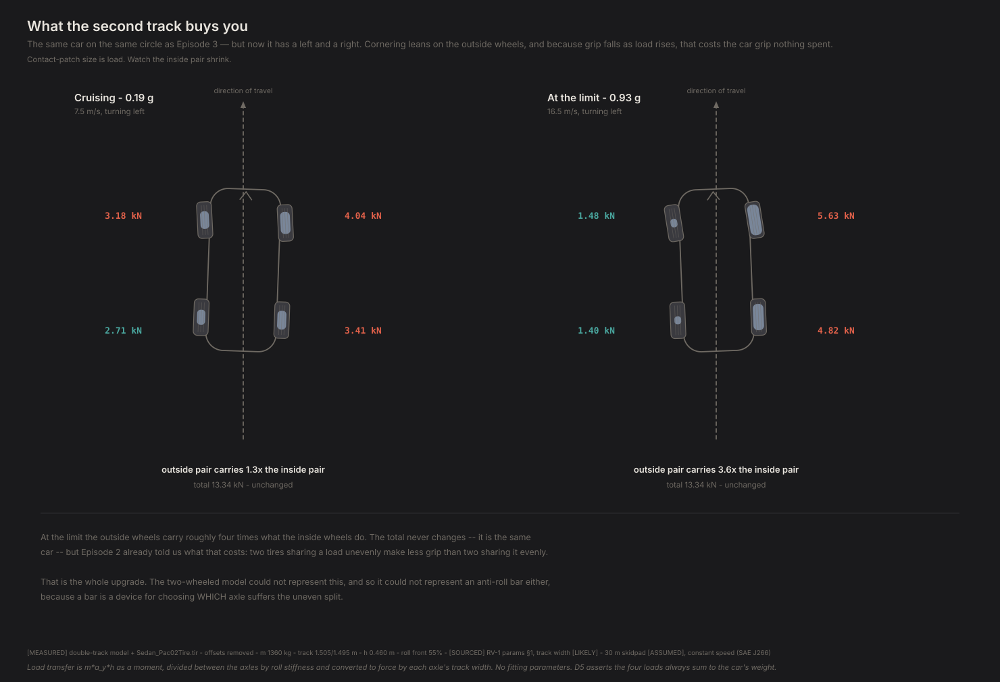
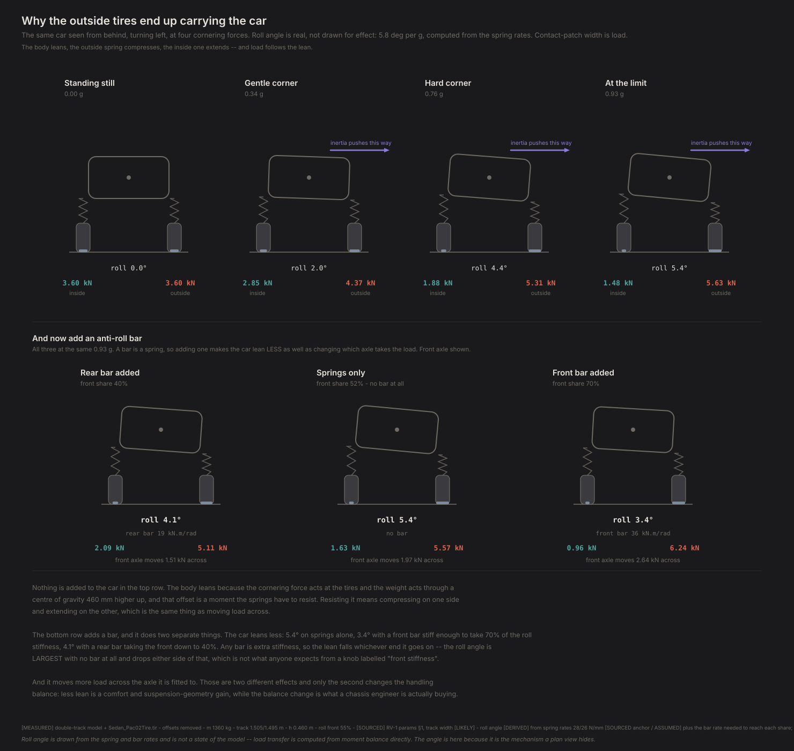
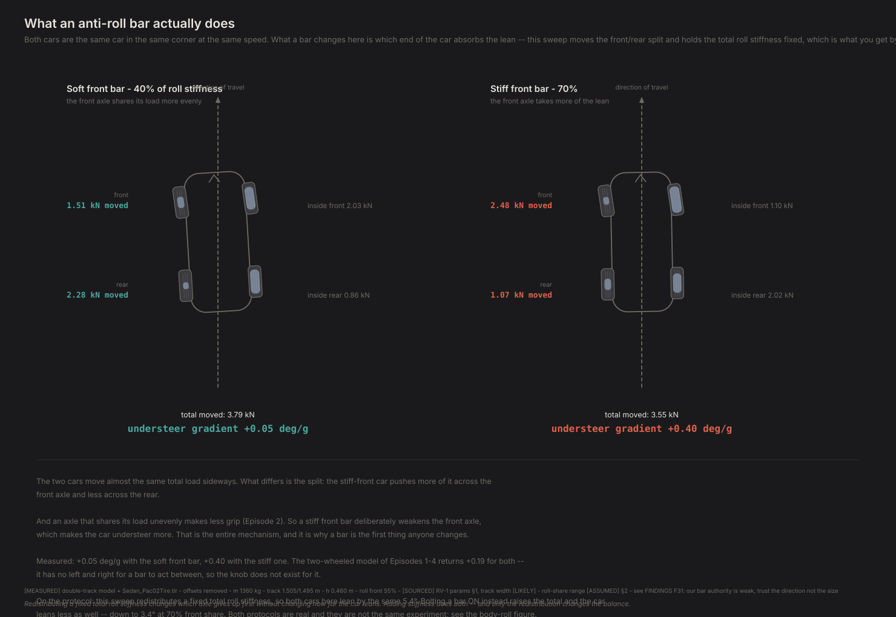
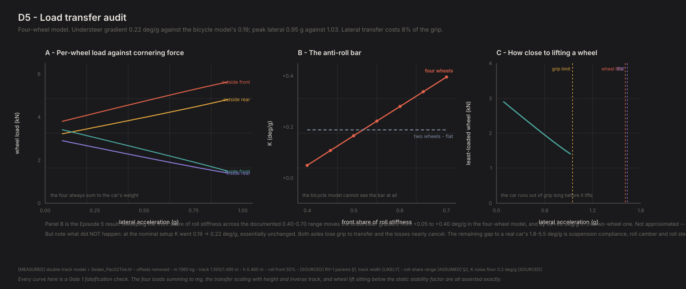

# D5 — Load transfer audit

*Generated by `python -m diagnostics.D5_load_transfer`. Do not edit — re-run it.*

**What this checks.** Gates the four-wheel model. Everything it adds over the two-wheel one is load moving between wheels, so this is mostly about whether that bookkeeping is exact — and about one thing the two-wheel model could not do at all.

**PASSED** · 22/22 checks · 5 technical notes

---

## What this found

- The four wheel loads always sum to the car's weight, to 2e-12 N. Cornering moves load onto the outside wheels, braking moves it forward, and doubling the height of the centre of gravity exactly doubles the sideways transfer. No fitting parameters anywhere.
- **Lateral load transfer costs 8% of the car's peak cornering grip** — 1.03 g becomes 0.95 g, purely from each axle sharing its load unevenly. Episode 3 predicted about 6% from static geometry alone, before a model existed that could simulate it.
- **An anti-roll bar now works, and in the two-wheel model it did nothing whatsoever.** Sweeping front roll stiffness from 40% to 70% moves the understeer gradient from +0.05 to +0.40 deg/g. The identical sweep through the bicycle model moves it by 0e+00 — exactly zero, because the model has no left and right for the bar to act between.
- **But it did not close the understeer gap, and that is a correction.** At the nominal setup K goes 0.19 -> 0.22 deg/g — essentially unchanged. Both axles lose grip to transfer and the losses nearly cancel. Episode 3 blamed the missing understeer partly on this term; that was wrong. What remains is suspension compliance, roll camber and roll steer.
- With the centre of gravity lowered to the road the four-wheel model reproduces the two-wheel model's gradient to 1.42% and its grip limit to 0.00%. Two independently written models agreeing in the limit where they must is the strongest check in this diagnostic.

## Figures

### Ep 5 - four wheels

The same corner with four wheels instead of two. Contact patches sized by load: the outside pair carries several times what the inside pair does.

`D5_four_wheels.svg`

### Ep 5 - body roll

The car seen from behind at four cornering forces, then again with an anti-roll bar fitted. Roll angle is derived from the spring and bar rates, not drawn for effect. The mechanism a plan view cannot show — and the second row shows a bar reducing lean while INCREASING the load it moves across the axle it is fitted to.

`D5_body_roll.svg`

### Ep 5 - the anti-roll bar

Two cars in the same corner with different front bar stiffness, at fixed TOTAL roll stiffness — so both lean the same amount here and the bar only chooses which axle absorbs it, and therefore which end gives up. Bolting a bar on instead raises the total and reduces lean as well; see the body-roll figure.

`D5_anti_roll_bar.svg`

### Ep 5 - low and wide

The same car cornering with only its height or its width changed. The two geometric levers that reduce load transfer rather than merely redistributing it.

`D5_low_and_wide.svg`

### technical card

Per-wheel load against cornering force, the anti-roll-bar sweep with the bicycle model's flat line for comparison, and where the wheel-lift threshold sits.

`D5_load_transfer_card.svg`

## What was checked

| Question | Checks | |
|---|---|---|
| Is the load bookkeeping exact? | 3/3 | ok |
| Does load move the right way? | 2/2 | ok |
| Is the transfer proportional to what it should be? | 4/4 | ok |
| Does it lift a wheel when it should? | 2/2 | ok |
| Does it become the bicycle model when it should? | 2/2 | ok |
| What does lateral load transfer cost? | 2/2 | ok |
| Can it respond to an anti-roll bar? | 3/3 | ok |
| What does a bar do to how far the car leans? | 3/3 | ok |
| Does it reach a real car yet? | 1/1 | ok |

## Technical notes

*Recorded, never pass/fail. These are where the model is correct but a reference is not, or where a number is worth watching.*

### degeneracy_test_is_the_strongest_check_here

With the centre of gravity on the road there is no lateral load transfer, so the four-wheel model has nothing the two-wheel model lacks. It reproduces the understeer gradient to 1.42% and the grip limit to 0.00%. Residual is the per-wheel slip-angle difference from yaw rate across the track, which the bicycle model averages away and which does not vanish with height.

### F18_predicted_this_before_the_model_existed

FINDINGS F18 estimated, from static geometry and the tire's load sensitivity alone, that lateral transfer would cost the front axle about 6% of its grip and the rear about 5%. Measured whole-car loss: 8.1%. The prediction was made in Episode 3 with a model that could not simulate the effect, and it landed.

### our_anti_roll_bar_authority_is_weaker_than_a_real_car_s

The full documented roll-share range buys 0.35 deg/g, only 1.7x the 0.2 deg/g floor at which a professional test program can distinguish two builds. A single realistic bar change — say 0.05 of roll share — moves K by about 0.05 deg/g, which is BELOW that floor and would not be reportable. Real chassis engineers get much more than this out of a bar. Two reasons ours is weak, and the second is the interesting one: we model all lateral transfer as elastic, which if anything OVERSTATES bar authority; and a real bar acts partly through roll camber and roll steer, which change the tires' effective slip angles rather than just their loads, and we model neither. Same missing terms as the understeer gap. **Treat the Season 2 roll-stiffness sweeps as directionally right and quantitatively weak until those terms exist.**

### roll_angle_is_largest_with_no_bar_at_all

The roll angle is **not monotonic** in front roll-stiffness share. It peaks at 5.8 deg/g at the spring-only share of 0.522 and falls either side — 4.4 deg/g at 0.40 (which needs a REAR bar) and 3.6 deg/g at 0.70. Not what anyone expects from a knob labelled 'front stiffness', and the reason is simply that any bar is extra stiffness. **A bar does two separate things — it reduces lean AND it redistributes load — and only the redistribution changes the handling balance.** An earlier version of the anti-roll-bar figure asserted a bar cannot change how far a car leans, which was true of our parameterisation and false of cars.

### lateral_load_transfer_is_not_where_the_understeer_gap_came_from

Episode 3 measured K = 0.19 deg/g and attributed the gap to the road-car band to missing lateral load transfer plus missing suspension effects. Adding lateral load transfer gives 0.22 deg/g at the nominal roll split — **essentially unchanged, and slightly lower**. Front and rear both lose grip to transfer, and at a 0.55 front roll share on a 54%-front car the two losses very nearly cancel, the same way the cornering compliances did. What the term DOES buy is authority: K spans +0.05 to +0.40 across the documented bar range, a knob that does not exist in the bicycle model at all. So the correct attribution is: the remaining gap to a real car is compliance steer, roll camber, roll steer and aligning torque — the Bundorf terms — not lateral load transfer. FINDINGS F11's emphasis was wrong and F29 records the correction.

## Key numbers

| | |
|---|---|
| `schema_version` | 0.1.0 |
| `roll_stiffness_front_share` | 0.55 |
| `K_double_track` | 0.22277186316724704 |
| `K_bicycle` | 0.18804927619088158 |
| `max_g_double_track` | 0.9482199667781327 |
| `max_g_bicycle` | 1.0315421886550773 |
| `grip_loss_fraction` | 0.08077441988638386 |
| `fit_r_squared` | 0.9679426777681824 |

Full data, including every individual assertion, in `D5_report.json`.
