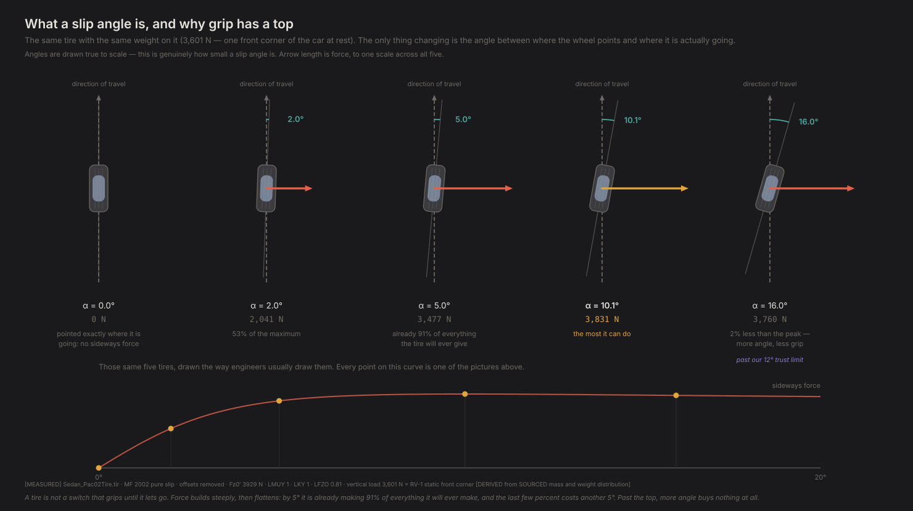

# Why does a tire make grip at all?

*Contact Patch, Episode 1. Season 1: How a car actually turns.*

---

## The question

You turn the steering wheel. The front tires point left. The car goes left.

So why does a car ever slide?

The obvious mental model is that a tire grips until it doesn't — that there's
some amount of cornering it can do, and past that it lets go and you're a
passenger. Grip as a threshold you cross.

That model is wrong in a way that matters. Not "technically incomplete" wrong —
wrong in the direction that makes fast driving feel impossible to explain. If
grip were a threshold, the fastest way round a corner would be to sit just under
it, and every driver would find the same limit. That isn't what happens.

Here's the thing the threshold model can't accommodate: **a tire makes its
biggest sideways force while it is already sliding.**

## The simplest model that can answer it

One tire. Not a car — a car has three more, plus suspension, plus a driver, and
every one of those is a way to get confused. One tire, with a fixed weight
pressing it into the road, and one thing changing.

That one thing is the **slip angle**: the angle between the direction the wheel
points and the direction it is actually travelling.

That definition sounds like it describes a mistake. It doesn't. A tire rolling
in a straight line has a slip angle of zero and makes no sideways force at all.
To get sideways force, the wheel has to be pointed slightly away from where it's
going — and the rubber in the contact patch bends sideways as it passes through,
and bent rubber pushes back. **Slip angle isn't a symptom of losing grip. It's
the mechanism by which grip exists.**

The tire in this experiment is real. Its Magic Formula coefficients come from
Project Chrono's open-source vehicle library — a 245/40 R18, measured on a rig
and fitted, not invented by me. Load is 3,600 N, which is what one front corner
of our reference car carries sitting still.



## The experiment

Sweep the slip angle from zero to twenty degrees. Measure the sideways force.

Five snapshots from that sweep, all at the same load:

| Slip angle | Sideways force | |
|---|---|---|
| 0° | 0 N | pointed exactly where it's going |
| 2° | 2,040 N | already over half of everything it has |
| 5° | 3,480 N | **91%** of the maximum |
| **10.1°** | **3,830 N** | the most it can do |
| 16° | 3,760 N | 2% *less*, from trying harder |

Read the top of the figure and you can see the whole story without reading a
number. The dashed line is the direction of travel, identical in all five. The
tire rotates away from it. The red arrow — grip — grows, reaches its longest,
and then shortens.

**Three things fall out of that table, and none of them fit the threshold
model.**

**Grip has a top.** Best force comes at about 10° of slip. Past it, more angle
buys you less force. There is no cliff, no moment of letting go — just a hill,
and you can be on the wrong side of it while still generating most of your grip.

**The top is flatter than you'd expect.** By 5° the tire is already making 91% of
everything it will ever make. The last 9% costs another 5° of slip. That's the
part that makes fast driving hard: near the top, the feedback that tells you
where you are gets very quiet.

**Zero slip means zero force.** Not "a little force." Zero. A tire tracking
perfectly straight contributes nothing to turning the car. Every newton of
cornering force a car generates is paid for in slip angle.

## Where this leaves the threshold model

A tire is not a switch. It's a hill.

Fast driving isn't sitting below a limit — it's living near the top of that
hill, where the surface is nearly flat and the difference between the right side
and the wrong side is a couple of degrees of a quantity you cannot see. That's
why it takes talent. Not because the limit is hard to reach, but because it is
hard to *locate*.

> **Grip is not a threshold you cross. It is a curve with a top, and the fast
> part is near the top but not past it.**

## What this model can't tell you

Three honest limits, because a result without them isn't a result.

**One tire is not a car.** The number here — about 3,800 N at 3,600 N of load,
which is roughly 1.06 g — is what *one* tire can do at *one* load. A car has
four, they carry different loads, and those loads change every time it brakes or
turns. That's the next episode.

**We don't trust the model past 12°.** The tire file declares itself valid to
±90° of slip, but that's a statement about where the formula is *defined*, not
where it was *measured*. Real tire rigs sweep roughly ±12°, so that's the bound
we impose on ourselves. The 16° point above is outside it and is drawn greyed
for that reason — the direction is certainly right, the exact number is an
extrapolation.

**It's a bigger tire than the car really wears.** A 245-section on a car that
comes with 215s. Grip is mildly optimistic in absolute terms. Everything in this
series is a *comparison* — this design against that one, with one tire model
throughout — so an absolute offset doesn't invalidate the comparisons. But no
number here is a claim about a specific real car.

## The crack

Everything above is one tire at one load.

But grip depends on load, and here's the part that breaks the intuition: **not
proportionally**. Press a tire twice as hard into the road and you do not get
twice the grip. You get less than twice.

Which means a car with four tires has a problem that a car with one wouldn't:
every time it brakes, accelerates or turns, it moves weight around, and moving
weight around costs it grip that nobody spent.

That's Episode 2, and it's the most important graph in vehicle dynamics.

---

**Fidelity: rung 1 — one tire, no car.** This episode is a single contact patch on a test rig. It says nothing about how a car divides load between four of them, and nothing about what happens when the tire is doing two jobs at once. Both arrive in the next two episodes.

## Reproducing this

```bash
python -m experiments.ep01.run
```

Figures and raw numbers land in `experiments/ep01/out/`. The tire model is
`physics/tire.py`; it's gated by `diagnostics/D1_tire_card.py`, which reproduces
an independently computed reference for this tire file across seven loads to
0.1% on peak grip and 0.02% on peak force.

**Numbers quoted above.** Peak force, peak slip angle and the percentages are
`[MEASURED]` from `Sedan_Pac02Tire.tir` (Project Chrono, BSD-3), MF 2002 pure
slip, conicity and ply-steer offsets removed, unscaled. Load of 3,600 N is
`[DERIVED]` from the reference vehicle's `[SOURCED]` mass and weight
distribution. The ±12° operating bound is `[ASSUMED]` — ours, not the file's.

Full provenance: `FINDINGS.md` F3, F6 and the validation ledger.
