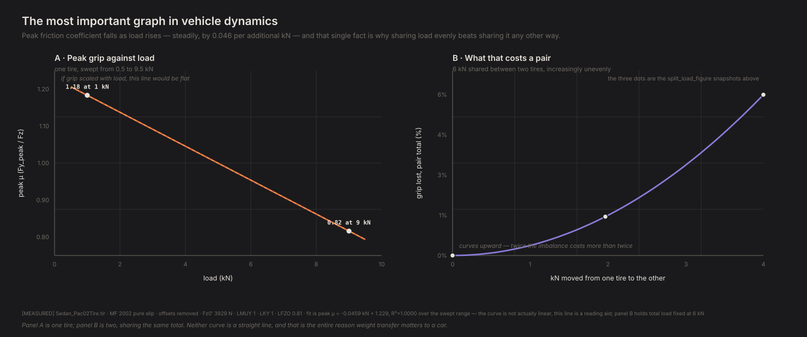
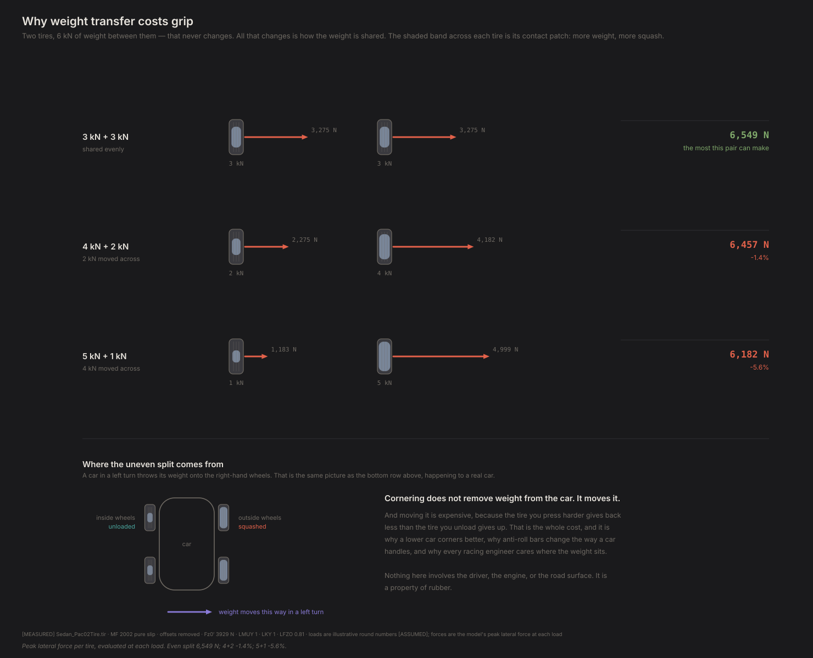

# The most important graph in vehicle dynamics

*Contact Patch, Episode 2. Season 1: How a car actually turns.*

---

## The question

A car weighs the same going round a corner as it does sitting in a car park.

The tires are the same tires. The road is the same road. Nothing is added and
nothing is taken away — the weight just moves around a bit, from the inside
wheels to the outside ones, or from the back to the front under braking.

So why does anyone care? Why is half of motorsport engineering — anti-roll bars,
spring rates, ride height, where the engine sits — an argument about moving
weight around, if the total never changes?

The answer is one property of rubber, and once you have it, most of the rest of
this series is bookkeeping.

## The simplest model that can answer it

Two tires, sharing a fixed total load. That's it.

Give them 6 kN between them. Split it evenly, 3 kN each. Then unevenly: 4 and 2.
Then 5 and 1. The total never changes. Add up what the pair can produce each
time.

Still no car, no suspension, no driver. Just the tire model from Episode 1, run
twice.

## The experiment, part one: does grip scale?

Before splitting anything, ask the simpler question. Press one tire harder into
the road. Does it grip proportionally harder?

| Load on the tire | Peak sideways force | Grip coefficient |
|---|---|---|
| 1 kN | 1,180 N | **1.18** |
| 3 kN | 3,270 N | 1.09 |
| 5 kN | 5,000 N | 1.00 |
| 9 kN | 7,350 N | **0.82** |

Nine times the load buys **6.2 times the force**, not nine times.

That right-hand column is the whole episode. If tires were simple, it would be a
constant — double the load, double the grip, same ratio. It isn't constant. It
falls, steadily, by about 0.046 for every extra kilonewton you put on the tire.

This is called **load sensitivity**, and it is a real, measured property of
rubber, not an artefact of our model. It comes from the contact patch: press
harder and it grows, but the rubber in it also works harder per unit area, and
the second effect wins.

Four points make a table. Here is the whole curve, and what it does to a pair
sharing a fixed total:



Panel A is the falling line the table above sampled at four points — a title
this episode has earned but never actually drawn until now. Panel B is what it
implies for two tires with a fixed total between them: not a straight-line
penalty for sharing unevenly, but a curve that bends upward, which is the
"fourteen times the penalty for four times the transfer" below stated as a
shape instead of two numbers.

## The experiment, part two: what that costs

Now the split. Two tires, 6 kN between them, shared three ways:



| Split | Pair's total grip | |
|---|---|---|
| 3 + 3 kN | 6,550 N | the most this pair can make |
| 3.5 + 2.5 kN | 6,530 N | −0.35% |
| 4 + 2 kN | 6,460 N | −1.4% |
| 5 + 1 kN | 6,180 N | **−5.6%** |

**Even sharing wins, every time.** The tire you press harder gains less than the
tire you unload gives up — because the one you pressed harder is now operating
further down that falling grip curve.

And notice the shape of the penalty: it starts almost free and gets expensive
fast. Moving 500 N across costs 0.35%. Moving 2,000 N costs 5.6% — sixteen times
the penalty for four times the transfer.

That isn't a coincidence. Because the grip coefficient falls almost perfectly
*linearly* with load, the pair's total force works out to depend on the **sum of
the squares** of the two loads. For a fixed total, a sum of squares is smallest
when the two are equal, and it grows quadratically as they diverge. Gentle at
first, then accelerating.

## Why this is the graph that matters

Here's the connection that makes it more than arithmetic.

**Cornering doesn't remove weight from a car. It moves it** — onto the outside
wheels, off the inside ones. Braking moves it forward. Accelerating moves it
back. Every one of those is the experiment above, happening to a real car, in
real time.

Which means a car has *less total grip while it is doing something* than it has
sitting still. Not because anything wore out — because the weight got shared
unevenly, and unevenly shared weight makes less grip than evenly shared weight.

Once you have that, a pile of apparently unrelated engineering decisions
collapse into one idea:

- **Low centre of gravity.** Halve the height, halve the weight transfer, keep
  more of your grip. It's why the reference car's 460 mm figure is the number
  its engineers put in the press release.
- **Anti-roll bars.** They don't reduce total weight transfer — they change how
  it's *divided* between the front and rear axles. Which end you make suffer is
  a tuning choice.
- **Wide track.** More distance between the wheels, less transfer for the same
  cornering force.
- **Spreading tire workload.** The objective every torque-vectoring controller
  optimises, thirteen episodes from now, is a restatement of this graph.

> **This single fact — that tires get worse as you push harder on them — is why
> low centres of gravity, anti-roll bars, and half of motorsport engineering
> exist.**

## What this model can't tell you

**How much weight actually moves.** We've shown what a given split costs. We
haven't shown what split a real corner produces — that needs a car with a mass,
a centre of gravity height and a width. Next episode starts building one.

**Nothing about left and right yet.** The 6 kN pair above could be a front axle
and a rear axle, or an inside wheel and an outside wheel. The arithmetic is the
same either way, which is exactly why this graph shows up everywhere.

**These are round numbers.** 6 kN split into thirds is chosen to be readable,
not because a real car does that. The reference car's front corners carry about
3.6 kN each at rest — close enough that the middle of this chart is where it
actually lives.

## The crack

We can now say what an uneven load split costs. We still can't say what split
you get.

That depends on how heavy the car is, how high its weight sits, how quickly it's
turning — and on something we've been quietly ignoring, which is that a car has
a front and a back, and they don't have to behave the same way.

Give a car two axles instead of two tires and something new appears: the front
can run out of grip before the rear, or the other way round. That's the
difference between a car that pushes wide and one that spins.

Episode 3 builds the simplest car that can tell those apart.

---

**Fidelity: rung 1 — one tire.** The friction ellipse here is a property of a tire, measured one contact patch at a time. What a *car* does with four of them — load transfer, roll, per-wheel differences — is rung 2 and starts at Episode 5.

## Reproducing this

```bash
python -m experiments.ep02.run
```

Figures and raw numbers land in `experiments/ep02/out/`.

**Numbers quoted above** are `[MEASURED]` from `Sedan_Pac02Tire.tir` (Project
Chrono, BSD-3), MF 2002 pure slip, offsets removed, unscaled. The 6 kN total and
the three splits are `[ASSUMED]` round numbers for legibility. Reference-car
corner loads are `[DERIVED]` from `[SOURCED]` mass and weight distribution.

The load-sensitivity slope, −0.046 per kN, is exactly the tire file's own `PDY2`
coefficient divided by its nominal load — it is one fitted number, not a curve
we tuned. `diagnostics/D1_tire_card.py` reproduces an independent computation of
this tire's peak grip across seven loads to 0.1%.

Full provenance: `FINDINGS.md` F1, F2 and the validation ledger.
