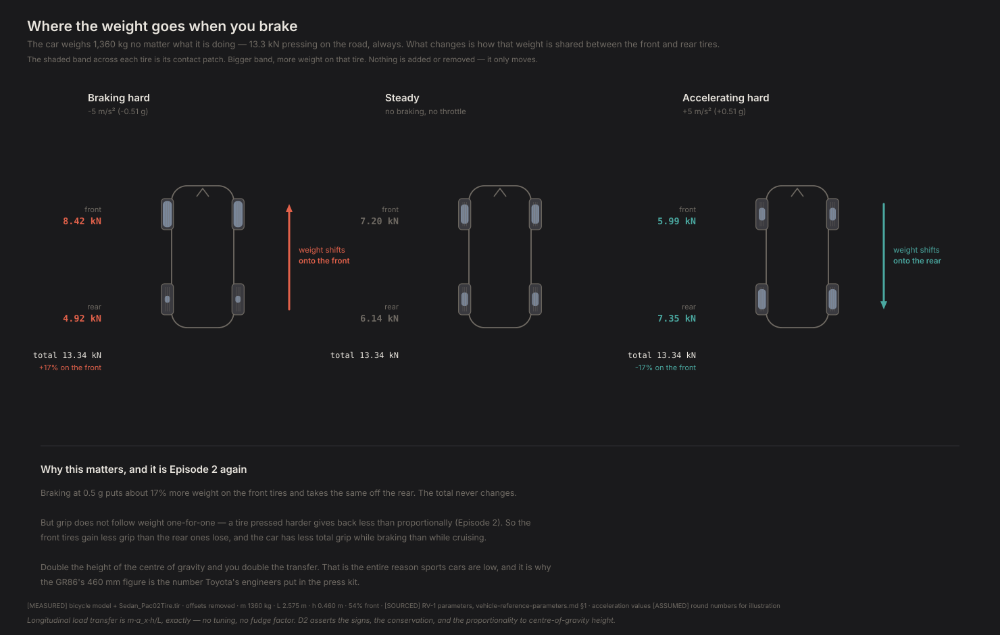
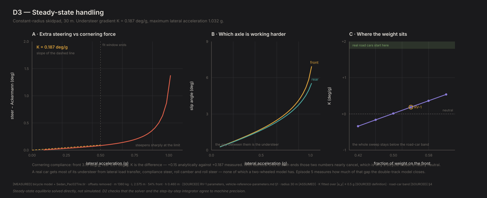

# Building the simplest car that can understeer

*Contact Patch, Episode 3. Season 1: How a car actually turns.*

---

## The question

"Understeer" is a word people use to mean *the car didn't turn as much as I
wanted*. Which is a feeling, and feelings aren't measurable.

But manufacturers don't ship feelings. Somebody at Toyota decided how much this
car would understeer, wrote it down as a number, and validated it. It's a spec,
like ride height or spring rate.

So: what actually *is* understeer? Not the sensation — the measurement.

## The simplest model that can answer it

Two tires isn't enough. Episode 2's pair could have been anything; the
arithmetic didn't care which end of the car they were on.

To have understeer you need a car with a **front** and a **back**, because
understeer is a statement about one running out before the other. So: two axles,
a wheelbase, a mass, a centre of gravity somewhere between them. Weight shifts
forward under braking and back under acceleration. Each axle has two of Episode
1's tires on it.

That's the whole car. No suspension, no roll, no width — the two front wheels
are collapsed into one, and so are the rears. It's called a **bicycle model**,
and it's deliberately the least car that can answer the question.

Our reference is a GR86-class coupé: 1,360 kg with a driver, 2.575 m wheelbase,
54% of the weight over the front wheels, centre of gravity 460 mm off the road.

## The experiment: a skidpad

Drive a 30 m circle. Start slow, go faster. Measure how much steering it takes.

At walking pace the geometry does all the work — steer the wheels by the angle
the corner geometrically requires (`wheelbase ÷ radius`, which here is 4.92°)
and the car follows. That's the **Ackermann angle**, and it's the baseline.

Go faster and you need *more* than that. The extra is what we're measuring. Plot
it against cornering force and the slope has a name: the **understeer gradient**,
in degrees of extra steering per g.

That's it. That's the number Toyota wrote down.


## What we measured

| | Cruising, 0.20 g | At the limit, 1.03 g |
|---|---|---|
| Steering angle | 4.9° | 6.3° |
| Front tires sliding | 0.66° | 6.9° |
| Rear tires sliding | 0.62° | 5.6° |
| **Front works harder by** | **0.03°** | **1.4°** |
| Body points | 2.0° *out of* the corner | 2.9° *into* it |

**That "front works harder by" row is understeer.** Both axles have to slide to
make grip — Episode 1 — but the front has to slide *more* to hold the same
corner. You feel that as needing more steering than the corner should need, and
as the car running wide when you ask for more.

Three things came out of this that we didn't build in:

**The car understeers, and it does so all the way to the limit.** Steering
demand rises smoothly, then sharply in the last few percent of grip. That upturn
near the limit is exactly what real cars show, and nothing in the model asks for
it.

**The body's attitude flips.** At low speed the nose points slightly *out* of
the corner; past about 0.7 g it points *into* it. Every driver has felt that and
almost nobody knows it has a name. It fell out of the equations.

**It grips about 1.03 g** and reaches that at 6.9° of front slip — comfortably
inside the range where we trust the tire model, so the limit is a real grip
limit rather than the model being extrapolated.

### Where the weight goes

The other thing two axles buy you: the car can now shift weight between them.
Brake and it moves forward, accelerate and it moves back. Same total, different
split — Episode 2's experiment, happening to a real car.



Braking at half a g puts about **1,200 N** more on the front axle and takes the
same off the rear — 17% more weight on the front tires than at rest. The total
never changes. Double the height of the centre of gravity and you exactly double
the transfer, which is the whole quantitative case for a low car.

## The number, and the problem with it

The understeer gradient came out at **about 0.2 deg/g**.

A real sports car is 1–2. A passenger car is 3–5. Below 1 deg/g is, according to
people who measure these for a living, essentially never seen in production.

Ours is 0.2. That is not a sports car. That's a car with almost no understeer at
all, which no manufacturer would ship.

**The model isn't broken. It's telling the truth about itself, and the reason is
worth more than the number.**

Here's why it comes out near zero. The front axle carries 7,200 N and needs 3.16°
of slip per g of cornering. The rear carries 6,100 N and needs 3.01°. Understeer
is the *difference* between those two — and with identical tires at both ends,
they nearly cancel. 3.16 minus 3.01 is 0.15, and that's essentially what we
measured.

So where does a real car's understeer come from? Almost entirely from things
this model does not have:

- **Lateral load transfer.** A real car leans on its outside tires in a corner,
  which costs the axle grip (Episode 2). A bicycle model has no width, so it
  can't.
- **Compliance steer, roll camber, roll steer, aligning torque.** Suspension
  effects. A published worked example attributes roughly 3 of a real car's 4.1
  deg/g to exactly these.

We can even size the missing piece without building it. At the limit, a real car
of these dimensions moves about **2,300 N** from its inside front tire to its
outside one — roughly ten times the front-to-rear transfer this model does have.
That would cost the front axle an estimated 6% of its grip and the rear 5%. The
two differ, and *that difference is most of the understeer we aren't producing*.

## What the model does get right

The low number would be worrying if the rest were shaky. It isn't. In the linear
range this model reproduces closed-form vehicle-dynamics theory — formulas that
appear nowhere in our code — to better than 0.01%: yaw-rate gain, body sideslip,
and the understeer gradient itself, which converges to the textbook
`W_f/C_f − W_r/C_r` as the measurement window shrinks.

So the structure is right. One term is missing, we know which, and we know
roughly how big it is.

## Moving the weight

The other half of the experiment: slide the weight forward and back and measure
again.

| Weight on the front | Understeer gradient |
|---|---|
| 42% | −0.34 deg/g (oversteer) |
| 46% | −0.16 |
| 50% | +0.01 |
| **54% (ours)** | **+0.19** |
| 58% | +0.36 |
| 62% | +0.54 |

Forward weight adds understeer, monotonically, every time. And the car is
neutral at almost exactly 50:50 — which is what you get when the tires at both
ends are identical.

That last point is quietly interesting. **Real cars are not neutral at 50:50**,
and the gap between that and this result is the same missing mechanism. 50:50 is
a starting point, not an answer.

> **Understeer isn't a fault. It's a number, it's deliberate, and every
> manufacturer picks one.**



The technical version of the same three results: extra steering against
cornering force with the fitted gradient, which axle is working harder, and how
the gradient moves with weight distribution. The green band at the top of the
right-hand panel is where real road cars start — the whole sweep stays below it.

## How much to trust these numbers

The reference sheet gives this car's weight distribution as a *range* — 53% to
56% — because the manufacturer quotes one figure at curb weight and a
corner-weighted car with a driver sits differently.

Propagate that and the understeer gradient spans **0.14 to 0.27 deg/g**. Driver
mass and centre-of-gravity height together move it by less than 0.02.

So it's a one-decimal number. The solver returns more digits; they aren't
information. And the thing worth pinning down, if anyone wants a better answer,
is the weight distribution — not the model.

## The crack

The bicycle model has two wheels.

Everything it can't explain — the understeer that isn't there, the load transfer
we could only estimate — comes from that. A real car has a left and a right, it
leans, and its outside wheels do more work than its inside ones.

Worse: it means this model **cannot respond to an anti-roll bar at all**. Roll
stiffness distribution, one of the primary tuning knobs on any performance car,
is simply invisible to it.

Episode 5 builds the four-wheel version and measures how much of the gap closes.

But before that, a different question. We now have a car that corners. We
haven't asked what the *fastest* way round a corner is — and the answer isn't
the one most people would guess.

---

**Fidelity: rung 1 — the bicycle model.** Two axles, no left and right, no load transfer, no roll. It is enough to show what understeer *is* and where it comes from, and it is not a description of a car: our understeer gradient is about **0.2 deg/g against a real car's ~4.1**, so this model reproduces roughly **5% of a real car's understeer**. About 3 of those missing 4 deg/g are suspension terms — compliance steer, roll camber, roll steer, aligning torque — that no rung below 3 has. The mechanism is right; the magnitude is illustrative (CLAUDE.md rule 15).

## Reproducing this

```bash
python -m experiments.ep03.run
```

Figures and raw numbers land in `experiments/ep03/out/`.

**Numbers quoted above.** Steering angles, slip angles, understeer gradient and
max lateral g are `[MEASURED]` from the bicycle model in `physics/bicycle.py` on
the Project Chrono tire, offsets removed. Vehicle parameters are `[SOURCED]`
(mass, wheelbase, centre-of-gravity height) or `[LIKELY]` (track width, unused
here). The 30 m radius is `[ASSUMED]`. The estimate of omitted lateral load
transfer is `[DERIVED]` from `m·a_y·h/t` and the tire's load sensitivity — **not
simulated**, because this model cannot simulate it.

The skidpad holds constant speed, matching SAE J266. That choice is not
cosmetic: letting the car coast instead changes the measured gradient by nearly
20% and inverts the terminal balance. See `FINDINGS.md` F17.

Gated by `diagnostics/D3_steady_state.py` (21 checks) and
`diagnostics/D2_invariants.py` (29 checks). Full provenance: `FINDINGS.md`
F10–F18.
