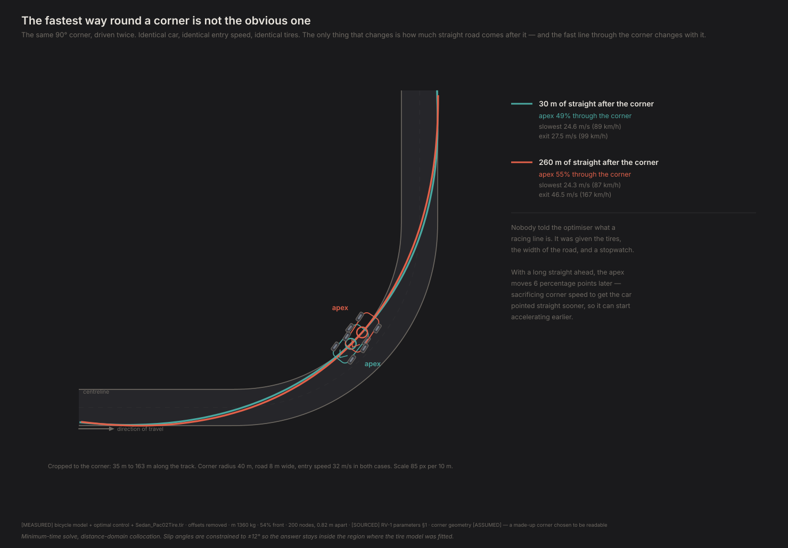
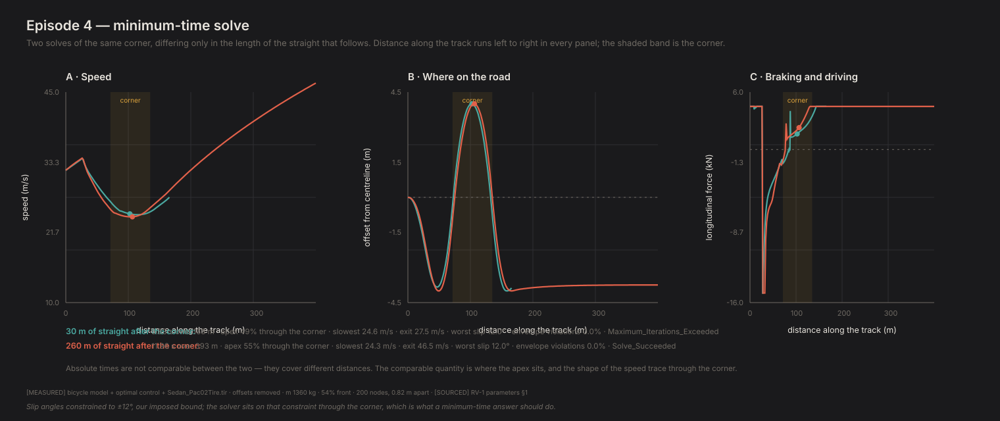

# The fastest way round a corner isn't the obvious one

*Contact Patch, Episode 4. Season 1: How a car actually turns.*

---

## The question

If a tire's grip is limited — Episode 1 — then the way to carry the most speed
through a corner is to make the corner as gentle as possible. Start wide, cut to
the inside at the middle, run wide again on the way out. The widest possible arc.
Biggest radius, least cornering force, highest speed.

That's the geometric racing line, it's what gets drawn in every explainer, and
it's what a reasonable person would derive from Episode 1.

So why doesn't anyone drive it?

## The simplest model that can answer it

The same bicycle model from Episode 3. Nothing new about the car.

What's new is the question we ask it. Instead of "hold this circle and tell me
what happens," we ask: **given this piece of road, what is the fastest possible
way through it?**

That's an optimal control problem, and it's solved with CasADi and IPOPT by
direct collocation. In plain terms: chop the road into 200 slices, treat the car's
position, speed and steering at every slice as unknowns, and let the solver find
the combination that minimises total time while obeying the physics at every
slice.

The important part is what the solver is *not* told. It doesn't know what a
racing line is. It doesn't know about apexes, or trail braking, or any of the
vocabulary. It gets the tire model, the width of the road, and a stopwatch.

One constraint deserves calling out. The solver is forbidden from exceeding 12°
of slip angle — our self-imposed bound on where the tire model can be trusted.
Without it, a minimum-time solver will happily drive at 30° of slip, because the
Magic Formula keeps returning force out there and there's no penalty for being in
a region nobody ever measured. **The lap time would be a statement about our
curve fit, not about a car.** Both solves sit exactly on that 12° limit through
the corner, which is what a real minimum-time answer looks like.

## The experiment

One 90° corner, 40 m radius, on an 8 m wide road. The car arrives at 32 m/s
(115 km/h) in both cases.

The only difference: how much straight road comes after it. Once with 30 m of
exit, once with 260 m.

Same corner. Same car. Same entry speed. Same tires.



## The result

| | 30 m exit | 260 m exit |
|---|---|---|
| Apex position | 49% through the corner | **55% through the corner** |
| Slowest speed | 24.6 m/s | 24.3 m/s |
| Speed at the finish | 27.5 m/s | **46.5 m/s** |
| Braking stops at | 83 m | 73 m |

**The apex moves later** — about 6 percentage points, or roughly 4 m further
round a 63 m arc — when there's a long straight to come.

And it *pays* for that by cornering slightly slower. The minimum speed drops from
24.6 to 24.3 m/s. The car deliberately gives up mid-corner speed.

Why? Look at the last row of the table. A later apex means the car finishes
turning sooner, which means it can point straight and put the power down earlier.
On the long exit that's worth 19 m/s of extra speed by the end. Trading 0.3 m/s in
the corner for 19 m/s down the straight is not a close call.

On the short exit there's barely any straight to accelerate down, so that trade
isn't available and the solver keeps the apex nearly in the middle — much closer
to the geometric line.

> **The fast line isn't a shape. It's the answer to a question about what comes
> next.**

That's why nobody drives the geometric line. The geometric line is optimal for a
corner with nothing after it. Real corners always have something after them.

## The thing nobody asked for

Look at where braking stops: **83 m and 73 m along the track.** The corner starts
at 70 m.

Both lines are **still braking after the car has begun turning.** That's trail
braking — the technique racing drivers spend years learning, and one of the least
intuitive things about driving fast. Nobody wrote it into the model. It came out
of a minimum-time solve that had never heard of it.

The mechanism is Episodes 2 and 3 combined. Braking moves weight onto the front
tires. More load on the front means more front grip, and more front grip means the
car turns in better. So carrying the brakes past turn-in buys you front-end bite
exactly when you need it.

It isn't free — the friction ellipse says a tire braking at 70% of its
longitudinal limit keeps only about 71% of its cornering force — and the solver
weighs that trade rather than being told the answer. Notice the long-exit line
gets *off* the brakes 10 m earlier: with a straight to come, getting on the power
matters more than the last of the turn-in help.

I'd planned to demonstrate trail braking by scripting three braking strategies
and reporting which was fastest. This is better. **A solver that was given no
technique and rediscovered one is stronger evidence than a comparison I designed
to have a winner.**



## Do we believe it?

Three checks, because "the apex moved" is only a finding if it survives them.

**Does it survive changing the discretisation?** The whole result is an artefact
of chopping the road into slices, so it must not depend on how many slices.

| Nodes | Apex shift |
|---|---|
| 140 | +5.5 points |
| 200 | +6.2 points |
| 280 | +5.9 points |

Stable. The shift is real, and it's about 6 points, not 6.2.

**Did it stay inside the envelope?** Yes — zero nodes outside the ±12° slip
bound in either solve. The answer describes a car, not an extrapolation.

**Did the solver actually converge?** The long-exit solve converged cleanly. The
short-exit solve hit the iteration limit.

That is a gate, not a footnote. A solve that stops early has not driven its
constraint violation to zero, so its objective belongs to a trajectory that does
not quite obey the physics. Warm-starting the same problem from a resampled
coarser answer converges cleanly to **5.912 s**, where the unconverged run
reports 5.873 s — 0.65% apart. *(That pair is measured at 110 nodes cold against
80 nodes warm-started, recorded in `FINDINGS.md` F39 — not at the 200 nodes this
episode's own table uses, where the short-exit solve reports 5.827 s. Same
corner, same defect, different grid.)* "The objective stopped moving to 1 part in 10⁵"
measures whether the iterate stalled, not whether it reached the optimum, and the
two differ by far more than that. Nor is the *direction* predictable: on
Episode 6's corner the deviations went both ways, so an unconverged objective is
untrustworthy rather than optimistic.

Agreement across node counts is not convergence evidence either — runs that share
a stopping criterion can agree about the same artefact. Worth being explicit
about how much of this table that covers: **five of the six grid-refinement
solves stopped on the iteration limit** — every short-exit run, and the long-exit
run at 280 nodes. The apex shift is a
comparison of *where* the apex sits rather than of lap times, and it survives
clean convergence intact on Episode 6's corner. **The times in the table above
are not quotable until both cases are re-solved with the raised iteration
limit.**

**Absolute times are not comparable** between the two cases — they cover
different distances (163 m vs 393 m). The comparable quantities are where the
apex sits and the shape of the speed trace.

## What this model can't tell you

**It knows the future.** The solver saw the whole road before choosing a single
input. It knows exactly where the corner ends and exactly how much grip every
tire will have. Real driving has none of that.

**It still has two wheels.** Everything from Episode 3 applies — no lateral load
transfer, so the trail-braking benefit is understated. Real trail braking works
partly by loading the *outside* front tire specifically, and a model with no left
and right can't represent that. The direction is right; the magnitude is low.

**The friction ellipse is an assumed shape.** This is the first result that turns
on it. That a tire trades braking for cornering is certain; that it trades along
an ellipse is a modelling choice standing in for coefficients this tire file
doesn't contain. Trail braking would still appear with a different trade-off
curve, but how much of it is optimal would shift.

**The corner is invented.** 40 m radius, 8 m wide, chosen to be readable.

## The crack

We now have a driver that is perfect, and it is perfect in a way that should
bother you: it plans the entire corner before turning the wheel.

It cannot be surprised. It cannot respond to a gust, a damp patch, or a car
appearing where it shouldn't. Every input it produces was computed with full
knowledge of everything that would happen next.

Which means there's a whole category of question it structurally cannot answer.
"What happens when the grip isn't what you expected?" is not a question you can
put to a solver that already knows the answer.

Before that, though: this car still has two wheels. It's time to find out what
that's been costing us.

Episode 5 builds the four-wheel version and puts the two side by side.

---

**Fidelity: rung 1 — the bicycle model, plus an optimal-control solver.** The racing line here is the best line *for a two-axle car with a perfect driver*. No load transfer, nothing per-wheel, and a driver that cannot be surprised. Rank ordering and shape are what this can claim; the absolute lap time is a statement about an invented corner.

## Reproducing this

```bash
python -m experiments.ep04.run
```

Takes a few minutes — six optimal-control solves including the grid-refinement
check. Figures and raw numbers land in `experiments/ep04/out/`.

**Numbers quoted above** are `[MEASURED]` from `physics/optimal_control.py`
(distance-domain trapezoidal collocation, CasADi 3.7 / IPOPT) driving the bicycle
model on the Project Chrono tire, offsets removed. Corner geometry, entry speed,
road width and the actuator limits are all `[ASSUMED]`. The ±12° slip bound is
ours, documented in `FINDINGS.md`.

**On trusting the tire model inside an optimiser.** The Magic Formula is
evaluated symbolically here and numerically everywhere else. Rather than write it
twice, `physics/mathkit.py` supplies either a numpy or a CasADi namespace and
`physics/tire.py` is written against whichever it's handed —
`tests/test_casadi_tire.py` asserts the two agree to machine precision across the
whole operating envelope. A duplicated tire model would be the worst possible
place for two implementations to drift, because an optimiser will find the
difference and exploit it, and the result would look like a finding.

Full provenance: `FINDINGS.md` F26–F28.
