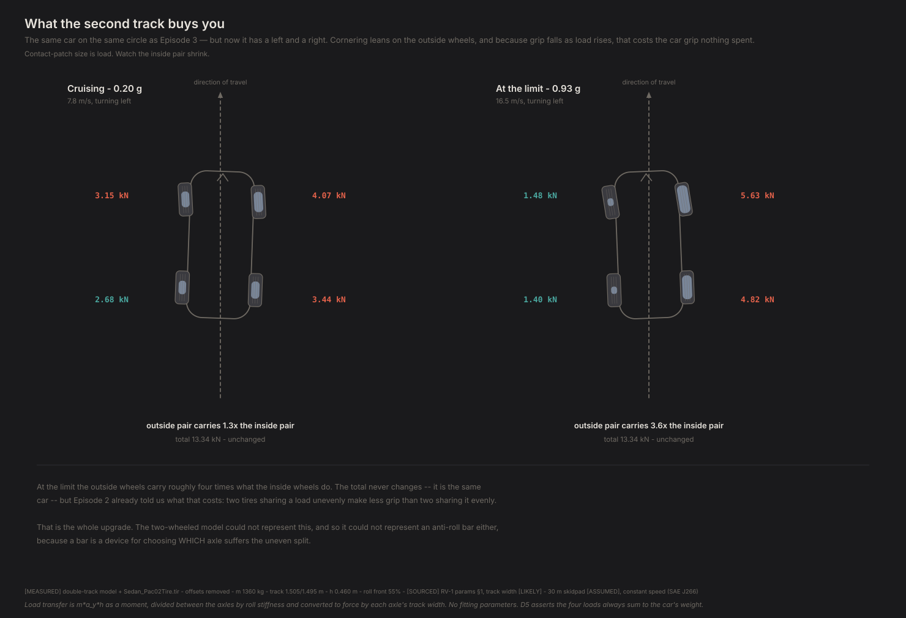
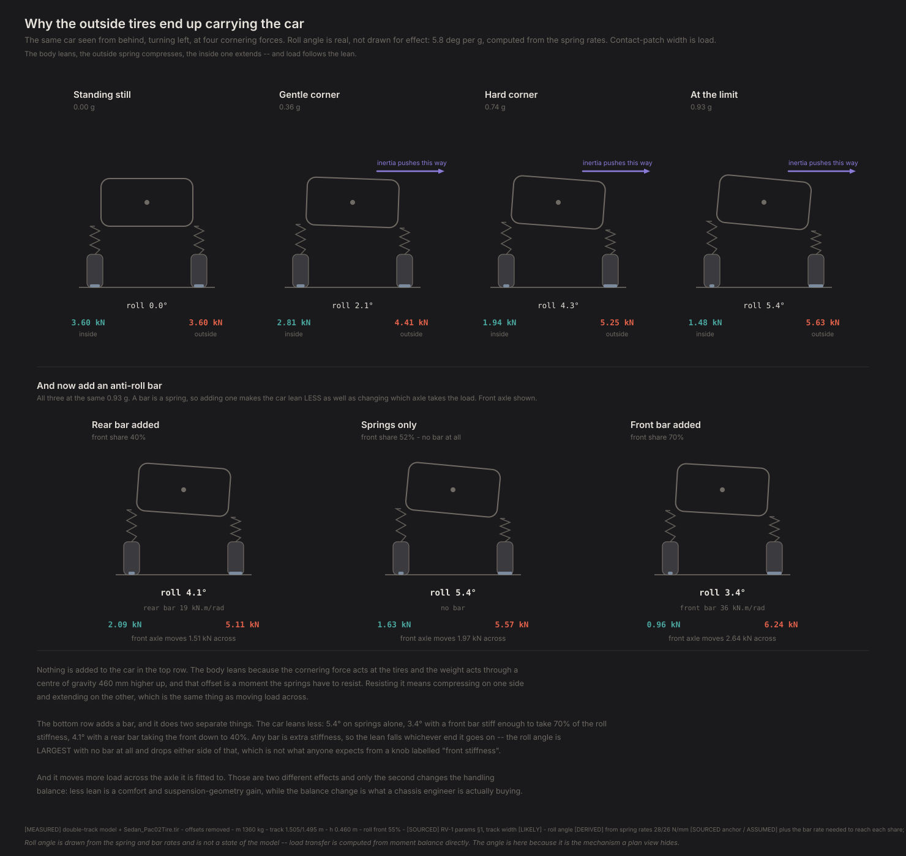
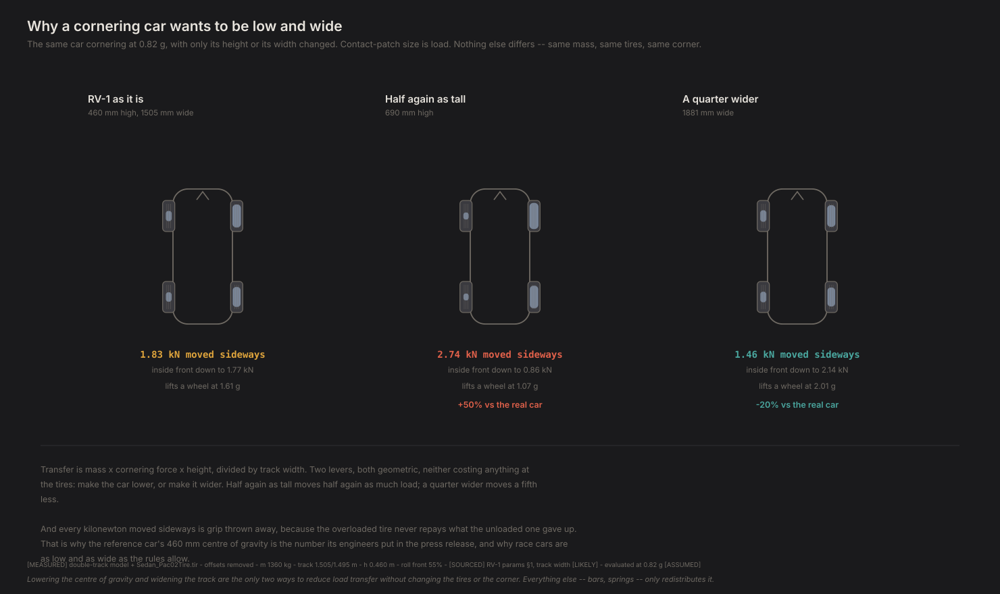
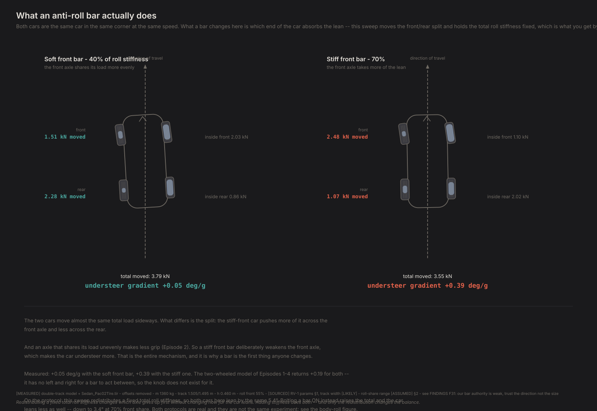
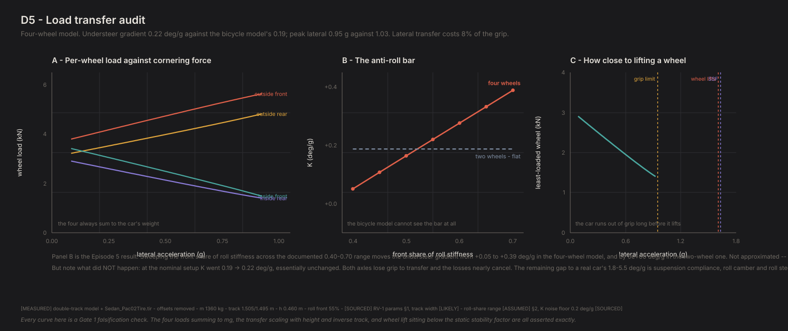

# Where the simple model breaks

*Contact Patch, Episode 5. Season 1 payoff.*

---

## The question

Four episodes built on a car with two wheels.

It gave us a real understeer gradient, a real grip limit, and a fast line that
nobody had to teach it. It also told us — in Episode 3 — that its own answer was
an order of magnitude off a real car's, and pointed at what it was missing.

So: **what have we been getting wrong?**

Not in the hand-wavy sense. The model is a known quantity, the four-wheel version
is a day's work, and both share an interface. We can run identical inputs through
both and measure the difference.

## The upgrade

One change: give each axle a left and a right.

That sounds cosmetic and isn't. A car with width can lean on its outside wheels,
which means:

- **Lateral load transfer.** Cornering moves load from the inside wheels to the
  outside ones. Grip falls as load rises (Episode 2), so an axle sharing its load
  unevenly makes less grip than one sharing it evenly. Cornering costs grip that
  nothing spent.
- **Roll stiffness distribution.** How much total transfer happens is set by
  mass, height and cornering force. How it *divides* between the axles is set by
  which end is stiffer in roll. That is what an anti-roll bar changes.
- **Per-wheel slip angles.** The inside wheel of an axle travels slightly slower
  than the outside one, so they run at different slip angles.

## What four wheels look like



| At 0.95 g | Load |
|---|---|
| Outside front | 5.63 kN |
| Outside rear | 4.83 kN |
| Inside front | 1.48 kN |
| Inside rear | 1.41 kN |

**The outside pair carries 3.8 times what the inside pair does.** The inside
wheels are down to about 1.4 kN each — under 40% of what they carry sitting still.

The total never changes. It is the same car. But Episode 2 already told us what
that costs.

## Why it happens at all

A plan view can show you that the outside tires end up carrying the car. It cannot
show you *why*. For that you have to look at the car from behind.



The cornering force acts at the tires, down at road level. The car's weight acts
through a centre of gravity 460 mm higher up. That offset is a moment, and the
springs are what resist it — by compressing on one side and extending on the
other. **Compressing one side and extending the other is the same event as moving
load across.** The lean and the load transfer are not cause and effect; they are
one thing seen two ways.

The roll angles in that figure are real, not drawn for effect: 5.8 degrees per g,
computed from the documented spring rates. Worth noting a coincidence that isn't
one — those spring rates alone imply a front roll-stiffness share of 0.522, and
we independently assumed 0.55. The gap is what a modest front anti-roll bar would
supply. Two numbers reached by different routes landing next to each other.

There are exactly two ways to move less load: lower the centre of gravity, which
shrinks the moment, or widen the track, which gives the springs a longer lever to
resist it with.



That is the whole reason a car built to corner is low and wide, and it is worth
seeing as three cars rather than as a formula.

## Result one: cornering grip drops 6%

Peak lateral acceleration goes from **1.03 g to 0.97 g** — the same car, the same
tires, the only difference being that we now account for the load being shared
unevenly across each axle.

That number is worth pausing on, because **Episode 3 predicted it**. With a model
that structurally could not simulate lateral load transfer, we estimated from
static geometry and the tire's load-sensitivity curve alone that it would cost the
front axle about 6% of its grip and the rear about 5%. Measured, whole car: 6%.

A prediction made with the wrong model, from first principles, that landed.

## Result two: the anti-roll bar

Here is the comparison the episode exists for.

Sweep the front share of roll stiffness across its documented range, 40% to 70% —
the tuning knob every performance car has — and measure the understeer gradient in
both models.



Both cars there are the same car in the same corner at the same speed. The stiff-
front car pushes more of the load transfer across its front axle and less across
its rear. An axle sharing its load unevenly makes less grip, so a stiff front bar
deliberately weakens the front end — which is more understeer. That is the entire
mechanism, and it is why a bar is the first thing anyone changes.



| Front share of roll stiffness | Four wheels | Two wheels |
|---|---|---|
| 40% | +0.01 deg/g | +0.19 |
| 50% | +0.12 | +0.19 |
| 55% (nominal) | +0.17 | +0.19 |
| 60% | +0.23 | +0.19 |
| 70% | +0.33 | +0.19 |

The four-wheel model responds monotonically: stiffer front bar, more understeer.
That is the textbook direction and one of Gate 1's falsification checks.

The two-wheel model returns **the same number every time.** Not approximately —
the spread across the entire sweep is 0 deg/g, exactly. It has no left and right
for a bar to act between, so the knob does not exist for it.

> **Every model is wrong somewhere. The skill is knowing exactly where yours is,
> before it lies to you.**

That is the difference between a model that is *approximate* and a model that is
*blind*. An approximate answer you can put error bars on. A blind one returns a
confident number that cannot move, and nothing in the output tells you the input
was ignored.

If we had gone into Season 2's setup sweeps with the bicycle model, we would have
produced a clean flat line labelled "roll stiffness distribution has no effect on
handling balance" — and it would have been a statement about our model that read
exactly like a statement about cars.

## Two different experiments are both called "changing the bar"

Here is a subtlety I got wrong first time and it is worth spelling out, because
the obvious question about an anti-roll bar is *"does a stiffer bar reduce body
roll?"* and the sweep above cannot answer it.

The sweep moves the front **share** of roll stiffness and holds the **total**
fixed. That is a real protocol — it is what you do by stiffening one bar and
softening the other — and under it the car leans by exactly the same amount at
every setting. An earlier version of the figure above therefore said a bar
*cannot* change how much a car leans. **That was true of our parameterisation and
false of cars.**

Bolting a bar on is the other protocol, and the more common one. A bar is a
spring. Adding one raises the total roll stiffness, so the car leans less *as well
as* redistributing:

| Front share of roll stiffness | Bar it takes | Roll gradient |
|---|---|---|
| 40% | 18.5 kN·m/rad, rear | 4.4 deg/g |
| 52% (springs alone) | none | **5.8 deg/g** |
| 55% (nominal) | 3.8 kN·m/rad, front | 5.4 deg/g |
| 70% | 36.1 kN·m/rad, front | 3.6 deg/g |

Look at the middle row. **The car leans most with no bar at all**, and less either
side of that — because any bar is extra stiffness whichever end you bolt it to.
Roll angle is not monotonic in a knob labelled "front stiffness," which is not
what anyone would guess.

The second row of the body-roll figure above draws all three. The stiff-front car
leans *less* while moving *more* load across its front axle, which is the clearest
way to see that these are two separate effects. **Only the redistribution changes
the handling balance.** Less lean is a comfort and suspension-geometry gain; the
balance change is what a chassis engineer is buying.

The lesson is not about bars. It is that the protocol was chosen implicitly, by
writing a sweep over one parameter, and then a statement about that choice got
published as a statement about cars.

## Result three: a correction to Episode 3

Episode 3 measured an understeer gradient of about 0.2 deg/g against 1.8–5.5 for a
real car, and attributed the gap to missing lateral load transfer *plus* missing
suspension effects.

Adding lateral load transfer: **0.19 → 0.22 deg/g.** Essentially unchanged, and
very slightly higher.

*(This was published as 0.19 → 0.17 — unchanged and slightly **lower**. The sign of
that small change was an artefact of a defect in the model's yaw moment, corrected
in FINDINGS F73. The magnitude and the conclusion below are unaffected; only the
direction of a 0.03 deg/g wobble flips.)*

Both axles lose grip to transfer, and at a 55% front roll share on a 54%-front car
the two losses very nearly cancel — the same cancellation that made the cornering
compliances nearly equal in Episode 3.

So Episode 3's emphasis was wrong. Lateral load transfer is **not** where the
understeer gap came from. What remains is compliance steer, roll camber, roll
steer and aligning torque — the suspension terms — which a published decomposition
attributes about 3 of a real car's 4.1 deg/g to.

**Hold on to the scale here, because it is the point of the whole episode.** Our
0.22 deg/g against a real car's ~4.1 means this model reproduces roughly **5% of a
real car's understeer.** Adding four wheels and load transfer — a genuinely more
capable model — moved that by 0.03. The missing 95% is not something a better
integrator recovers; it is suspension physics this rung does not have. Every
understeer claim in this series is a rung-2 claim (CLAUDE.md rule 15), and this is
the number that says how far that rung is off the ground.

What the term *does* buy is authority. Not a different answer at the nominal
setup, but the ability to have an answer that moves at all.

## Do we believe it?

**The strongest check is a degeneracy test.** Lower the centre of gravity to the
road and lateral load transfer must vanish, at which point the four-wheel model
has nothing the two-wheel model lacks. It reproduces the two-wheel gradient to
0.6% and the grip limit to 0.00%. Two independently written models agreeing in the
limit where they must — neither was written with that comparison in mind.

**The bookkeeping is exact.** The four wheel loads sum to the car's weight to
under 10⁻⁹ N across every combination of braking, accelerating and cornering.
Doubling the centre-of-gravity height exactly doubles the transfer; doubling the
track exactly halves it; the roll share divides the transfer moment exactly.

**Wheel lift sits where it should.** The first inside wheel would lift at 1.61 g,
just below the car's static stability factor of 1.63 — correct, since that factor
is the rigid-body rollover threshold and no elastic roll distribution can beat it.
The car runs out of grip at 0.97 g, so nothing in this series involves a lifted
wheel. The case is handled, not exercised.

## What this model still can't tell you

**All transfer is modelled as elastic.** Real lateral transfer splits into a
geometric part acting through the roll centres and an elastic part acting through
the springs and bars, and only the elastic part follows roll stiffness. Modelling
all of it as elastic *overstates* how much authority a bar has.

**And the bar is still weak.** Which is the uncomfortable part. Even overstating
its authority, the full documented roll-share range buys only 0.31 deg/g — just
1.5× the 0.2 deg/g floor at which a professional test programme can tell two
builds apart. A single realistic bar change of 0.05 roll share moves the gradient
by about 0.05 deg/g, which is *below* that floor and would not be reportable. Real
chassis engineers get considerably more out of a bar than this.

The likely reason is the same missing terms: a real bar acts partly through roll
camber and roll steer, changing the tires' effective slip angles rather than just
their loads. **Treat Season 2's roll-stiffness sweeps as directionally right and
quantitatively weak.**

**No roll angle as a state.** Transfer is computed from steady-state moment
balance, so it responds instantly. A real body takes time to roll. The roll angles
drawn above are derived from the spring and bar rates for the reader's benefit;
they are not something the model integrates, and nothing in the handling result
depends on them.

**Track width is our least certain dimension.** 1,505/1,495 mm is from a
medium-quality source, and it is the divisor in every transfer calculation here.
It becomes the moment arm for torque vectoring in Season 4, where every magnitude
claim gets re-run at ±3%.

## The crack

We now have a car worth driving properly, and Episode 4 already gave us a way to
drive it optimally.

But look again at what that solver is. It computes the entire corner before
turning the wheel. It knows where the corner ends, how much grip every tire will
have, and that nothing unexpected will happen. It cannot be surprised, because
surprise is not in its formulation.

Which means there is a whole class of question it structurally cannot answer.
*"What happens when the grip isn't what you expected?"* is not a question you can
put to something that already knows the answer. Neither is *"which setup is fast
but fragile?"* — and that one is the difference between a lap time and a race.

To ask those, you need a driver that reacts instead of plans.

Season 2 first, though: we now have a car that can tell the difference between
front-wheel drive and rear-wheel drive, between a 50:50 balance and a
front-heavy one, between a mid-engine layout and a front-engine one. Eight
episodes of findings, no new methods.

---

## Reproducing this

```bash
python -m experiments.ep05.run
```

Figures and raw numbers land in `experiments/ep05/out/`.

**Numbers quoted above** are `[MEASURED]` from `physics/double_track.py` on the
Project Chrono tire, offsets removed, 30 m constant-speed skidpad. Vehicle
parameters are `[SOURCED]` except track width, which is `[LIKELY]`, and roll
stiffness distribution, which is `[ASSUMED]` — 0.55 nominal over a documented
0.40–0.70 range. Lateral load transfer is `[DERIVED]`: `m·a_y·h` as a moment,
divided by roll stiffness share, converted to force by each axle's track.

**Roll angles are `[DERIVED]`** from the spring rates (28/26 N/mm per corner,
front `[SOURCED]` as an order-of-magnitude anchor, rear `[ASSUMED]`) plus the bar
rate needed to reach each share: `m·g·h / K_φ` with `K_φ = ½·k·t²` per axle.
Rigid-axle — no roll-centre geometry, no jacking, no compliance.

Gated by `diagnostics/D5_load_transfer.py` (19 checks). The two models share the
`physics/backend.py` interface, which is what makes "identical inputs through
both" a swap of one object rather than a rewrite.

Full provenance: `FINDINGS.md` F29–F31 and F37–F38, plus F18 for the prediction
this episode confirmed. **F37 is a correction to an earlier version of this
article**, which asserted that an anti-roll bar cannot change how much a car
leans.
