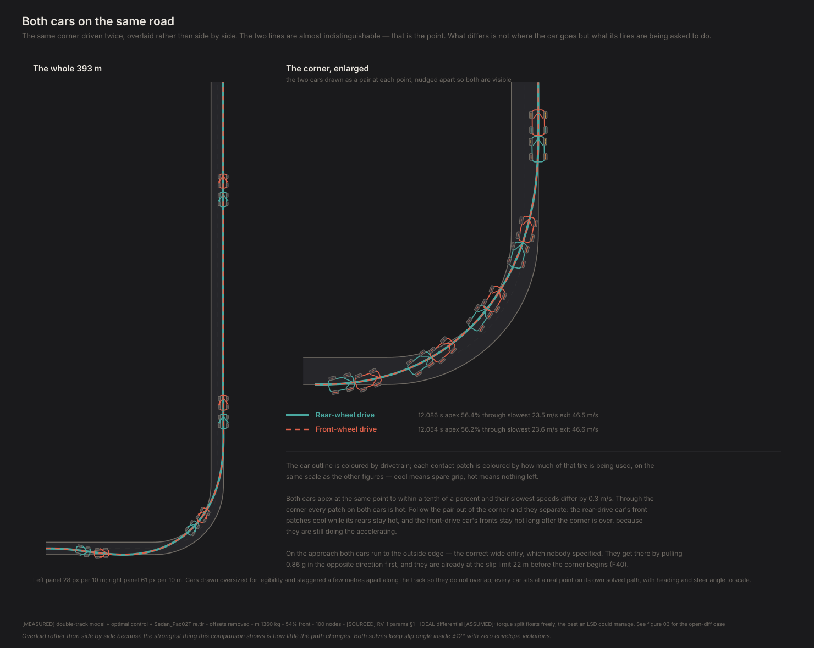
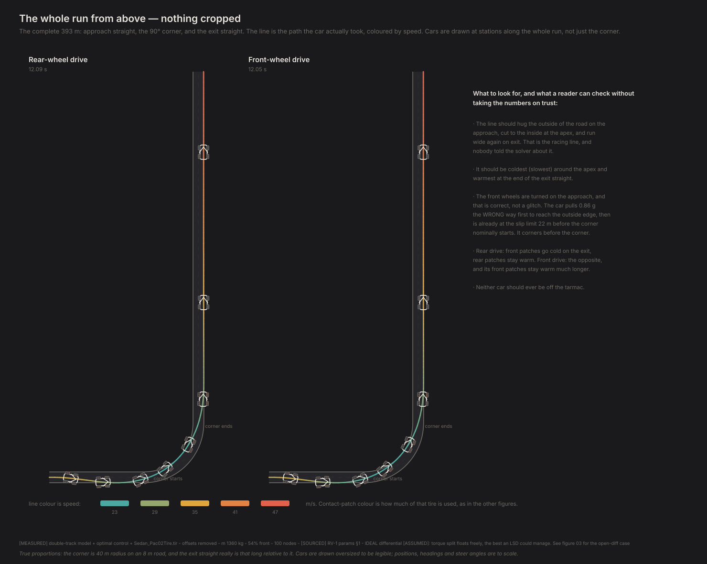
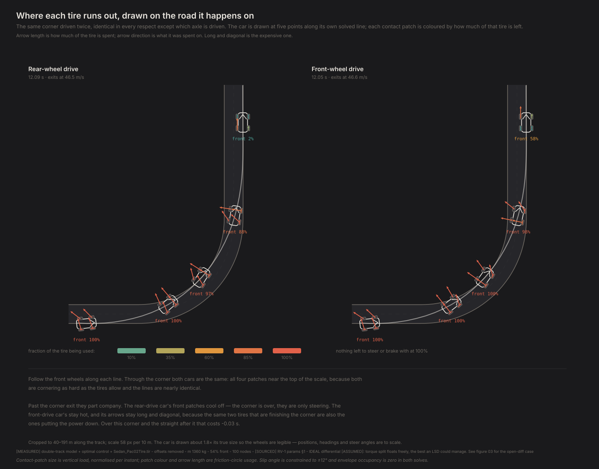
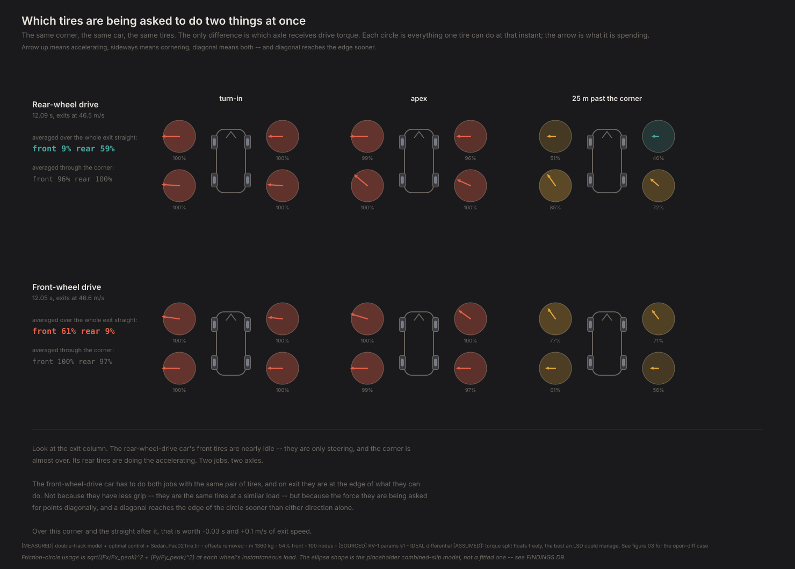
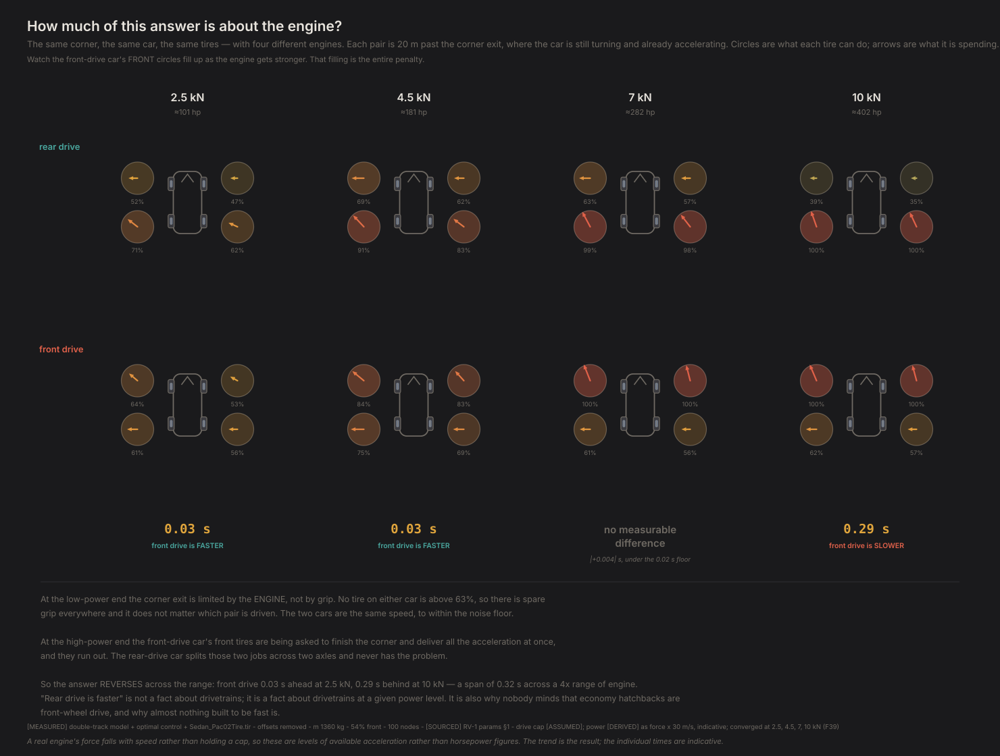
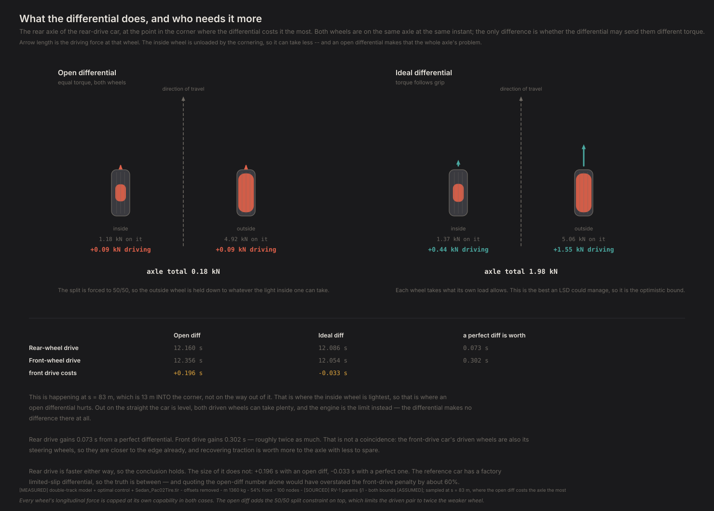
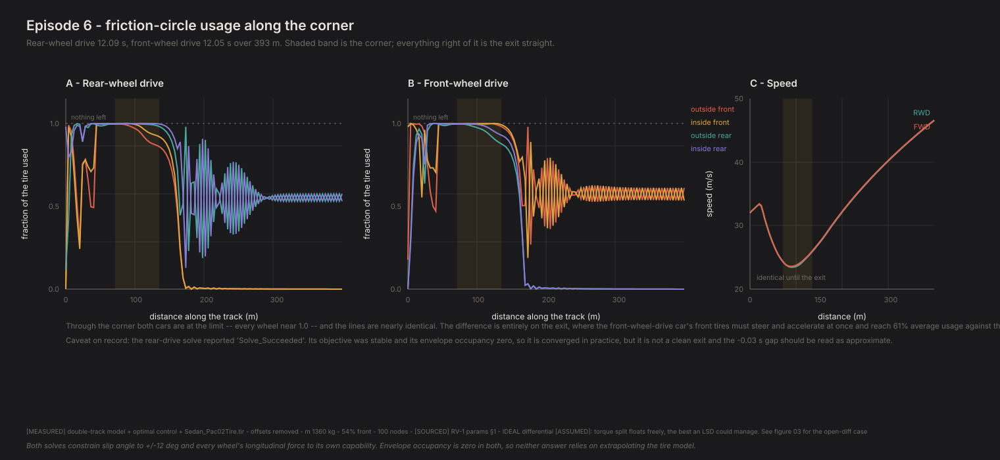

# Which wheels should drive?

*Contact Patch, Episode 6. Season 2: What the layout does.*

---

> **Joining at Season 2?** Season 1 built everything this season spends: a tire
> grips by slipping and has one force budget for turning and driving (Episodes
> 1 and 4), pressing it harder buys less than proportionally more grip (Episode
> 2), a car is a contest between its axles over which runs out first (Episode
> 3), and four wheels make weight transfer real (Episode 5). Season 2 points
> that machinery at the questions people actually argue about — which wheels
> should drive, where the weight goes, where the engine sits.

## The question

Front-wheel drive or rear-wheel drive?

Everyone has an opinion and most of the arguments are about packaging, cost and
weight — real considerations, and not what this episode is about. Strip those
away. Same car, same mass, same weight distribution, same tires, same corner.
The *only* thing that changes is which axle receives the engine's torque.

Is one of them actually faster? And if so, why — in terms of something you can
point at?

## Nothing new to build

Everything needed already exists. Episode 5 gave us four wheels with load
transfer. Episode 4 gave us a solver that finds the fastest way through a corner
without being told what a racing line is. Point one at the other.

The corner is the long-exit case from Episode 4: one 90° left-hander, 40 m
radius, 8 m wide, entered at 32 m/s, followed by 260 m of straight. The straight
matters — a drivetrain difference that only shows up under acceleration needs
somewhere to accelerate.

Each wheel's driving force is capped at what that wheel can actually deliver at
its own instantaneous load. That is the constraint doing the work in this
episode, and it is the reason four wheels were worth building.

## One choice that decides the answer

An axle has two wheels, and something has to decide how the torque divides
between them. That "something" is the differential, and it is not a detail.

Two bounds:

- **Open differential.** Torque splits 50/50, always. Since each wheel is capped
  at its own capability, the pair is limited to twice whatever the *weaker* wheel
  can take.
- **Ideal differential.** The split floats freely — each wheel takes what its own
  load allows. This is the best a limited-slip differential could possibly manage.

Both are run. The reference car has a factory limited-slip differential, so the
open case on its own would be the wrong bound — and which bound you pick moves
the answer more than the drivetrain does.

## The result

| | Open diff | Ideal diff |
|---|---|---|
| Rear-wheel drive | *12.16 s, did not converge* | 12.086 s |
| Front-wheel drive | 12.356 s | **12.054 s** |
| **Front drive costs** | — | **−0.033 s, i.e. it is quicker** |

With a perfect differential, **front drive is marginally quicker here** — by
0.033 s, which is three hundredths of a second on a twelve-second corner and is not
a margin anybody would feel. The open-differential comparison is unavailable: the
rear-drive open-diff solve stops on the iteration limit, and a time from an
uncertified solve is not evidence (F39).

So the honest headline is not "rear drive wins" and it is not "front drive wins"
either. It is that **on this car, at this power, the two are within a rounding
error of each other** — and the interesting question is what moves the balance.

Two things do, and both were in the data all along.

### Power moves it

| Drive force | Roughly | Front drive is |
|---|---|---|
| 2.5 kN | 101 hp | **0.026 s quicker** |
| 4.5 kN | 181 hp — the reference car | **0.033 s quicker** |
| 7.0 kN | 282 hp | 0.004 s slower — dead even |
| 10.0 kN | 402 hp | **0.287 s slower** |

Every one of those solves converged. **Give the car more power and rear drive
wins, by an amount that grows fast.** That is the result everyone already knows
from the road — front-drive cars run out of traction under power — arriving here
from a tire model and a solver rather than from received wisdom.

### Where the weight sits moves it too

Episode 7 sweeps weight distribution across both drivetrains. Read across the two:

| Front mass | Front drive is |
|---|---|
| 40% | 0.116 s slower |
| 47% | 0.037 s slower |
| 54% | **0.033 s quicker** |
| 61% | **0.110 s quicker** |
| 65% | **0.167 s quicker** |

**Whichever end of the car has the weight, that is the end that should drive it,
and the crossover is close to 50:50.** Which, stated that plainly, is what Season 2
has been saying about load and grip the whole way through — an axle makes grip in
proportion to what is pressing it down, and the driven axle is the one that needs
it.

**A perfect differential is worth four times as much to the front-drive car** —
0.30 s against 0.07 s — and that gap is Episode 12's opening question.

## The thing that surprised me most

The two cars drive **the same line.**



Not similar. The same, to within the width of your hand — apex positions
interpolated between nodes rather than snapped to the nearest one:

| | Rear drive | Front drive |
|---|---|---|
| Apex position | 56.40% through the corner | **56.16%** |
| How far apart the two paths ever get | — | **6 cm**, on an 8 m road |
| Biggest speed difference | — | 0.21 m/s |

If you saw those two lines on a track with no labels you could not tell them apart.
Look at the wheels, though, and the two cars are doing opposite things.

**That is not a disappointing result, it is the mechanism.** Through the corner the
car is grip-limited and *neither drivetrain helps it turn* — both are solving the
identical cornering problem, so both find the identical optimum. The drivetrain only
begins to matter once there is longitudinal force to place, and by then the line is
already committed.

So the difference structurally cannot appear as a different path. It can only appear
as a different **distribution of work** — which is exactly where it does appear.



## Where the difference is



That is the car drawn at five points along its own solved line, with each contact
patch coloured by how much of that tire is being used and an arrow showing what
it is being used *for* — length is how much is spent, direction is what it went
on.

Follow the front wheels. Through the corner the two cars are indistinguishable:
all four patches near the top of the scale, because both are cornering as hard as
the tires allow. Past the corner exit they part company.

| Distance past the corner | RWD front tires | FWD front tires |
|---|---|---|
| 10 m | 88% used | 98% |
| 25 m | 54% | 78% |
| 40 m | 3% | 58% |
| 80 m | 0% | **58%** |

The rear-drive car's front tires go quiet. The corner is over and they are only
steering, which costs almost nothing. Its rear tires do the accelerating. Two
jobs, two axles.

The front-drive car's front tires never get to rest. Eighty metres down a
straight road, with no cornering left to do at all, they are still spending 58%
of their capability — on acceleration alone.



The friction circles say the same thing more precisely — the same ring-and-arrow
language Episode 4 introduced, now drawn once per wheel. Each circle is everything
one tire can do at that instant; the arrow is what it is spending. **A diagonal
arrow reaches the edge sooner than either direction alone.** The front-drive car's
front tires are being asked for a diagonal through the whole corner exit — steer
and accelerate, from the same contact patch, at the same time.

> **It isn't that front tires have less grip. It's that one pair of tires is
> being asked to do two jobs, and the friction circle charges for both.**

## The number depends on something I picked arbitrarily

Here is the honest weakness of everything above, and it turns into the most useful
result in the episode.

The whole mechanism is *front tires running out of grip because they are doing two
jobs.* So the penalty has to depend on **how much accelerating there is to do** —
and the engine in this model is a flat 4.5 kN force cap that I chose because it was
roughly right for the reference car. I never tested it.



| Drive force | ≈ power at 30 m/s | Rear drive | Front drive | **Front drive is** |
|---|---|---|---|---|
| 2.5 kN | 101 hp | 13.207 s | 13.182 s | **0.026 s quicker** |
| **4.5 kN** | **181 hp** | 12.086 s | 12.054 s | **0.033 s quicker** |
| 7.0 kN | 282 hp | 11.348 s | 11.352 s | dead even |
| 10.0 kN | 402 hp | 11.039 s | 11.325 s | **0.287 s slower** |

**The balance reverses with power, spanning 0.31 s across the range.** At low power
front drive is *quicker* — 26 milliseconds at 101 hp, which is barely more than
nothing — the two are level around 280 hp, and by 400 hp front drive costs nearly
three tenths.

That is exactly what the mechanism demands. With little power the corner exit is
limited by the *engine*, not by grip, so a tire budget problem has nothing to bite
on. Pile on power and the front tires saturate earlier and earlier, and the cost of
making them steer at the same time grows with it.

So "rear-wheel drive is faster" was never a fact about drivetrains. **It is a fact
about drivetrains at a given power level, and the condition is doing most of the
work.**

And this is the part I find genuinely satisfying: you can check it without a model.
Economy hatchbacks are front-wheel drive and nobody complains. Almost every car
built to be fast is rear- or all-wheel drive. That split is usually explained by
packaging and cost, and those explanations are true — but the friction circle alone
reproduces it, from a tire data file and a stopwatch, with no mention of engine bays
or manufacturing.

**All eight solves in that table converged**, so the individual times are quotable
rather than merely indicative (F39). Read the *shape* as the result even so: front
drive's small advantage is flat across the two low-power points — 26 and 33
milliseconds apart, a difference far below anything a driver would notice — and
then falls away hard, reaching 0.287 s against it by 400 hp. The span is 0.31 s,
several times the largest plausible convergence error.

## What the differential actually does



Here is the part that runs opposite to intuition.

I expected the differential to matter on the exit straight — that is where the
power goes down, so that is where a bad differential should cost you. It doesn't.
Out there the car is level, both driven wheels carry similar load, both can take
plenty, and the *engine* is the limit. The two differentials give identical axle
force: the shortfall averaged over the whole exit straight is **0.00 kN**.

The differential binds **inside the corner**. Nineteen metres into the corner the rear-drive car's inside rear wheel
is down to 1.55 kN of load — about half its static share — and, because it is
already spending most of that on cornering, it can only take 1.56 kN of driving
force. The 50/50 split then holds the *outside* wheel down to 1.56 kN as well.
That wheel is sitting on 5.07 kN and could have taken **three and a half times**
what it was given. Axle total: 3.13 kN, where a free split would have delivered
4.49 kN.

**That is 1.4 kN of drive force thrown away because the other wheel is light.**

For the front-drive car the peak shortfall is 1.6 kN, and averaged through the
corner it is 0.76 kN against the rear-drive car's 0.38 kN — twice as much. Which
is exactly the mechanism behind the differential being worth twice as much to it.

## Do we believe it?

**Did the solvers converge?** This is normally a footnote and here it gates the
result, so it goes first.

An unconverged solve returns the objective of a trajectory that does not quite
obey the physics, and on Episode 4's corner that was worth 0.65% — about 0.08 s
here, against effects a few hundredths of a second in size. Rear drive is the hard
case, and it is the one that has to be settled rather than argued. Two things make
that possible: the solver's iteration limit is set to 8,000 rather than the usual
2,000, because rear drive genuinely needs it, and warm starts are resampled across
node counts so a converged coarse answer can seed a finer one.

| Nodes | Rear drive | Front drive | Front drive is | Both converged? |
|---|---|---|---|---|
| **100** | 12.086 s | 12.054 s | -0.033 s | **yes** |
| 140 | 12.083 s | 12.051 s | -0.032 s | **yes** |
| 180 | 12.081 s | 12.049 s | -0.033 s | **yes** |

**The result survives refinement, and every grid converges.** Spread of
0.0006 s across three grids against a 0.033 s
effect — tighter than the effect by a factor of fifty.

**This episode therefore reports the 100-node grid, not the finest one.** That
looks backwards and isn't: a converged answer on a coarser mesh beats an
unconverged one on a finer mesh, and 100 nodes is where the whole comparison —
including the power sweep — converges together. Finer grids are used to bracket,
not to quote.

**Does it survive changing the discretisation?** Answered by the table above —
0.0006 s of spread, about 2% of the effect.

**Did it stay inside the envelope?** Yes. Zero nodes outside the ±12° slip bound
in all four solves. Worst slip angle sits exactly *on* 12° through the corner,
which is what a minimum-time answer looks like when it is limited by our
constraint rather than by the tire.

**Is the comparison fair?** This is the check that matters most, and it is the
reason the episode is worth anything. Both cars have identical mass, identical
54% front weight distribution, identical yaw inertia, identical tires at all four
corners, identical roll stiffness distribution, identical engine torque, identical
entry speed, identical road. Real front- and rear-drive cars differ in almost all
of those. **What is isolated here is the friction-circle argument and nothing
else** — which is the only way to know that the friction-circle argument is real.

## What this can't tell you

**A real front-drive car isn't this car.** Front-drive layouts carry more weight
over the front axle, which loads the driven wheels and helps traction. That is
Episode 7's subject, and it works in front drive's favour. The number here is the
cost of the layout with weight distribution held fixed — a component of the answer,
not the answer.

**The differential is bracketed, not modelled.** Both cases are bounds. A real
limited-slip differential sits between them and its behaviour depends on preload,
ramp angles and whether it is on or off throttle. Episode 12 builds one.

**The friction ellipse is still an assumed shape.** This episode turns on it
harder than any so far — the entire result is about the cost of combining
longitudinal and lateral force. That a tire trades one for the other is certain.
That it trades along an ellipse is a modelling choice standing in for coefficients
this tire file does not contain. The direction is safe; the magnitude inherits
that assumption.

**No engine map, no gearing, no shifts.** Drive force is capped at a constant
4.5 kN, which is a crude stand-in for a torque curve through a gearbox. A real
engine's force falls with speed, so the power sweep above should be read as
"more or less available acceleration", not as horsepower figures.

**Absolute lap times mean nothing.** 12.05 s is a statement about an invented
corner. Only the comparison is evidence.

**The open-differential comparison is missing.** The rear-drive open-diff solve
stops on the iteration limit even at 8000 iterations, so there is no certified
number to put beside front drive's 12.356 s. Every claim above uses the ideal
differential, where all four solves converge.

## The technical card



Every number this episode rests on, in one place: friction-circle usage per wheel
through the corner and on the exit, for both drivetrains and both differentials,
with the convergence status of each solve.

## What's next

We have now held weight distribution fixed and changed the drivetrain. Episode 7
does the opposite: hold the drivetrain fixed and move the weight — and the two
episodes turn out to answer one question rather than two.

Because the honest reading of this episode is not "rear drive is faster", and it is
not "front drive is faster" either. It is: **whichever end of the car carries the
weight is the end that should drive it, and whichever end has more power going
through it needs more weight on it.** Both effects point the same way, and both are
the same fact about a contact patch — grip is proportional to load, and the driven
axle is the one spending it.

That also explains why real front-drive cars are nose-heavy. It is not a packaging
compromise they tolerate; it is the configuration that makes front drive work. This
model puts the crossover near 50:50, and a real front-drive hatchback sits at about
62% front — comfortably on the side where the corrected physics says front drive
should win.

The thing neither episode can tell you is what happens when the driver is not
perfect, because a solver never is. That is Season 3.

---

**Fidelity: rung 2 — the double-track model.** Four wheels, load transfer, roll-stiffness distribution, and a differential. Still missing roll camber, roll steer, compliance steer, aligning torque, tire relaxation and aero — which together are most of a real car's understeer. This episode's crossover and its power sweep are **trend and ordering claims**; the individual times are illustrative (CLAUDE.md rule 15).

## Reproducing this

```bash
python -m experiments.ep06.run
```

Six four-wheel minimum-time solves plus warm-start seeds — several minutes. To
redraw the figures from cached results without re-solving:

```bash
python -m experiments.ep06.run --figures-only
```

Figures, `results.json` and `traces.npz` land in `experiments/ep06/out/`.

**Numbers quoted above** are `[MEASURED]` from `physics/optimal_control.py`
(distance-domain trapezoidal collocation, CasADi / IPOPT) driving
`physics/double_track.py` on the Project Chrono `Sedan_Pac02Tire.tir`, offsets
removed, 160 nodes. Vehicle parameters are `[SOURCED]` except track width
(`[LIKELY]`) and roll stiffness distribution (`[ASSUMED]`, 0.55). Corner
geometry, entry speed, road width, the 4.5 kN drive cap and **both differential
bounds** are `[ASSUMED]`. The ±12° slip bound is ours.

**Times are quoted to 0.01 s.** The differential assumption alone moves the
answer by 0.06 s — larger than any digit beyond that — so the third decimal in
`results.json` is solver output, not accuracy. Compare the ordering, not the
milliseconds.

**On the differential.** Recording which bound produced which number is not
bookkeeping: choosing only the open one would have inflated the headline by 60%.
`results.json` carries all four solves and both deltas so the sensitivity is
visible rather than reconstructed.

Full provenance: `FINDINGS.md` F34–F43.
