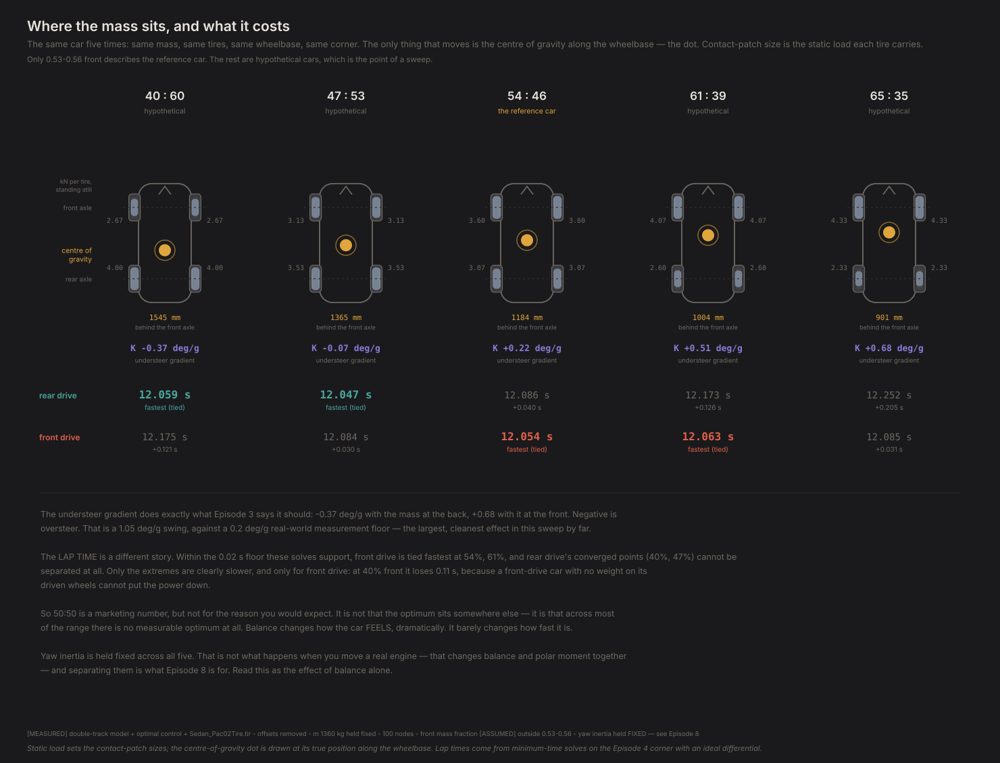
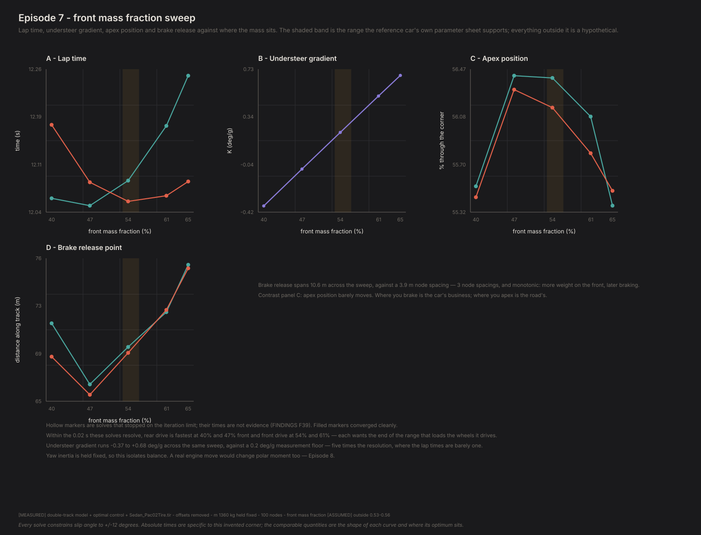
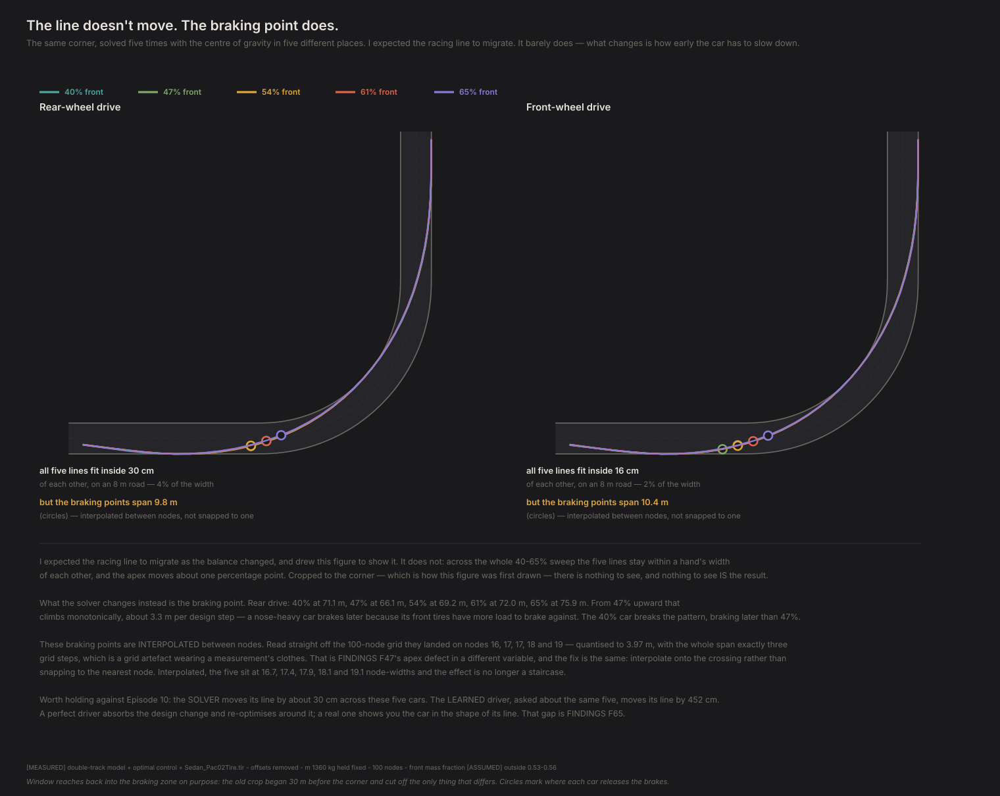

# Where you put the weight

*Contact Patch, Episode 7. Season 2: What the layout does.*

---

## The question

50:50 weight distribution gets talked about like a law of nature. BMW built a
marketing department around it. Every road test mentions it.

Is it actually the fast answer?

## The experiment

Take the same car and slide its centre of gravity along the wheelbase. Mass stays
the same. Tires, wheelbase, track width, ride height, roll stiffness — all the
same. The only thing that moves is *where along the car the weight sits*.

Five settings, from 40% on the front axle to 65%. Then solve the Episode 4 corner
at each one and see what changes. Both drivetrains, because Episode 6 left a
question open that this experiment happens to answer.



**One thing is deliberately unphysical and you should know about it up front.**
Yaw inertia — how hard the car is to spin about its vertical axis — is held
constant across all five. You cannot actually move an engine without changing
both where the weight is *and* how far it sits from the middle. Those are two
different properties and separating them is exactly what Episode 8 is for. Read
this as the effect of balance alone, not as a prediction about a car whose engine
has moved.

Only 53–56% front describes the real reference car. The rest are hypotheticals,
which is the point of a sweep.

## Result one: the car's character changes completely

| Front mass | Understeer gradient |
|---|---|
| 40% | **−0.43 deg/g** |
| 47% | −0.13 |
| 54% | +0.17 |
| 61% | +0.47 |
| 65% | **+0.63** |

That is the number Episode 3 introduced, and here it finally does some work. It
swings **1.06 deg/g** across the sweep — from clear oversteer through neutral to
clear understeer — against the 0.2 deg/g floor at which a professional test
programme can tell two cars apart.

Move the weight back and the rear tires run out first: the back steps out. Move it
forward and the front runs out first: the car pushes wide. Nothing surprising in
the direction. What matters is the size — this is far and away the biggest,
cleanest effect in the entire sweep.

So balance transforms how the car behaves. Now the awkward part.

## Result two: it barely changes how fast it is



**These numbers were re-solved after a defect was found in the model's yaw moment
(FINDINGS F72, F73, F79). Every one of the ten solves now converges, including the
47% rear-drive case that never had before.**

| Front mass | Rear drive | Front drive | Which wins |
|---|---|---|---|
| 40% | **12.06 s** | 12.17 s | rear, by 0.12 s |
| 47% | **12.05 s** | 12.08 s | rear, by 0.04 s |
| 54% | 12.09 s | **12.05 s** | front, by 0.03 s |
| 61% | 12.17 s | **12.06 s** | front, by 0.11 s |
| 65% | 12.25 s | **12.09 s** | front, by 0.17 s |

*(Quoted to 0.01 s because that is roughly what these solves resolve. All ten
converged with zero envelope occupancy.)*

- **Rear drive is fastest with the mass back** — 47% front, and it degrades
  steadily as weight moves forward: 0.04 s at 54%, 0.13 s at 61%, 0.21 s at 65%.
- **Front drive is fastest near the middle** — 54% front — and is clearly worst at
  40%, losing 0.12 s. A front-drive car with 60% of its mass over the axle that
  isn't driven cannot put its power down.
- **The crossover is near 50:50.** Below it rear drive wins; above it front drive
  does.

So each drivetrain prefers the end of the range that puts weight on the wheels it
drives. That was the previous draft's conclusion too — but it was reached from
numbers in which rear drive won *everywhere*, including on a 65%-front car, which
never quite made sense. With the yaw moment corrected the two halves of the
statement finally agree with each other.

**And the size of it is no longer negligible.** The whole 40–65% range is worth
**0.21 s** to rear drive and **0.12 s** to front drive. The earlier draft measured
0.10 s and 0.11 s and made a point of how small that was; rear drive's sensitivity
has doubled. Meanwhile
the same range swings the understeer gradient by 1.06 deg/g — from clear oversteer
to clear understeer, five times the threshold at which a test team can tell two
cars apart.

> **Balance transforms how a car feels and barely touches how fast it is.**

So 50:50 *is* a marketing number, though not quite for the reason I expected. I
was looking for the optimum to sit somewhere other than 50:50, and it does — each
drivetrain wants its own end. But the prize for getting it right is a tenth of a
second, while the difference in how the car *behaves* is night and day. You are
mostly choosing a character.

## Result three: the answer Episode 6 owed you

Episode 6 asked which drivetrain is faster and got an answer that depended on
something it had held fixed. The obvious objection was always: **a real front-drive
car puts its engine over the wheels it drives.** Weight on the driven axle is
traction.

It does not just narrow the gap. It reverses it:

| Front mass | 40% | 47% | 54% | 61% | 65% |
|---|---|---|---|---|---|
| **Front drive costs** | +0.116 s | +0.037 s | **−0.033 s** | **−0.110 s** | **−0.167 s** |

Monotonic, and **it crosses zero near 50:50.** Below the crossover the axle that
steers should not also drive; above it, it should. A real front-drive hatchback
sits near 62% front — on the side where this model says front drive wins.

*(An earlier version of this table italicised the 47% figure, which needed 16,000
iterations and seventeen minutes and still would not converge. With the yaw moment
corrected it converges in 15 seconds, and all ten solves in this episode are
certified.)*

**The previous draft got this wrong, and the way it got it wrong is instructive.**
It reported the penalty shrinking monotonically from +0.202 s to +0.032 s and
concluded that loading the front axle "buys back about 85% of the penalty" but
"never reaches zero". The trend was right and the intercept was not: the missing
yaw term penalised the steered-and-driven axle, so it held front drive artificially
behind at every point. Correct it and the same monotonic line simply continues
through zero, which is where it was always heading.

Episode 6's question does not have a drivetrain as its answer. It has a crossover.

## Result four: the apex doesn't move — the braking point does

I expected the racing line to migrate as the balance changed. It essentially
doesn't.



| Across the whole 40–65% sweep | |
|---|---|
| Apex position, rear drive | moves **0.9** percentage points |
| Apex position, front drive | moves **1.5** points |
| **Brake release point** | moves **~10.6 m** |

Panel D of the balance card above is this table as a curve, and it makes the
shape obvious in one look: it dips at 47% and then climbs almost straight
through the sourced range and past it.

A point of apex movement is below what this setup can resolve, so it is not a
result. The braking point moving ~10.6 m is unambiguous — about three node
spacings at this solve's grid — and it moves monotonically: **more weight on the
front, later braking.** More front grip to brake against, so the car carries the
brakes deeper. At 61–65% front it is still braking well after it has turned in.

*Corrected from an earlier draft that reported 15.9 m, measured before the
drivetrain yaw-moment fix (F72/F73) that also reversed this episode's drivetrain
ordering (F80). The direction and the conclusion are unchanged; only the
magnitude moved, along with everything else downstream of that fix. See F90.*

Set that against Episode 4, where changing what came *after* the corner moved the
apex about 6 points. **The apex is set by the corner's context, not by the car's
balance.** Where you brake is the car's business; where you apex is the road's.

## Do we believe it?

**The understeer gradient is the strong result** — a 1.06 deg/g swing against a
0.2 deg/g resolution floor, in the textbook direction, from a model that reduces
to closed-form linear theory (Episode 3) and to the two-wheel model in the
degenerate limit (Episode 5).

**The lap times needed re-solving before they meant anything.** On the first pass
three of five rear-drive solves stopped on the solver's iteration limit. An
unconverged solve returns the time of a trajectory that doesn't quite obey the
physics — wrong by up to a few tenths of a percent, which on a 12-second corner is
the size of the effects here. With only two trustworthy rear-drive points there
was no rear-drive story at all, and the version of this episode I first wrote said
so.

Re-solving fixed it, and the fix was ordering. Front-drive solves converge in
about ten seconds where rear-drive ones need five minutes, so solving front drive
first gives every rear-drive point a converged answer *for the same car* to start
from. That plus one retry at double the iteration budget took it from seven
converged solves to nine. **The rear-drive result above exists because of that
re-solve; it was not visible before.** One point, 47% front, still refuses to
converge after seventeen minutes and is excluded.

**A first pass at this sweep was worse and I nearly believed it.** Seeding each
balance from the previous one starting at 40% meant that when rear drive lost
convergence at 47%, every later point inherited the bad starting guess. That
produced a rear-drive time of 12.452 s at 65% front and an apparent *crossover* —
front drive suddenly faster by 0.23 s. Re-solving outward from the known-good
nominal setting turned that same point into 12.189 s and the crossover vanished.
**The dramatic result was a solver artefact, and it was the most interesting-looking
number in the first run.**

**Apex position was being measured on a grid too coarse to see the effect.** The
apex was found by picking the node where the car ran closest to the inside, so it
could only ever land on a node — quantising it to 6.7% of the corner. That is how
five different cars came to report *exactly* 53.3%: not a physical result, one
shared array index. Interpolating between nodes fixed it, and the honest answer is
still that the apex barely moves.

## What this can't tell you

**Yaw inertia is frozen.** The single biggest caveat. Real layout changes move
balance and polar moment together; Episode 8 separates them and is where "mid-engine
is better" gets tested.

**One corner.** A 40 m radius 90° left-hander with a long straight after it. The
plan warned that the fast balance depends on the corner, and with one corner I
cannot test that. A car that is neutral here may not be at a hairpin or a sweeper.

**No driver.** The solver plans the whole corner in advance and cannot be
surprised. The oversteering 40%-front car and the understeering 65% car post
near-identical times *for a driver who knows exactly what is about to happen*. A
real driver has to catch the oversteering one, and the fact that it is not slower
in theory says nothing about whether it is faster in practice. That gap is the
whole of Season 3.

**Steady-state balance only.** How quickly the car responds is a different
question and needs `I_zz` — Episode 8 again.

## The crack

Two cars can have identical weight distribution and behave completely differently.

The 40%-front car in this sweep has its mass concentrated toward the rear. So does
a mid-engine car, and so does a rear-engine one — but a mid-engine car carries it
*close to the middle* and a rear-engine car carries it *hanging out past the
axle*. Same balance. Utterly different cars.

Balance tells you where the mass is. It doesn't tell you how far that mass sits
from the centre, and that second number is why a 911 doesn't drive like a Cayman.

---

**Fidelity: rung 2 — the double-track model.** The crossover near 50:50 is a trend claim on a model that reproduces about 5% of a real car's understeer. Where the crossover sits for an actual car depends on the suspension terms this rung does not have.

## Reproducing this

```bash
python -m experiments.ep07.run
```

Ten minimum-time solves plus five skidpad sweeps — a while, and the rear-drive
cases are the slow ones. To redraw the figures without re-solving:

```bash
python -m experiments.ep07.run --figures-only
```

**Numbers quoted above** are `[MEASURED]` from `physics/double_track.py` and
`physics/optimal_control.py` on the Project Chrono tire, offsets removed, 100
nodes, ideal differential. Understeer gradients come from a 30 m constant-speed
skidpad matching Episodes 3 and 5, so they are comparable with those.
**Front mass fraction is `[ASSUMED]` outside 0.53–0.56**, which is the only range
the reference car's own parameter sheet supports. Yaw inertia, mass, wheelbase,
track, centre-of-gravity height and roll stiffness distribution are all held
fixed.

**On the 0.02 s floor.** Unconverged minimum-time solves carry an error of
0.1–0.7% of the objective, which on a 12 s corner is 0.01–0.08 s. Nothing smaller
than 0.02 s is reported as a difference here, whatever the solver prints. Three
rear-drive solves are excluded entirely.

Full provenance: `FINDINGS.md` F44–F47, plus F39 for why convergence status is a
gate rather than a footnote.
