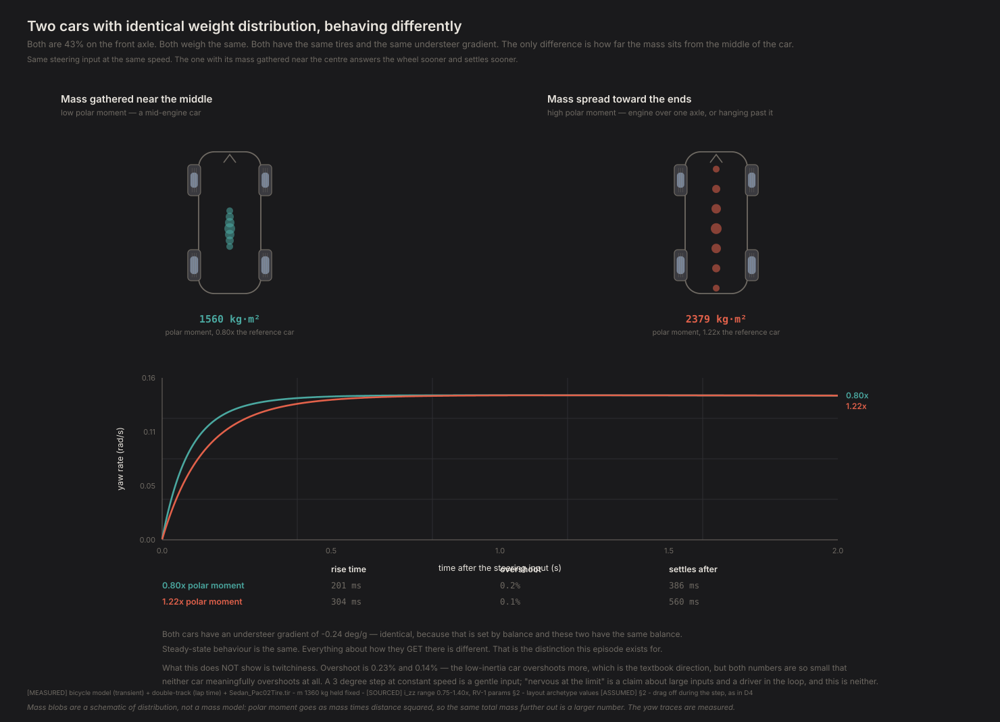
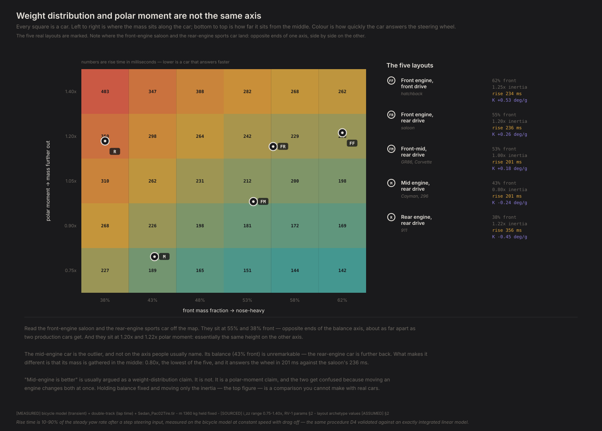
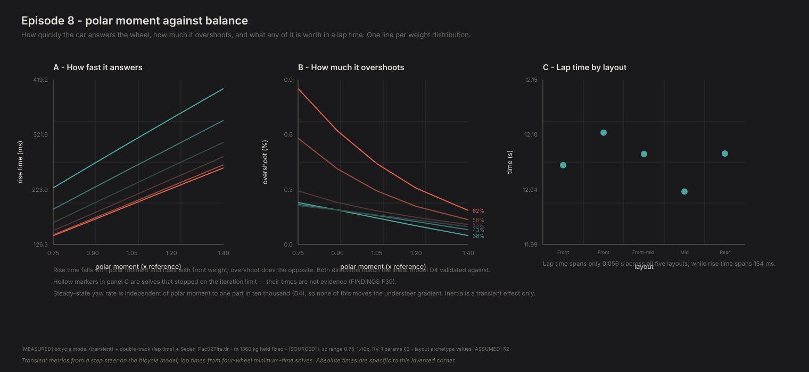

# Front, mid, or rear engine

*Contact Patch, Episode 8. Season 2 payoff.*

---

## The question

Everyone says mid-engine is better.

Better how, exactly? The usual answer is weight distribution — get the mass off the
nose, closer to 50:50, and the car handles. Except Episode 7 just spent a whole
episode on weight distribution and found it barely changes how fast the car is.

So either mid-engine isn't actually better, or it's better for a reason nobody
names.

## Two numbers, not one

Here is the distinction the whole episode turns on.

**Weight distribution** tells you *where along the car* the mass sits. 54% front,
46% rear.

**Polar moment of inertia** tells you *how far from the middle* it sits. Same
total mass, same balance — but gathered near the centre, or flung out toward the
ends.

You can feel the second number in your hands. Swish a broom side to side
holding it by the middle, then hold it near the brush and swing the same swing:
same mass, but with it all sitting far from your grip, the broom answers late
and argues. That reluctance is polar moment, and a car built with its engine at
one end carries it everywhere.

Those are different questions and you can have any combination of them. A car
with its engine ahead of the front axle and a car with its engine behind the rear
axle are at opposite ends of the *balance* axis, and both have a lot of mass a
long way from the middle.

The catch, and the reason this gets muddled: **you cannot move an engine without
changing both at once.** Every real comparison is confounded. A model isn't.



Both of those cars are 43% front. Same mass, same tires, same springs, same
everything — except how far from the centre the mass sits.

| | Mass gathered in | Mass spread out |
|---|---|---|
| Polar moment | 0.80× | 1.22× |
| **Rise time** | **201 ms** | **304 ms** |
| Settling time | 386 ms | 560 ms |
| Understeer gradient | −0.24 deg/g | **−0.24 deg/g** |

Identical understeer gradient, because that's set by balance and the balance is
the same. **Identical steady-state behaviour. A 51% difference in how long it
takes to get there.**

That's a comparison you cannot run with real cars, and it isolates exactly the
thing the mid-engine argument is actually about.

## The map

Now put both axes on one picture and mark where real layouts land.



| Layout | Front mass | Polar moment | Rise time | Understeer gradient |
|---|---|---|---|---|
| Front engine, front drive | 62% | 1.25× | 234 ms | +0.53 deg/g |
| Front engine, rear drive | **55%** | **1.20×** | 236 ms | +0.26 |
| Front-mid, rear drive | 53% | 1.00× | 201 ms | +0.18 |
| Mid engine | 43% | **0.80×** | 201 ms | −0.24 |
| Rear engine | **38%** | **1.22×** | 356 ms | −0.45 |

Look at the front-engine saloon and the rear-engine 911. **55% front against 38%
— about as far apart as two production cars get on balance. And 1.20× against
1.22× polar moment: the same height on the other axis.** On the map they sit at
opposite ends of one row.

Now look at the mid-engine car. Its balance is 43% front — **less rearward than
the 911's 38%.** If balance were the story, the 911 would be the extreme one and
the mid-engine car would be unremarkable.

What actually separates it is 0.80× polar moment: the lowest of the five, mass
gathered near the middle. That is the whole difference.

> **"Mid-engine is better" is a polar-moment claim that gets argued as a
> weight-distribution claim, because moving an engine changes both at once.**

There's a nice detail buried in that table too. The front-mid car (53% front,
1.00×) and the mid-engine car (43% front, 0.80×) reach **exactly the same 201 ms
rise time** by opposite routes — one is nose-heavier but carries more inertia, the
other is more rearward but gathers its mass in. Two axes, trading off.

## The uncomfortable part

None of it makes the car meaningfully faster.



All five layouts, every one cleanly solved:

| Layout | Polar moment | Rise time | Lap time |
|---|---|---|---|
| Mid engine, RWD | **0.80×** | 201 ms | **12.04 s** |
| Front engine, FWD | 1.25× | 234 ms | 12.07 s |
| Front-mid, RWD | 1.00× | 201 ms | 12.08 s |
| Rear engine, RWD | **1.22×** | **356 ms** | 12.08 s |
| Front engine, RWD | 1.20× | 236 ms | 12.10 s |

Quoted to 0.01 s, because these solves cannot resolve better than about 0.02 s
and printing milliseconds would be inventing precision. **Four of the five layouts
sit inside 0.04 s of each other.** Their polar moments run from 0.80× to 1.25× and
their response times from 201 to 356 ms.

**Across all five cars, response time spans 154 ms and lap time spans 0.056 s** —
barely above the floor, so read it as "almost nothing" rather than as a
measurement. The mid-engine car is the only one far enough clear to separate at
all, and it is quickest by 0.03 s over the next.

**The front-drive car is not the outlier you might expect either.** It comes in at
12.07 s, second quickest, inside the pack — which sits exactly where Episode 6
left things, with the two drivetrains within 0.03 s of each other at this car's
power. Whatever the friction circle charges a front-drive car for steering and
accelerating at once, it is not big enough to show up in a layout comparison.

Three episodes in a row now: Episode 6 finds the drivetrains within 0.03 s at this
car's power, Episode 7 finds 0.12–0.21 s across the whole weight-distribution range,
and Episode 8 finds 0.056 s across the full range of polar moment. Meanwhile the
cars are behaving *completely differently* — oversteering, understeering, darting,
dawdling.

Something is wrong with the question.

## What's wrong with the question

The solver plans the entire corner before it turns the wheel.

It knows precisely when the corner arrives. So for a car that takes 356 ms to
respond instead of 201 ms, it simply **starts steering earlier.** The delay costs
almost nothing, because the delay is perfectly predictable and the solver has
perfect foresight.

A real driver does not have that. A real driver reacts to what has already
happened — the car starting to slide, the corner tightening, the surface changing.
For them, 155 ms is 155 ms of the car not doing what they just asked, arriving at
exactly the moment they are trying to correct something.

**Response time is nearly free if you know the future and expensive if you don't.**

That is why every "which layout is faster" answer in Season 2 has come back
smaller than expected. We have been asking a question about driveability using a
driver for whom driveability does not exist.

## Do we believe it?

**The transient results are the strong ones.** They come from the bicycle model,
whose step response D4 validated against an exactly integrated linear model to
within 3%, across the same inertia range used here. Yaw inertia is a rigid-body
property — lateral load transfer does not change it — so the four-wheel model
would add nothing. Rise time rising with polar moment and falling with front
weight is textbook, and D4 checks that direction independently.

**Steady state does not move.** D4 established that final yaw rate is independent
of polar moment to one part in ten thousand. Inertia is purely a transient effect,
and the understeer gradients in the table above depend only on balance — which is
why the two cars in the controlled pair share one to the decimal.

**The lap times converged**, and getting there is a matter of ordering. Every
layout is seeded from the front-drive solve — which converges in about 13 seconds
where the rear-drive ones need five or six minutes — with one retry at double the
iteration limit behind it. Seeding from the *easiest* member of the family rather
than the most typical one is what does it. All five
solves report clean convergence with zero envelope violations, so nothing above is
excluded.

**And the plan expected something this doesn't show.** It predicted low polar
moment would be "twitchier at the limit". Measured overshoot: 0.23% at 0.80×
against 0.14% at 1.22×. The direction is right — lower inertia overshoots more —
but both numbers are so small that neither car meaningfully overshoots at all. A
3° step at constant speed is a gentle, nearly linear input with no driver in the
loop, and "nervous at the limit" is a claim about large inputs near saturation
with a human correcting. Calling a 0.09 percentage-point difference twitchiness
would have been dressing up noise.

## What this can't tell you

**No driver.** Stated three times now because it is the binding limitation of the
whole season.

**One corner.** A 40 m radius left-hander. Response time should matter more where
direction changes come quickly — a chicane, an esses sequence — and this corner has
exactly one direction change.

**Archetype numbers are assumed.** The balance and inertia values for the five
layouts are plausible figures from the reference sheet, not measurements of
specific cars. The *ordering* is the claim; treat individual values as
illustrative.

**Inertia is imposed, not derived.** We set polar moment directly rather than
building a car out of components and computing it. That is the right way to
isolate the effect and the wrong way to ask "what would this engine placement
actually give me?"

## What you can now explain

Season 2's design findings, in the form you would actually say them:

- **Which wheels should drive: whichever end carries the weight.** And the
  answer flips with power — front drive is fine at hatchback power, and the
  more power you add, the more rear drive wins. (Episode 6)
- **Why 50:50 is mostly marketing.** Balance transforms the car's character —
  a full swing from oversteer to understeer across the sweep — while moving
  lap time by tenths. You are choosing a personality, not a lap time.
  (Episode 7)
- **Why "mid-engine is better" is argued with the wrong number.** The
  mid-engine car is less rearward than a 911; what separates them is how far
  the mass sits from the middle, not where the balance lands. (Episode 8)
- **The season's quiet lesson:** a driver with perfect foresight makes every
  design question look smaller than it is. Response time is nearly free if
  you know the future — and no real driver does. (Episode 8)

## The crack

Everything in Seasons 1 and 2 assumes a driver who knows the future.

That driver has told us: the racing line barely changes with the car, weight
distribution is nearly free, and polar moment is worth thirty milliseconds. All
true, and all quietly useless for choosing a car to drive, because the one thing
that driver cannot experience is being surprised.

There is a whole category of question underneath: *what happens when the grip
isn't what you expected?* Which setup is fast but fragile? Which car gives you
warning before it lets go? None of these can be put to a solver that already knows
the answer.

To ask them, you need a driver that reacts instead of plans — one that has to
learn what the car does by driving it.

Season 3 builds one.

---

## Reproducing this

```bash
python -m experiments.ep08.run
```

Thirty step-steer runs (fast), twelve skidpad sweeps, and five four-wheel
minimum-time solves (slow — the rear-drive ones take several minutes each). To
redraw the figures:

```bash
python -m experiments.ep08.run --figures-only
```

**Numbers quoted above.** Transient metrics are `[MEASURED]` on
`physics/bicycle.py` with a 3° step at 25 m/s, drag disabled so speed does not
drift during the response window — the same procedure as `diagnostics/D4_transient.py`,
which validates it against an exactly integrated linear model. Understeer
gradients come from a 30 m constant-speed skidpad on `physics/double_track.py`,
matching Episodes 3, 5 and 7. Lap times are four-wheel minimum-time solves with an
ideal differential at 100 nodes.

**Polar moment range is `[SOURCED]`** — 0.75× to 1.40× of the reference car, from
the parameter sheet §2. **The five layout archetypes are `[ASSUMED]`**: plausible
balance and inertia figures for each configuration, not measurements of named
cars. The ordering between them is the finding; the individual values are
illustrative.

**On excluded solves.** Any minimum-time solve that stops on the iteration limit
returns the time of a trajectory that does not quite obey the physics, and is
excluded from every comparison here — see `FINDINGS.md` F39.

Full provenance: `FINDINGS.md` F48–F50, plus D4 for the step-response validation
this episode rests on.
