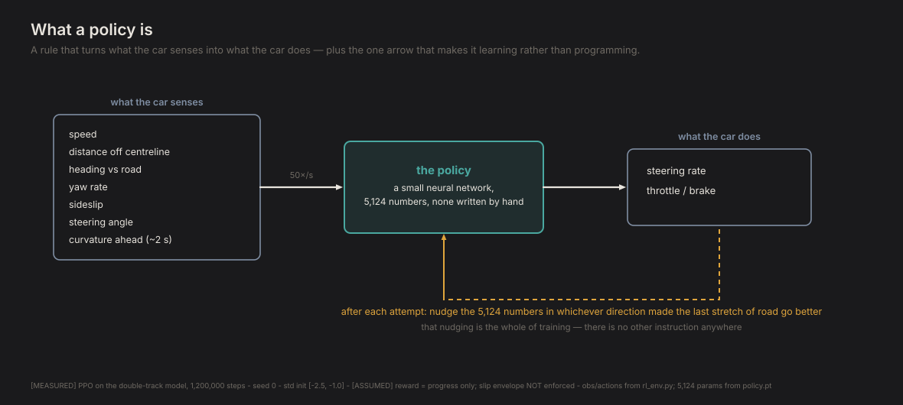
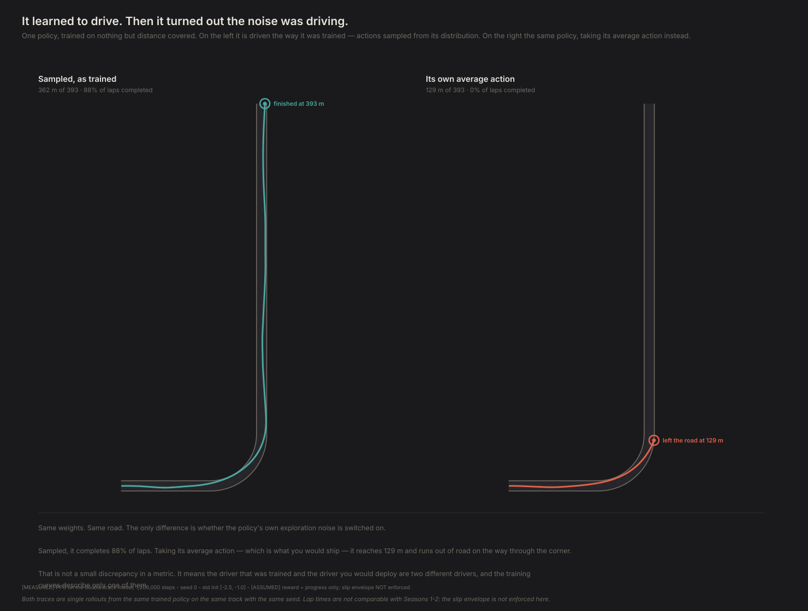
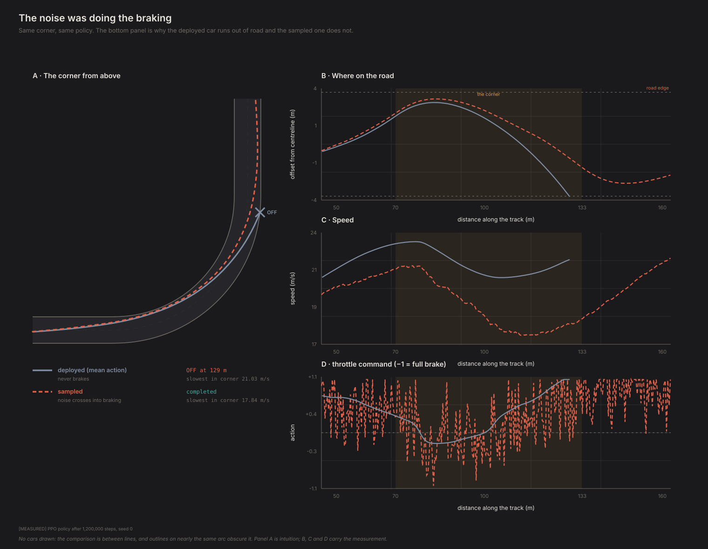
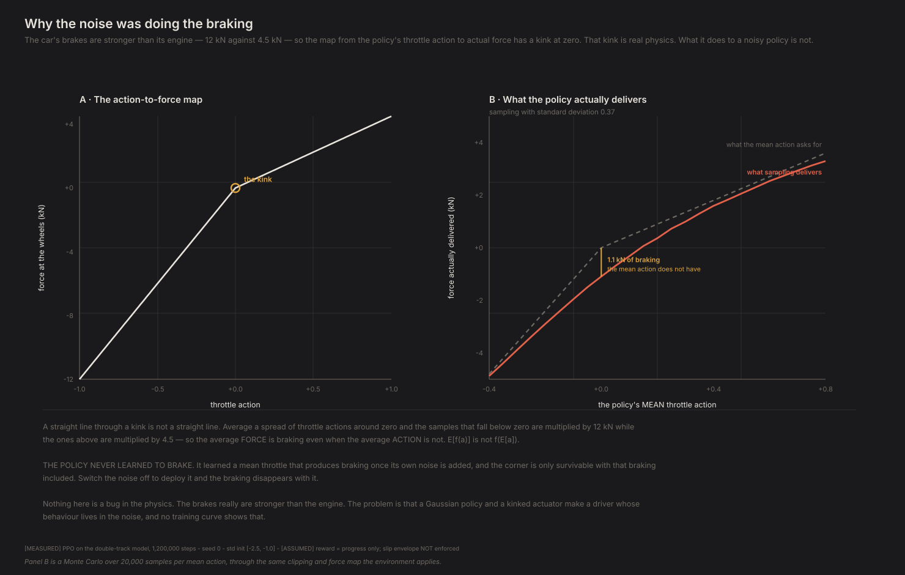
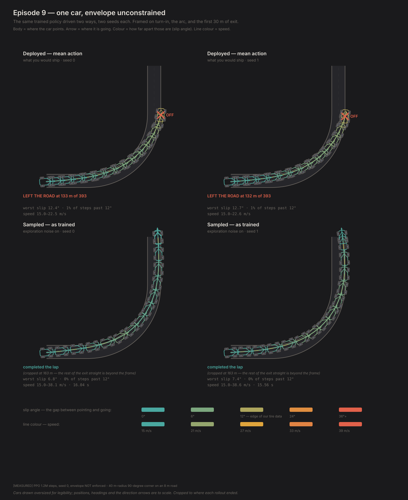
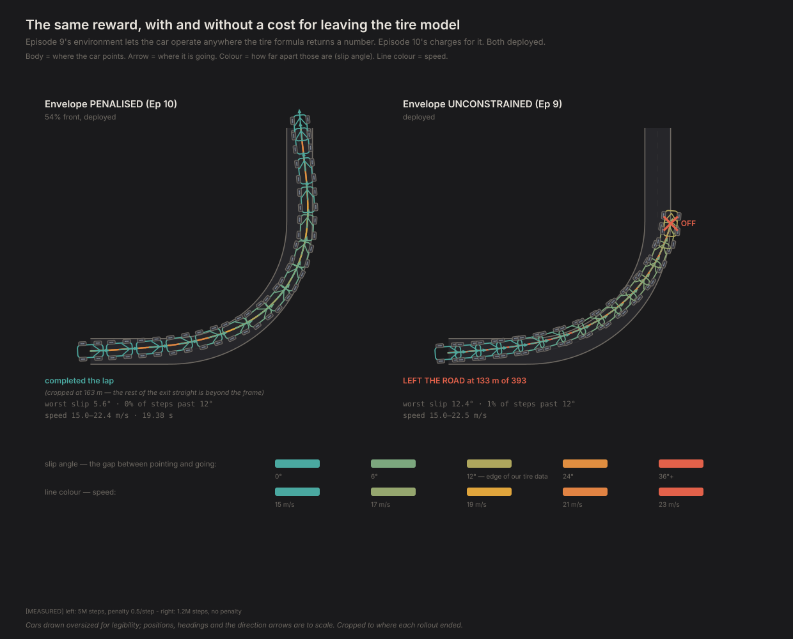
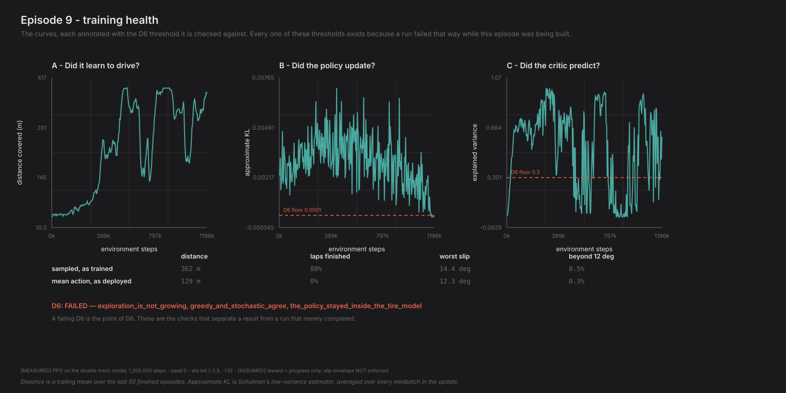

# Teaching a car to drive, and watching it cheat

*Contact Patch, Episode 9. Season 3: The driver.*

---

## The question

Everything so far has been driven by a solver that sees the whole road. It knows
where the corner is before it turns the wheel, it knows exactly how much grip
every tire will have, and it cannot be surprised.

That driver has spent three episodes telling us that almost nothing about the car
matters. Weight distribution: nothing measurable. Polar moment: thirty
milliseconds. Drivetrain: a tenth of a second. All true, and all suspicious,
because the one thing that driver cannot experience is not knowing what happens
next.

So: **can something learn to drive fast with no instruction at all — just a
stopwatch?**

Short answer, up front: **no — and the two things it learned instead are worth
more than a policy that had simply worked.**

## The setup

A car on the same corner. Fifty times a second it gets a handful of numbers —
speed, how far off the centreline it is, which way it's pointing relative to the
road, yaw rate, sideslip, current steering angle, and the curvature of the road
about two seconds ahead. It chooses a steering rate and a throttle position. Then
it finds out what happens.

**The thing doing the choosing is called a policy**, and it is worth being
concrete about what that means, because it is the artefact this whole season
produces. A policy is just a rule that turns what the car senses into what the
car does. Ours is a small neural network — 5,124 numbers, counted from the saved
policy file — and "training" means nudging those numbers, over and over, in
whatever direction made the last few seconds go better. Nobody writes the rule. Nobody knows what it says
afterwards. You get a driver and a stopwatch, and the only way to find out what
it learned is to watch it drive.



That dashed amber arrow is the entire difference between this season and the
solver seasons: the boxes stay the same, and the numbers inside the middle one
get nudged after every attempt.

**The reward is distance covered. That's all.** No reward for staying on the road
beyond a penalty for leaving it, no shaping toward a racing line, no penalty for
sliding. "Just a stopwatch" is meant literally, because anything more sophisticated
that shows up has to have been discovered rather than encoded.

**And one deliberate omission.** Every minimum-time solve in Seasons 1 and 2
constrained slip angle to ±12°, because a solver handed an unconstrained tire
model will drive at 30° of slip where the Magic Formula is extrapolating and
return a lap time that describes our curve fit rather than a car. **That
constraint is absent here.** The envelope is measured every single step but
nothing stops the policy going there. The whole point is to find out what a
learner does with physics that is wrong somewhere nobody fenced off.

## It did not learn

After 1.2 million steps of trial and error, **the policy you would actually ship
completes 0% of laps.** It reaches 129 m of a 393 m track and leaves the road, every
single time.

That is the result, and it is not the one the training run reports. Measured the
way training measures it, the same policy reads: *88% of laps completed, 362 m
average, nobody told it about racing lines or apexes.* Which is true of the policy
**as it was measured during training** — and training measures a policy that is
still adding random noise to every action it takes. Take the noise away, which is
what deploying means, and there is no driver there.

> **A reinforcement-learning result is the deployed policy's performance.** For a
> Gaussian policy that means the mean action. If the sampled policy scores well and
> the mean action fails, the run has not produced a driver — its competence lives in
> the exploration noise.

That is a rule in this project (FINDINGS F61) and a gate in its training
diagnostic, and it exists because of this episode.

So the honest question is not "did it learn to drive?" It is: **what did it learn
instead, and how did that get mistaken for driving?** There turn out to be two
answers, and both are more interesting than a policy that just works.

## The same policy, twice



Those are two rollouts of **the same trained policy**, same weights, same road,
same seed. The only difference is how you ask it for an action.

A policy like this doesn't output an action — it outputs a *distribution* over
actions, and during training you sample from it. That's the exploration. When you
deploy one, you normally stop sampling and take the average action, because you
want the behaviour without the dithering.

| | distance | laps finished |
|---|---|---|
| Sampled, the way it trained | **362 m** | **88%** |
| Its own average action | **129 m** | **0%** |

The deployed version doesn't get round the corner. Not slower — it runs wide and
ends up in the scenery, every time. And note the standard deviation on that 129 m:
**zero**. A deterministic policy in a deterministic environment fails the same way
to the metre.

> **The driver that was trained and the driver you would ship are two different
> drivers, and every training curve in the run describes only one of them.**

## Shortcut one: the noise was doing the braking



Before the arithmetic, look at the bottom panel of that figure, because it settles
the question on its own. Down the entry straight the deployed policy commands
**+0.55 throttle on average and never once goes below +0.32.** It does not brake.
It arrives at the corner at **22.9 m/s** and runs out of road.

The sampled policy's noise crosses into braking, it arrives at **21.5 m/s**, and it
gets round.

Here is why the mean action cannot do what its own samples do.

## Why



The car's brakes are stronger than its engine. 12 kN of braking against 4.5 kN of
drive — which is true of essentially every road car, and is exactly right in the
model.

That means the map from the policy's throttle number to actual force **has a kink
at zero.** Above zero you multiply by 4.5; below zero you multiply by 12.

Now put a noisy policy through that kink. The samples that land below zero get
multiplied by the big number; the ones above get the small one. So the *average
force* is not the force of the *average action*:

| Mean throttle | What the mean action asks for | What sampling actually delivers |
|---|---|---|
| +0.30 | +1350 N | +939 N |
| **0.00** | **0 N** | **−1183 N** |
| −0.10 | −1200 N | −2035 N |

At a mean throttle of exactly zero, the noisy policy delivers **more than a
kilonewton of braking that the mean action does not have.**

**The policy never learned to brake.** It learned a mean throttle that produces
braking once its own randomness is added to it, and the corner is only survivable
with that braking included. Turn the noise off to deploy it, and the braking goes
away too.

It found a control input I didn't know I'd given it.

## Shortcut two: it turned its own randomness up

The policy's noise level is a learned parameter — it can turn its own randomness
up or down. A converging policy normally turns it *down*: it becomes more
decisive as it gets better.

This one turned it **up**.

The obvious explanation is the entropy bonus, a standard term that rewards
randomness to stop policies collapsing too early. So I ran it again with that term
set to exactly zero:

| Entropy bonus | Throttle noise |
|---|---|
| **None at all** | 0.368 → **0.383** |
| The usual small amount | 0.368 → 0.381 |

Identical. **The noise growth isn't the bonus — it's the policy's own gradient.**
Which is what you'd expect if the noise is doing useful work.

I want to be careful here: it's a 4% rise, and that's corroboration, not proof.
The hard evidence for noise-as-a-control-input is the 64% gap and the arithmetic
above. But it's the right sign, and "entropy is rising, turn down the entropy
coefficient" — the obvious reading — would have been wrong.

## What it actually looks like on the road

Two shortcuts described in arithmetic is not the same as seeing them. These are the
laps themselves.



The car is drawn along its own path, coloured by how hard the tires are working and
angled by where the body is actually pointing. The deployed policy's run ends at
129 m with the nose still aimed down the road it has just left.



And the comparison that sets up the next episode: the same corner in the
unconstrained environment this episode uses, beside the penalised one Episode 10
switches to. Same code, one line of configuration apart.

## The thing I expected to be the story, and wasn't

Going in, I expected this to be the episode. A policy rewarded only for progress,
handed a tire model with no guardrails, should discover that the Magic Formula
keeps returning force at 25° of slip where no tire was ever measured, and live
there.

It does go outside — worst slip **15.2°** against our 12° bound with the actions
sampled, about 1% of steps beyond it, and the deployed policy peaks at 12.8° with
2.5% of its steps outside. Nothing stops it. That's real, and D6 fails the run
for it.

But it's a footnote, not the story. **The policy isn't fast enough to be tempted
yet.** The tire-model exploit is available to something operating at the limit
everywhere, and this one finishes 88% of *sampled* laps at a moderate pace, and no
deployed ones at all. I expect this to
grow in Episodes 10 and 11 as the policies get quicker, and it gets re-checked
there.

The prediction was right about the mechanism and wrong about the timing.

## D6, and why it exists



Building this episode produced six failures. Here is the complete list, and the
thing they have in common:

1. **The policy never updated.** The value loss starts near 1600 and its gradient
   was 150× the policy's; one shared gradient clip scaled both by 0.0067. 250,000
   steps, effective learning rate 2×10⁻⁶.
2. **Exploration was 16× too large.** The corner needs a steering action of 0.037;
   the conventional starting value searches with 0.61.
3. **Exploration was also 10× too small** — for the other action. Throttle and
   steering have useful scales an order of magnitude apart, and one number was
   serving both. The policy sat at full throttle for half a million steps because
   it never once sampled the brakes.
4. **The task was physically impossible.** The corner caps at 19.3 m/s and the
   environment started the car at 32, a number copied from the optimal-control
   episodes where a solver that sees the whole road plans the braking trivially.
5. **The critic stopped predicting**, mid-run, while returns still looked fine.
6. **The deployed policy was a different driver** — the one above.

**Not one of them raised an error.** Every single one produced a training run with
moving curves, falling losses, and nothing to suggest anything was wrong. Four of
them produced a policy that had learned literally nothing while the plots went up
and to the right.

That's what D6 checks. Nine tests, seven of them written from a failure that
actually happened here rather than one I imagined. The useful ones compare a
hyperparameter against a **derived property of the task** — the corner needs a
0.037 steering action, the corner caps at 19.3 m/s — rather than against
convention. Those would have caught four of the six before an hour of compute was
spent.

**D6 fails this run**, on four of its twelve checks: the noise growth, the
deployed policy not completing the task, the greedy/sampled gap, and the
tire-model excursion. That is the correct outcome and the run is reported as
failing. A diagnostic that passes whatever you show it is decoration.

## Do we believe it?

**The environment was tested before anything was trained in it.** Fourteen checks,
most comparing against geometry the integrator doesn't have access to. The
important one drives the car round the corner at the textbook Ackermann angle and
confirms it tracks the centreline. That check has teeth: get the curvilinear
kinematics wrong — integrate the heading before computing the arc-length rate, or
use the wrong term for the road's own rotation — and the car still produces
perfectly smooth, entirely plausible laps that no amount of watching would flag.

**The greedy/stochastic gap is not a measurement artefact.** Eight seeds each
way, the deployed policy covers 128.7 m with a standard deviation of **zero** —
it fails identically every time — while the sampled one covers 232 m on average
and finishes 38% of the time. The sampled spread is enormous (sd 125 m), which is
the point: its competence lives in the noise, so it varies with the draw. The
mechanism is arithmetic that can be checked by hand.

**The lap times are not comparable with Seasons 1 and 2** and are not quoted as
though they were. Different entry speed, and the slip envelope is not enforced.

## What this can't tell you

**One seed.** Everything here is seed 0. The failures are structural and would
reproduce, but the specific distances would not, and there is no seed spread on
any number in this episode. That is the biggest hole in it.

**One corner, one car.** And the next episode's whole subject is that this policy
only knows how to drive *this* car.

**It isn't fast.** It finishes laps; it does not threaten the optimal-control
solver's time, and I have not compared them, because the envelope difference makes
that comparison meaningless as posed. Episode 10 sets it up properly.

**The environment is still a model.** A learner that exploits a kink in an
actuator map will exploit anything else that is wrong, and the only defence is
instrumentation plus the suspicion that a good result deserves.

## The crack

So: can something learn to drive with nothing but a stopwatch?

**Not this time.** What 1.2 million steps produced was a policy that finishes 0% of
laps when you deploy it, and gets round 88% of the time only while it is still
shaking. Two shortcuts, neither of them driving: one that borrowed braking from its
own randomness through a kink in the actuator map, and one that turned that
randomness *up* because it was load-bearing.

I want to be precise about what that does and does not mean. It is not that
reinforcement learning cannot drive a car — Episode 10 trains one that can, in the
same environment, with one change. It is that **this run produced a number that
looked like success and wasn't**, and that nothing in the training curves said so.
The reward went up. The losses went down. The policy was learning something the
whole time; it just wasn't driving.

The uncomfortable part is how easily this passes for success. The curves rise, the
losses fall, the sampled finish rate is 88%, and every one of those numbers is
real. What separates them from a driver is the one number a training run does not
print: what does the thing you would actually ship do?

Season 2 swept hundreds of designs with a solver that was the same solver every
time. This driver is not the same twice, and cannot drive a second car at all.

So the question for Episode 10 isn't "can it learn to drive?" It's: **how do you get
one driver good enough at driving in general that you can put it in any car and
trust the comparison?** — and, quietly underneath that, how do you know when you
have one.

---

## Reproducing this

```bash
python -m experiments.ep09.run
```

Trains for 1.2 million steps — about fifteen minutes on a laptop CPU — then runs
D6 over the result and writes the figures. Add `--quick` for a 40,000-step wiring
check, which fails D6 and is supposed to.

```bash
python -m experiments.ep09.run --figures-only
```

**Numbers quoted above** are `[MEASURED]` from `physics/ppo.py` driving
`physics/rl_env.py` on the four-wheel model with the Project Chrono tire, offsets
removed. The reward is progress only; the slip envelope is instrumented every step
and **deliberately not enforced** — see the module docstring, and the test named
`test_the_envelope_is_not_enforced`, which exists so a future change cannot
quietly add the constraint and erase the episode's premise.

**Hyperparameters are `[ASSUMED]`** but not arbitrary: the exploration scales are
derived from the steering action the corner requires and are documented with that
derivation in `PPOConfig`. The 15 m/s entry speed is a task-design choice, argued
in `EnvConfig`.

**Everything in this episode is one seed.** Treat every distance as illustrative.

Full provenance: `FINDINGS.md` F51–F56, and `diagnostics/out/D6.md` for the
generated training-health write-up.
