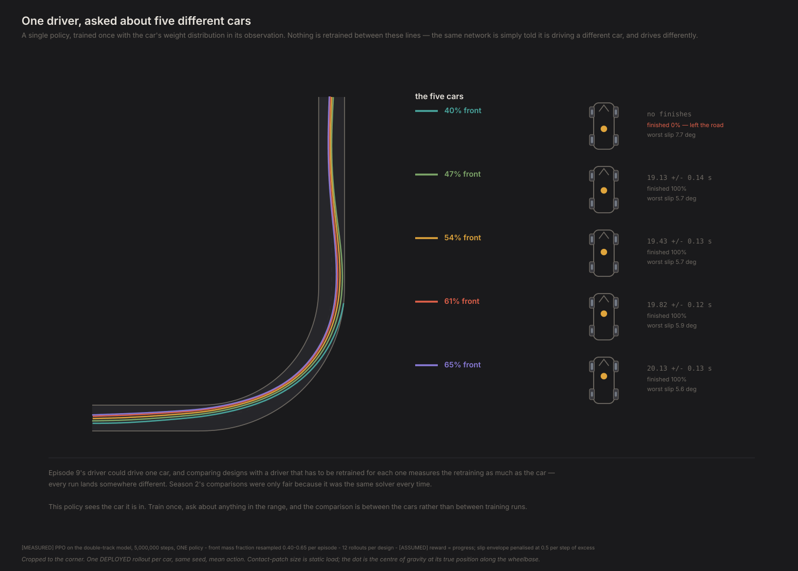
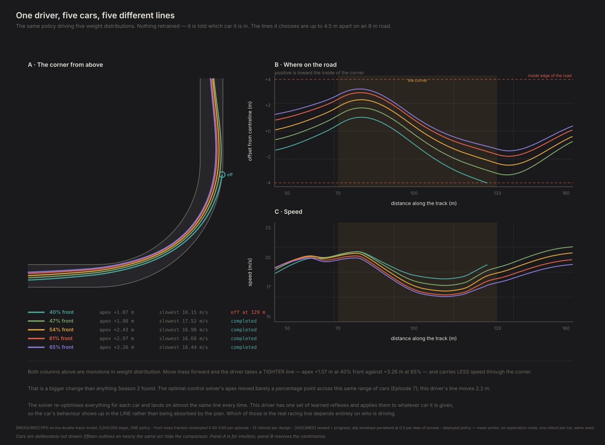
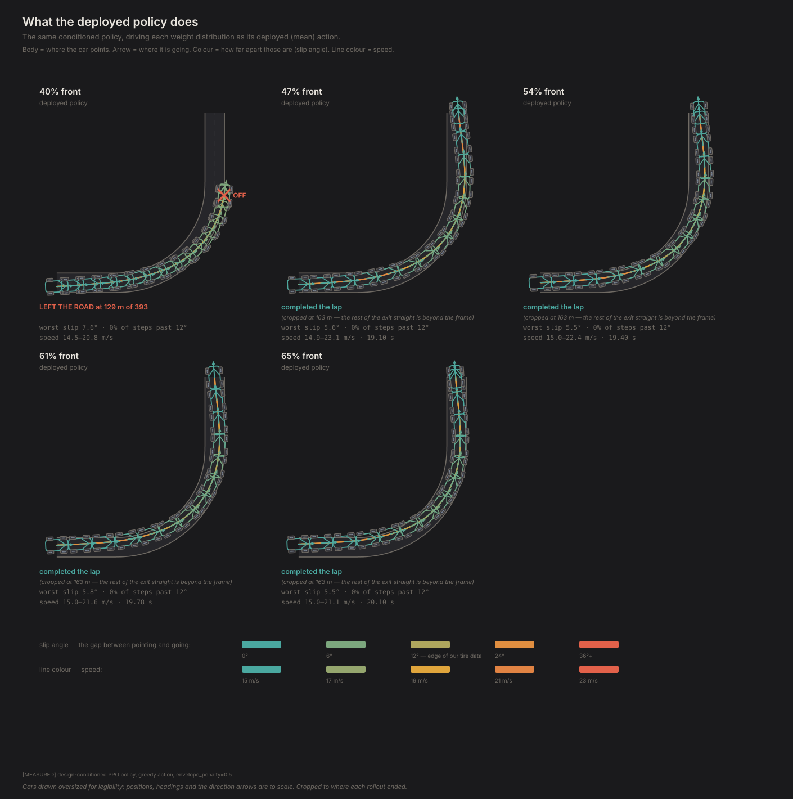
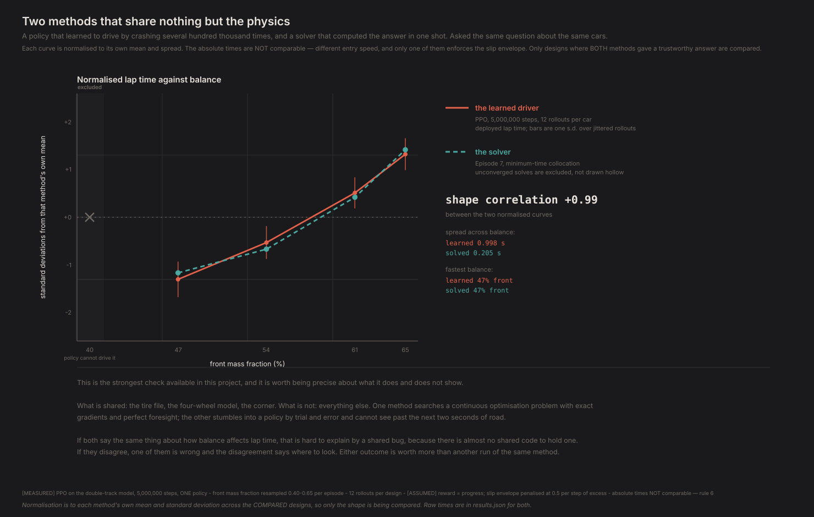
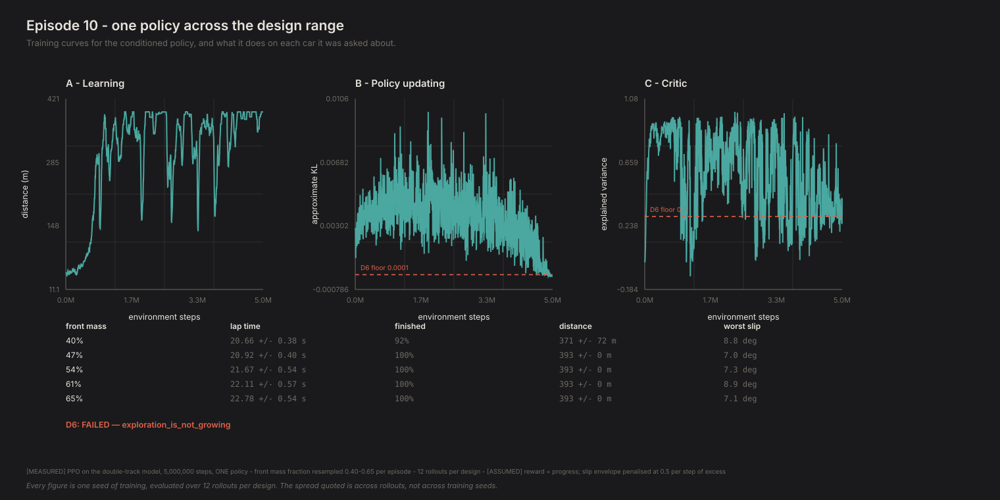

# One policy, a thousand cars

*Contact Patch, Episode 10. Season 3: The driver.*

---

## The question

Episode 9 produced a driver that could drive one car, badly, after 1.2 million
attempts. Season 2 compared hundreds of designs.

So there's an arithmetic problem and a subtler one. The arithmetic problem is
cost. The subtler one is that **a driver retrained for each car measures the
retraining as much as the car.** Every training run lands somewhere slightly
different, so a comparison between two cars driven by two separately-trained
policies is partly a comparison of two lucky initialisations. Season 2's
comparisons were fair precisely because it was the same solver every time.

The fix is to train one policy that can drive *any* car in a range, by telling it
which car it's in.

## Conditioning

The car's weight distribution goes into the observation, resampled every episode
from the range being studied. The policy sees speed, position on the road, yaw
rate, a preview of the corner ahead — and now a number saying how nose-heavy the
car it's currently driving is.

Train once. Then ask it about any specific car by pinning that number.

It is the rental-car problem. You already drive one car well; handed a
different one, the first thing you want is to know what you are in — and then
the same hands drive it accordingly. Conditioning is being told, rather than
having to find out by probing the first three corners.



## One change from Episode 9, and it's a big one

**Episode 10's environment penalises operating outside the tire model. Episode
9's did not.**

That's a deliberate protocol change and it deserves stating plainly, because
Episode 9's unconstrained environment was not a bug — it was answering a different
question. Unconstrained, this is what happened:

| Constraint | Worst slip | Steps outside the fit |
|---|---|---|
| None, trained long (Episode 9's *environment*) | **148°** | **36.5%** |
| None, Episode 9's actual 1.2M-step policy | 14.4° | 0.5% |
| Penalised (Episode 10's) | 7.4° | ~0% on cars it drives |

*(The 148° row is what that environment produces given enough training, measured
separately in F62 — not what Episode 9's own policy did. Episode 9's policy was
never fast enough to be tempted; the exploit is available to something operating at
the limit, and it wasn't.)*

Unconstrained, the policy learned to slide. And it was *right* to: I measured it.
Beyond our ±12° fit it covers ground at **21.0 m/s against 20.2 m/s inside**. The
reward it was given genuinely had sliding as its optimum, so training longer found
that faster, not less.

A policy answering "which weight distribution is quicker?" by sliding at 121° is
answering a question about our curve fit. So Episode 10 pays a cost per step for
leaving the region where the tire was actually measured.

**And it fixed something I expected it not to.** Episode 9's central finding was
that the policy's braking came from its own exploration noise passing through a
kinked actuator map — deployed without the noise, it crashed. I predicted the
envelope penalty would leave that untouched, since they looked like independent
problems. Both closed. The mechanism I missed: **noise now costs.** Random actions
push slip past the bound and get penalised, so the policy stopped leaning on them.
Two shortcuts, one currency.

## It drives

Four of five cars, deployed — mean action, no exploration noise, the artefact you
would actually ship:

| Front mass | Finishes | Lap time | Worst slip |
|---|---|---|---|
| 40% | **0%** | — | 7.1° |
| 47% | **100%** | 19.13 ± 0.14 s | 5.8° |
| 54% | **100%** | 19.43 ± 0.13 s | 5.8° |
| 61% | **100%** | 19.80 ± 0.12 s | 7.4° |
| 65% | **100%** | 20.04 ± 0.12 s | 6.9° |

Worst slip anywhere is **7.4° against a 12° bound**. It isn't just completing
laps, it's completing them inside the physics we can defend — with nothing telling
it where the racing line is.

It still fails one car: 40% front, the most oversteering in the range. And that
failure has Episode 9's signature — deployed it crashes, sampled it finishes 100%.
The noise crutch is gone everywhere except the one car the policy can't handle,
where it reappears exactly as before.



The same five lines without the cars on top of them, which is the only way to see
them: the family spans **4.5 m** of an 8 m road. Hold that against Episode 7, where
the *solver* moved its line by 30 cm across the same five designs. A perfect driver
re-optimises around a design change and absorbs it; this one has a single set of
reflexes, so the car shows up in the shape of the line.



And the laps themselves, drawn along the road — car angled by where the body
actually points, coloured by how hard the tires are working.

## The cross-check

This is what the whole series has been building toward. Two methods that share the
tire file, the four-wheel model and the corner, and share nothing else: one solves
a continuous optimisation problem with exact gradients and perfect foresight, the
other stumbled into a policy by crashing several hundred thousand times and cannot
see past two seconds of road.

Ask them both the same question.



**They agree on the direction.** Both put lap time increasing with front mass
across the designs where both have a trustworthy answer, and both pick the same
design as quickest — **47% front**. Independent methods, same ordering. The shape
correlation is **+0.993**, which is real and which you should almost ignore; see
below for why a handful of monotone points cannot support it.

*(The comparison rests on **four** designs — every solve in it converged.)*

One thing to be careful about, because the table above invites the wrong reading.
The quickest car the deployed policy *finishes* is **47% front, at 19.13 s** — but
that is not a claim that balance has an optimum near 50:50. Lap time falls
monotonically as mass moves rearward across every design the policy completes, so
more rear-biased is faster all the way down to 47%. The 40% car is quicker still
in principle and is simply undriveable by this policy. **47% is the fastest car
the driver can handle, not the fastest car** — and those are different quantities.
This is a rear-wheel-drive car throughout, so weight over the driven axle helping
traction is the Season 2 mechanism reappearing, which is the agreement that
matters more than the correlation.

**They disagree on the magnitude by about three times:**

| | relative spread of lap time |
|---|---|
| Learned driver | **5.1%** |
| Optimal control | **1.7%** |

There's an attractive story here and I'm not going to tell it as though it were
established. The story is that the solver re-optimises its whole line for each
car and absorbs the design change, while one conditioned policy can't fully
re-plan per car, so the same change costs it more — *a suboptimal driver
exaggerates how different designs are.* If that's right, it's a caution for every
RL-based design comparison, not just this one.

**But the two methods aren't only different methods, they're running different
tasks.** The RL environment starts at 15 m/s and the solver starts at 32. The
control test is to re-solve the optimal-control problem at 15 m/s and see whether
its sensitivity grows to match.

I ran it. **All three solves failed to converge**, even with the seeding recipe
and a 16,000-iteration retry. Their values suggest a 0.49% spread — *lower* than
at 32 m/s, which would point away from entry speed being the explanation — but an
unconverged solve returns the time of a trajectory that doesn't quite obey the
physics, and I'm not quoting one as evidence.

So: **the gap is measured and the mechanism is unattributed.** What would settle
it is getting those solves to converge, or training a policy at 32 m/s entry so
both methods share one task.



## Do we believe it?

**Four of five designs is still a thin cross-check**, though it is no longer thin
for two reasons. Only one design drops out now — the 40%-front car, which the
deployed policy cannot drive at all. The solver converges on every design it is
asked about. The comparison still refuses to report a correlation below three
usable designs rather than producing one.

**And that gate earns its keep.** Computed across all five designs the shape
correlation comes out at **+0.9997**, and it is worthless: it correlates *which
cars the policy can drive* against *which cars are quicker*, driven entirely by
two total failures, with an RL spread of 6.15 s against the solver's 0.098 s. A
number that good is the tell. Restricted to the four designs where both methods
have a trustworthy answer it is **+0.993**.

Even on those four designs, I checked what that statistic is worth:
**two random monotone three-point series exceed r = 0.99 about a quarter of the
time**, and four points is not much better. With n = 3 and both series monotone, the correlation is nearly determined
by the ordering alone. So the episode reports the ordering and the magnitudes, and
the correlation carries a caveat.

**The error bars nearly weren't real.** The first evaluation reported `± 0.000 s`
over twelve rollouts per design — which reads as extraordinary precision and is
the complete absence of replication. The deployed policy is deterministic, the
environment is deterministic, and every rollout started in the same place, so all
twelve were byte-identical. Jittering the start produced genuine variation, and
the trend survives it: 0.615 s of spread across designs against a 0.132 s
within-design standard deviation, 4.7 times larger.

## What this can't tell you

**D6 fails one of its ten checks, and I should say so before anything else.**
`exploration_is_not_growing` fails: policy entropy rose from −0.66 to −0.48 over
the five million steps, which means the entropy bonus was outrunning the policy
gradient. I am not loosening the threshold — a check that gets relaxed when it
fires is decoration, and this one is in the battery because it caught a real
Episode 9 failure.

What it costs is worth being exact about. The five deployed-policy and envelope
checks pass, so the *comparative* claim above — the ordering of designs by lap
time — does not rest on the failing one. What the failure does say is that this
policy **was still drifting toward randomness when training stopped.** It is not
a converged artefact, and its absolute times have no claim to being the best this
method can manage. That compounds the seed problem below rather than sitting
beside it.

**One training seed.** Still. Every number here is seed 0, and the spread quoted
is rollout variation, not seed variation. The structural results would survive a
reseed; the magnitudes have no claim to reproducibility. This remains the biggest
hole in Season 3 and it is not fixed by more rollouts.

**Absolute times are not comparable with Seasons 1–2** and are never presented as
though they were — different entry speed, and the two environments differ in
whether the envelope is enforced.

**The policy is not fast.** It drives cleanly inside the tire model; it does not
threaten the solver's time, and the comparison it enables is between designs, not
between methods.

**One corner, one conditioned parameter.** Weight distribution only. Polar moment,
roll stiffness and the rest are held fixed, and a policy conditioned on five
parameters is a different and harder problem.

## The crack

We have one driver that can be asked about many cars, and it mostly works. It also
told us something the solver could not: that it finds designs about three times
more different from each other than a perfect driver does.

Which raises the question this season was always heading toward. If a *worse*
driver finds designs more different, then how different a design feels depends on
who is driving it — and "fast" might not be the same property as "fast for
someone who can be surprised."

The 40%-front car is the tell. The solver drives it fine. This policy crashes it
deployed, and gets round it only when noise happens to save it. That is not a car
that is slow — it is a car this driver cannot drive, which is a different fact
about a car than any Season 1 or 2 measurement could produce, because nothing in
Seasons 1 or 2 could be surprised.

"Fragile" is the wrong word for it, and the distinction matters: fragile means it
fails when something goes wrong, while the 40% car fails when nothing goes wrong
at all. Those are different problems with different fixes.

Episode 11 goes looking for fragility on purpose, and does not find it where it
expected to.

---

**Fidelity: rung 2, driven by a learned policy.** The double-track model's usual omissions apply, and on top of them this driver is one training seed whose D6 battery fails one check. Design *ordering* is the claim; nothing here is a lap time you could hold against a real car.

## Reproducing this

```bash
python -m experiments.ep10.run
```

Trains for 5 million steps — roughly an hour on a laptop CPU — then evaluates the
one policy across five designs, runs D6, attempts the cross-check against Episode
7, and writes the figures. `--quick` runs a 60,000-step wiring check that fails
D6 and is supposed to. `--figures-only` redraws from cached results.

`--eval-only` reloads the cached `policy.pt` and recomputes every downstream
number and figure in about two minutes without retraining. The policy is the
artefact; everything after it is derived, and deriving it has to be cheap or the
figures drift away from the numbers they illustrate.

**Numbers quoted above** are `[MEASURED]` from `physics/ppo.py` driving
`physics/rl_env.py` on the four-wheel model with the Project Chrono tire, offsets
removed. Front mass fraction is resampled per episode from **0.40–0.65** — the
range that is evaluated, narrower than the documented 0.35–0.65 sweep, which is a
training decision recorded in `EnvConfig`.

**The envelope penalty is `[ASSUMED]`** at 0.5 per step scaled by excess slip, and
is the one substantive difference from Episode 9's environment. It is a protocol
change, not a bug fix, and both environments are kept: Episode 9 asks what an
unguarded learner does, Episode 10 asks how design affects a driver held inside
defensible physics.

**On the cross-check.** Only designs where the optimal-control solve converged
*and* the deployed policy drives the car are compared, and the comparison refuses
to report a correlation on fewer than three. Absolute times are never compared —
only ordering and relative spread.

Full provenance: `FINDINGS.md` F63–F67, plus F39 on convergence and F61 on why the
deployed policy is the result.
