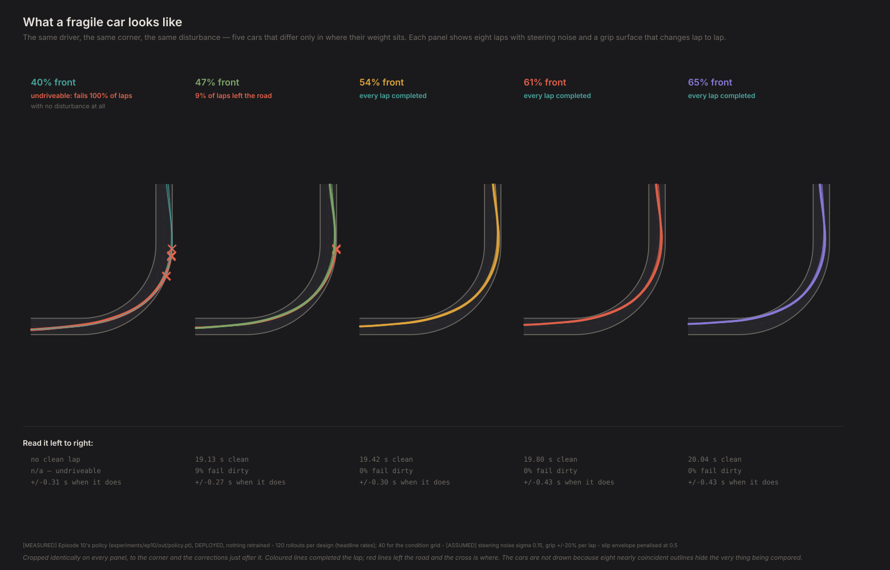
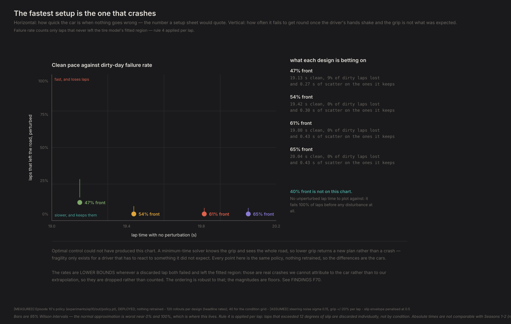
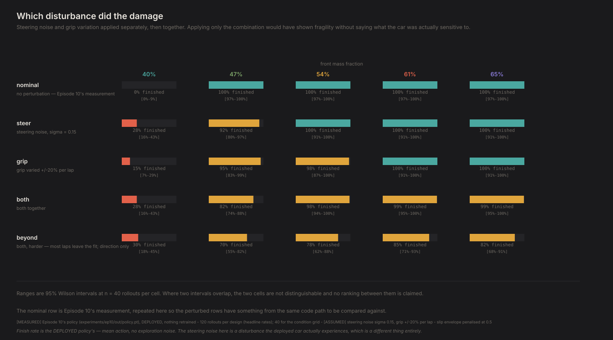
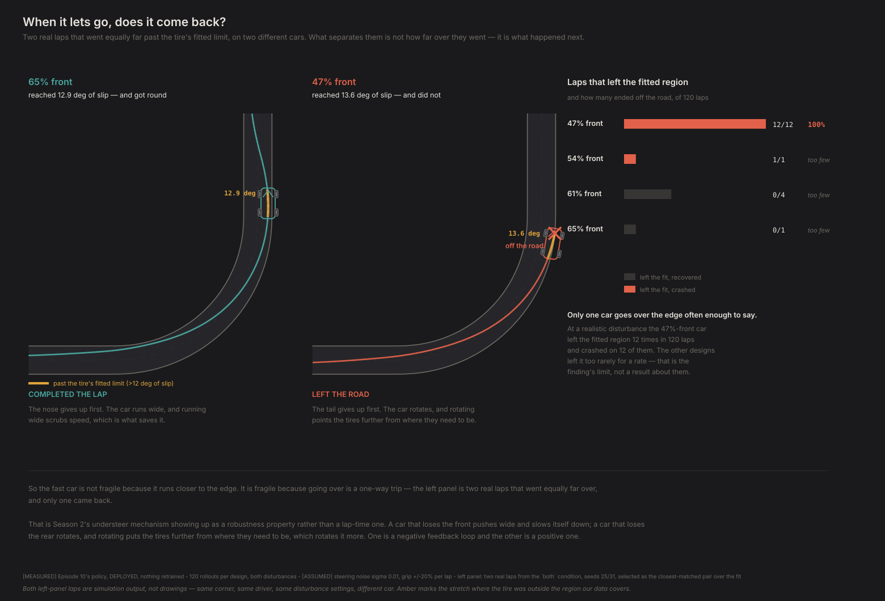

# The fastest setup is the one that crashes

*Contact Patch, Episode 11. Season 3: The driver.*

---

## The question

Why don't racers just run the fastest setup?

Everyone who has tuned a car in a game knows the answer in their hands before they
can say it. You soften the rear, the car rotates, the lap time drops — and then on
lap four you get a bump mid-corner and you are facing the wrong way. The fast setup
and the setup you can actually drive are not the same setup.

**This is the first question in the series that optimal control structurally could
not answer.** Every result in Seasons 1 and 2 came from a solver that was handed
the whole road and exact knowledge of the car. Ask it what happens when the grip is
lower than expected and it does not crash — it returns a new plan for the new grip.
It cannot be surprised, and fragility is a property of something that can be.

Season 3 finally has a driver that can be surprised. So: perturb it.

## The experiment

Episode 10's design-conditioned policy, loaded and deployed. **Nothing is
retrained.** That matters more than it sounds: the driver is held identical across
every car and every disturbance, so a difference in outcome cannot be a difference
in training luck. It is also the only honest way to run this with one training
seed, which is still all Season 3 has.

Two disturbances, applied separately and then together so each one's contribution
is attributable:

**Steering noise.** Gaussian noise added to the commanded steering, every step.
This is the hands and the linkage — and unlike Episode 9's exploration noise, it is
still there when you deploy the policy. Episode 9's whole failure was noise that
vanished on the car you would ship. This does not vanish. Magnitudes are set by
asking what a driver's hands actually do, then converting through an `[ASSUMED]`
13.5:1 steering ratio: **an attentive driver at `sigma = 0.01`** (1.6° at the
steering wheel) and **a distracted one at `sigma = 0.03`** (4.7°).

**Grip variation.** Peak lateral friction scaled per lap, through the tire file's
`LMUY` scaling coefficient and never by touching a fitted `P*` coefficient. One
surface per lap rather than per step, because that is what a damp patch or a cold
track actually is.

And **fragility defined before measuring it**, because it is a metric choice:
failure rate is the headline, lap-time scatter among the laps that survive is the
second number. A car can be reliable and still unpredictable, and a driver feels
the second one.



**Sample size is part of the design here, not an afterthought.** A failure rate
needs far more samples than a mean does: at n = 10, a true 7% rate reads as zero
events about half the time, which is not a measurement of "no failures" but the
absence of a measurement. And any max-over-n quantity — peak load, largest
excursion, worst slip — grows with sample size, so it describes the sample rather
than the system. Medians hold still as n grows; maxima do not. So nothing here
rests on a worst-case reading, and the headline runs at **120 deployed laps per
cell**, with 40 for the wider grid.

## How a lap counts

This project's rule 4 says laps from outside the slip envelope are discarded, not
celebrated — and it is a **per-lap** rule, not a per-condition one. Applied to
whole conditions it becomes absurd at realistic sample sizes: one excursion
reaching 35° while the *median* lap in the same cell sits near 8° would throw away
thirty-nine defensible laps.

A lap that left the road at 20° of slip tells us about our extrapolation. A lap
that left the road having never exceeded 12° is real evidence, and so is a lap
that finished inside. So: keep those, drop the rest, and report the failure rate
over what is left.

One honest consequence, stated where it belongs rather than in a footnote. A lap
that **both** failed and left the fit gets discarded, and some of those were real
crashes. Every in-fit failure rate below is therefore a **lower bound**, not an
estimate. The ordering survives that; the magnitudes are floors.

## The tradeoff is real

Four designs, 120 deployed laps each, both disturbances applied at both calibrated
levels, counting only laps that never left the tire's fitted region:

| Design | Lap, undisturbed | Laps lost (attentive) | Laps lost (distracted) | 95% interval |
|---|---|---|---|---|
| **47% front** — the quickest | 19.16 s | **10 of 108 · 9.3%** | **10 of 108 · 9.3%** | 5.1–16.2% |
| 54% front | 19.45 s | 0 of 119 · 0% | 0 of 119 · 0% | 0–3.1% |
| 61% front | 19.85 s | 0 of 116 · 0% | 0 of 116 · 0% | 0–3.2% |
| 65% front | 20.15 s | 0 of 119 · 0% | 0 of 119 · 0% | 0–3.1% |

Look closely at those two columns: they are **identical, cell for cell** — same
laps lost, same crashes, at every design. Changing the steering noise threefold
changes none of the numbers this experiment counts.

It does change the driving — measured directly, going from 0.01 to 0.03 on the same
seeds moves the paths and shifts peak slip by 0.2–0.7°. What it does not do is push
any lap across either threshold that matters here: 12° of slip, or off the road. And
the `steer`-only condition — noise alone, no grip variation — fails 0% of the time at
every drivable design, exactly like no disturbance at all.

**So this is a grip-variation result, and should be read as one.** The "two
disturbances, applied separately and then together so each contribution is
attributable" framing is what makes that visible: the steering noise carries none
of the effect at any magnitude a driver actually produces.

**And it survives correction for multiple comparisons, at both realistic levels.**
Six pairwise Fisher exact tests, Holm-Bonferroni at family-wise 0.05: the 47% car
differs from each other design at **p = 0.0005**, identically whether the disturbance
is the attentive or the distracted level. The other three designs are indistinguishable
from each other (p = 1.000).

**It is a cliff, not a slope.** One design loses laps and three do not. That is more
useful than a gradient would have been: it means there is a threshold to stay
behind rather than a dial to trade off.

The direction is what anyone who has tuned a car would predict. The more rear-biased
car is quicker and less forgiving. Weight over the driven axle helps it put power
down — Season 2's mechanism — and takes away the margin that absorbs a surprise. What
does *not* hold is that steering imprecision is part of "a surprise" at any magnitude
a driver actually produces — here, a surprise means the road itself, not the hands on
the wheel.



**This is the first chart in the series optimal control could not have produced.**
Ask a minimum-time solver about lower grip and it hands back a new plan, not a
crash. It has perfect foresight and exact knowledge of the car, so there is no such
thing as a surprise for it to mishandle. Fragility is a property of a driver that
can be caught out, and Season 3 finally has one.



## It isn't margin. It's whether you get it back.

The obvious explanation is that the fast car runs closer to the edge, so it needs
less provocation to go over. The data does not support it.

Count how often each car actually went past the tire's fitted limit, and how many
of those laps ended off the road:

| Design | Laps that left the fit | Of those, crashed |
|---|---|---|
| 47% front | 12 | **12 — 100%** |
| 54% front | 1 | 1 |
| 61% front | 4 | 0 |
| 65% front | 1 | 0 |

**Read the last three rows as counts, not rates.** At a realistic disturbance the
54/61/65% front cars rarely leave the fitted region at all, and 1 or 4 samples is
exactly the small-n trap this experiment is designed around — quoting "100%" or
"0%" from them would be reading noise. What the data supports is narrower and still
real: **the 47% car, the only design with enough exceedances to say anything,
crashes on every single one of them.**



That panel **selects** its own pair from the traces — a lap that exceeded 12°
*within the stretch of road the panel actually draws* and recovered, beside one that
exceeded it and did not — takes the closest-matched pair it can find, and reads every
number, seed and condition off those laps. Where no such pair exists it says so and
draws nothing, which is the honest output at a gentle disturbance.

A pair does exist, and it makes the point sharply: the **65%-front car reached 12.9°
and got round**, while the **47%-front car reached 13.6° and did not.** The
nose-heavy car recovered from slightly *less* provocation than the tail-heavy car
failed to recover from — so the asymmetry is not that the fast car gets pushed
further. Both went about equally far over. Only one came back.

The mechanism is the one Season 2 spent two episodes on, showing up as a robustness
property instead of a lap-time one. **A car that runs out of front grip pushes wide,
and pushing wide scrubs speed, which restores grip.** That is a negative feedback
loop; it corrects itself whether or not the driver does anything clever. **A car that
runs out of rear grip rotates, and rotating points the tires further from where they
need to be, which rotates it more.** That is a positive feedback loop, and catching
it requires a correction in the right direction at the right moment.

That mechanism is a property of the vehicle's balance, not of the disturbance that
exposes it — it does not depend on how hard the car was pushed to get there, only on
which end ran out of grip first. **What this data cannot support is the
population-level claim that the 61% car recovers reliably where the 47% car does
not**; only three designs ever leave the fit, and rarely. It supports that the 47%
car, when it does leave the fit, essentially never comes back. So "fragile" does not
mean "operating with less margin." It means **the failure mode is divergent rather
than self-limiting when it happens** — read here in one design with enough exposure
to show it, and illustrated, not proven population-wide, by the other three.

## Where the margin isn't

It is tempting to describe this policy as conservative — cornering at 5.8–7.4° of
slip against a 12° bound looks like margin it never spends. It isn't.

The Magic Formula is flat near its peak. Measured on our own tire, at 4 kN it peaks
at **10.35°** of slip — and at 5.8–7.3° the policy is already extracting **94–98% of
peak lateral force.** The ±12° envelope sits *at* peak grip, not comfortably beyond
it. There is no large untapped slip region; a flat curve near its maximum reads as
slack and is not.

## Fragile, or just undrivable

Those are different problems with different fixes, and it is worth keeping them
apart. Fragile means it fails when something goes wrong. The 40%-front car fails
when **nothing** goes wrong — 0% deployed finish rate with no disturbance at all.
It is not a knife-edge car, it is a car this driver cannot drive. The figures put
it off the chart with the reason stated rather than plotting it at a lap time it
never set.

## What this can't tell you

**The claim is scoped to 47-65% front, and to this driver.** The 40%-front car is
absent because the policy cannot drive it *unperturbed* — 0% deployed finish rate
with nothing going wrong, which is a car outside this driver's competence rather
than a fragile one.

**"Fragile for this driver" is the honest form.** I checked whether the policy is
simply *better* at nose-heavy cars, which would fake this whole result: relative to
what the solver achieves on the same car, it actually gets **further** from the limit
as the car gets nose-heavy. So the confound points the other way — it is relatively
better at the rear-biased cars, and those are the ones that fail. But that test is
indirect, because lap-time ratio measures pace, not disturbance rejection. A car can
be quick in a policy's hands and still be one it cannot catch.

**Every failure rate is a lower bound.** Laps that both failed and left the tire
fit are discarded, and some were genuine crashes. The ranking is robust to that;
the numbers are floors, and the report counts how many laps each cell had to drop.

**The recovery mechanism is argued, not measured across the field.** At a
realistic disturbance only the fastest design leaves the fitted region often enough
to count (12 laps of 120, against 1–4 for the others), so this episode can say that
car essentially never comes back, and can point at Season 2 for *why* — but it can no
longer put a recovery rate next to each design and compare them. That comparison
needs either a harsher disturbance, which costs realism, or many more laps.

**The ±12° bound is ours, not physics.** It is where the tire file's fit ends. A
sharper answer needs tire data past that, which we do not have, and no amount of
solver or policy work substitutes for it.

**One disturbance shape each, and effectively only one of them mattered.** Gaussian
per-step steering noise and a per-lap uniform grip scale are two guesses at what "a
bad day" means. A gust, a kerb, a damp patch part-way through a corner, or a driver
with a slow reaction time are all different disturbances and could rank designs
differently. At any realistic magnitude the steering noise contributes nothing
measurable here — **this is a grip-variation result**, and should be read as one.

**Still one training seed.** Episode 11 inherits Episode 10's policy and therefore
Episode 10's single seed, and Episode 10's D6 failure (`exploration_is_not_growing`)
applies here unchanged. Nothing in this episode is a claim about what PPO does in
general.

**Wilson intervals on every rate.** At n = 40 an observed 0% is consistent with a
true rate up to about 9%. "No failures" means "no failures in forty laps", which is
not the same as "cannot fail".

## The crack

Season 3 set out to build a driver and ask it a question a solver could not answer.
It built one, the question got an answer, and the answer is the one every racer
already knows in their hands: the quick setup is the one that bites.

What is new is not the conclusion. It is that the conclusion now falls out of a
tire model, a four-wheel car and a driver that learned to drive by crashing — with
no human intuition anywhere in the chain. That is worth more than being told it.

And it points somewhere specific. Every driver in this series so far — solver and
policy alike — has been handed a fixed car and asked to make the best of it. None
of them could change the car while driving it. A fragile car is one that needs a
correction the driver cannot make in time; the alternative is a car that makes the
correction itself.

That is what a differential does, badly, and what torque vectoring does on purpose.
Season 4 starts there.

---

**Fidelity: rung 2, one learned driver, one training seed.** Everything here is 'fragile **for this driver**' — a different policy, or a better one, could rank these cars differently. The double-track model's missing suspension terms are also the terms that would most change how a real car behaves at the limit.

## Reproducing this

```bash
python -m experiments.ep11.run
```

Trains nothing. Loads `experiments/ep10/out/policy.pt`, runs five designs across
seven disturbance conditions at 40 deployed rollouts each — about twenty minutes on
a laptop CPU — and writes the figures. `--deep` is the n = 120 run the headline rests
on (four designs, three conditions, about twenty-five minutes). `--quick` runs a
three-design wiring check. `--figures-only` redraws from `results.json`.

**Numbers quoted above** are `[MEASURED]` from Episode 10's policy driving
`physics/rl_env.py` on the four-wheel model with the Project Chrono tire, offsets
removed, deployed (mean action, no exploration noise — F61).

**Both disturbance magnitudes are `[ASSUMED]`.** Steering noise is in normalised
action units, calibrated from what a driver's hands do through an `[ASSUMED]`
13.5:1 steering ratio: the headline runs at 0.01 (attentive, 1.6° at the wheel)
with 0.03 (distracted, 4.7°) alongside it. Grip is a multiplier on peak lateral
friction applied through `[SCALING_COEFFICIENTS]`, never by editing a fitted `P*`
coefficient.

**Rule 4 is applied per lap.** `trial()` records `(finished, worst_slip)` for every
rollout, and `failure_rate_inside_fit` counts only laps that never exceeded 12° of
slip. `results.json` keeps the per-lap pairs so any other metric can be recomputed
without re-running.

**Two standing checks guard the claim.**
`a_speed_fragility_tradeoff_is_measurable_inside_the_fit` would fail if the effect
vanished, and `the_faster_car_is_the_more_fragile_one` asserts the *ordering* rather
than merely the existence of failures — a scrambled ranking would be a tradeoff you
could not act on.

Full provenance: `FINDINGS.md` F70, F96 and F98 on the disturbance calibration,
F63 on the envelope penalty, F61 on why every number is the deployed policy's, and
F69 on the inherited D6 failure.
