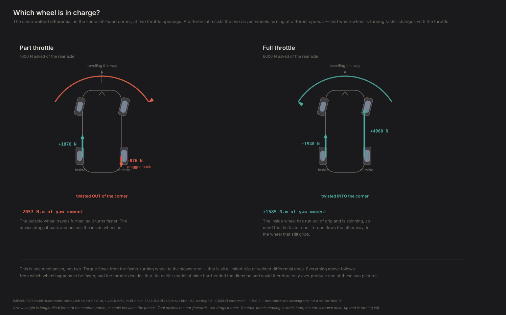
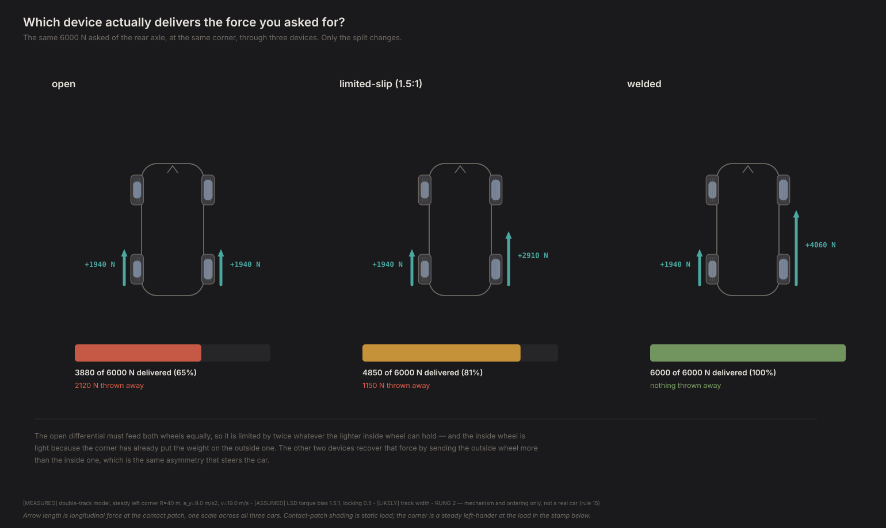
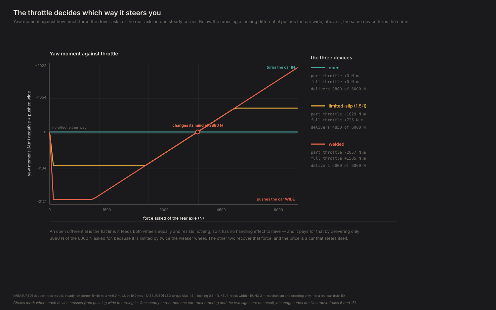

# What a differential actually does

*Contact Patch, Episode 12. Season 4: Torque vectoring.*

---

## The question

Your car has one. You have never seen it work. It is a lump of gears between the
driven wheels, and the only time most people think about it is when a video shows
a cheap hatchback lifting an inside wheel and spinning it uselessly in the air.

Here is what it is for. When you turn, the outside wheel travels further than the
inside one. Something has to let them turn at different speeds or the tires would
scrub. That something is the differential, and **every interesting thing it does
follows from how hard it resists that difference.**

## One mechanism, not two

This is worth stating carefully, because it is easy to get backwards.

A differential is not a torque-sharing device *and also* a handling device. It is
one device with one rule:

> **Torque flows from the faster-turning wheel to the slower one.**

That is all a clutch pack or a welded diff does — resist relative rotation. And
that single rule produces both of the things differentials are famous for,
depending on which wheel happens to be turning faster:

- **No wheelspin.** The outside wheel travels further round the corner, so it turns
  faster and loses torque to the inside. The car is twisted **out** of the corner.
  This is the locked-diff push.
- **Inside wheel spinning.** A light inside wheel turns faster than the corner alone
  would have it, so torque flows **out** to the wheel that still grips. This is the
  traction an LSD is bought for.

Opposite outcomes, same rule. **A model that hard-codes which wheel gets more torque
can only ever produce one of them**, and will have the locked differential's
handling backwards for half the throttle range (FINDINGS F75, F77).



## Three devices, two numbers

| Device | Torque bias ratio | Locking |
|---|---|---|
| Open | 1.0 — equal torque, always | 0.0 — resists nothing |
| Limited-slip | 1.5:1 `[ASSUMED]` | 0.5 `[ASSUMED]` |
| Welded | unbounded — grip only | 1.0 — resists everything |

Two numbers, and the second is the one that steers the car.

## The result

A steady left-hand corner, 40 m radius, 0.92 g, and the driver asking for varying
amounts of force from the rear axle.

**Part throttle — 1000 N:**

| | inside | outside | delivered | yaw |
|---|---|---|---|---|
| Open | 500 N | 500 N | 1000 N | none |
| Limited-slip | 1188 N | **−188 N** | 1000 N | **pushes wide** |
| Welded | 1876 N | **−876 N** | 1000 N | **pushes wide, hard** |

Look at the outside wheel. It is being **dragged backwards** — a negative
longitudinal force, on a car that is accelerating. That is the differential
fighting the corner, and it is the binding you can feel in a car with a welded
diff at low speed in a car park.

**Full throttle — 6000 N:**

| | inside | outside | delivered | yaw |
|---|---|---|---|---|
| Open | 1940 N | 1940 N | **3880 N** | none |
| Limited-slip | 1940 N | 2910 N | 4850 N | turns in |
| Welded | 1940 N | 4060 N | **6000 N** | turns in |

**The open differential throws away 2120 N of the 6000 N the driver asked for** —
35% of it. It has to feed both wheels equally, so it is limited by twice whatever
the lighter inside wheel can hold. That single sentence is the entire reason the
other two devices exist.



And the welded diff has **changed its mind**: at part throttle it pushed the car
wide, at full throttle it turns the car in. Same device, same corner, opposite
behaviour, because the inside wheel is now spinning and is therefore the faster
one.



The crossover is at **3880 N** — precisely twice the inside wheel's grip, which is
the point where the open differential runs out and the inside wheel starts to spin.
The number is not a coincidence; it is the same limit read two ways.

## So which one do you want?

That is the honest shape of the answer: **it depends what you are doing with the
throttle.**

- An **open** differential never steers the car and never fights you. It also gives
  away a third of your traction at the exit of a hard corner.
- A **welded** differential gives all of it back and charges you a car that pushes
  wide every time you are not hard on the power — which is most of a lap, and all
  of a car park.
- A **limited-slip** differential is the compromise, and "compromise" is exactly
  what the numbers say: about half the traction recovered, about half the push.

A differential is a machine for deciding which wheel gets to be in charge. Every
one of these three makes that decision differently, and none of them makes it
*well*, because none of them knows anything. They are all reacting to a speed
difference with a fixed rule.

## What this can't tell you

**Fidelity: rung 2** (CLAUDE.md rule 15). This shows the mechanism on a
double-track model. It is not a claim about any particular hardware.

**Both of the LSD's numbers are `[ASSUMED]`.** The torque bias ratio (1.5:1) and
the locking fraction (0.5) are mid-range stand-ins. Real clutch packs vary their
locking with torque, and behave differently on coast than on drive — this models
neither. The conclusion survives the assumed range: sweeping locking from 0.25 to
0.75, the part-throttle moment stays negative throughout. **The magnitudes plainly
do not survive it**, and are illustrative.

**Track width is `[LIKELY]`, not measured**, and it is the moment arm for
everything here. Every yaw number scales directly with it.

**One corner, one steady condition, one car.** The crossover at 3880 N is specific
to this corner's lateral load transfer. A tighter corner unloads the inside wheel
more and moves it.

**No coast case.** Everything above is on power. Trailing throttle into a corner is
where a locked diff's binding is most notorious and this episode does not go there.

## The crack

Every device in this episode is reacting. The differential feels a speed difference
and applies a rule to it — a good rule, an honest rule, but a fixed one. It cannot
tell the difference between a corner exit where you want the inside wheel pushed
and a corner entry where that same push runs you wide. It applies the same response
to both, because it has no idea which one is happening.

Season 3 built a driver that could be surprised. This episode built a device that
cannot be.

What if the thing deciding which wheel is in charge could *know* which corner it
was in, and *choose*?

---

## Reproducing this

```bash
python -m experiments.ep12.run
```

Runs in seconds — this episode has no solver and no training, just the double-track
model evaluated across a throttle sweep at one steady corner. `--figures-only`
redraws from `results.json`.

**Numbers quoted above** are `[MEASURED]` from `physics/double_track.py`, with the
Project Chrono tire, offsets removed, at 40 m radius and 9.0 m/s² lateral (19.0 m/s,
0.474 rad/s — a self-consistent steady corner, since `a_y = v²/R` ties all three).

**Two `[ASSUMED]` numbers**, both the LSD's, both swept. **One `[LIKELY]`**, the
track width.

**On the mechanism.** `differential_forces` is one method on purpose. Splitting it
into a torque bias and a separate speed couple counts the same physical effect
twice and gives the bias the wrong direction — under which the welded differential
turns *into* the corner at part throttle. Four D2 checks guard against that, and
removing the speed term makes two of them fail. See FINDINGS F75, F76 and F77.

**On the yaw moment this rests on.** Every number here depends on the model
carrying a drivetrain yaw term. Without one, moving the entire drive force from one
wheel to the other changes the computed yaw by exactly zero and torque vectoring
measures a silent null — which is why Season 4 needs this term before it can have
an episode at all. See FINDINGS F72.
