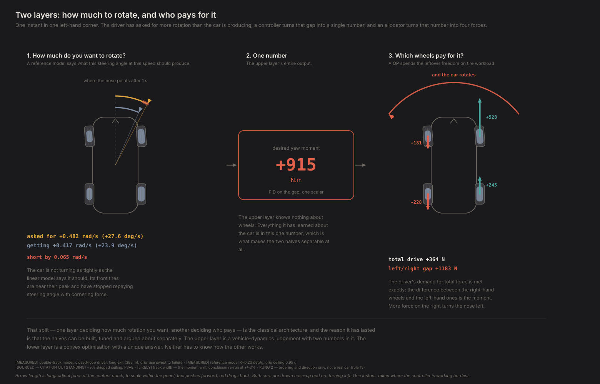
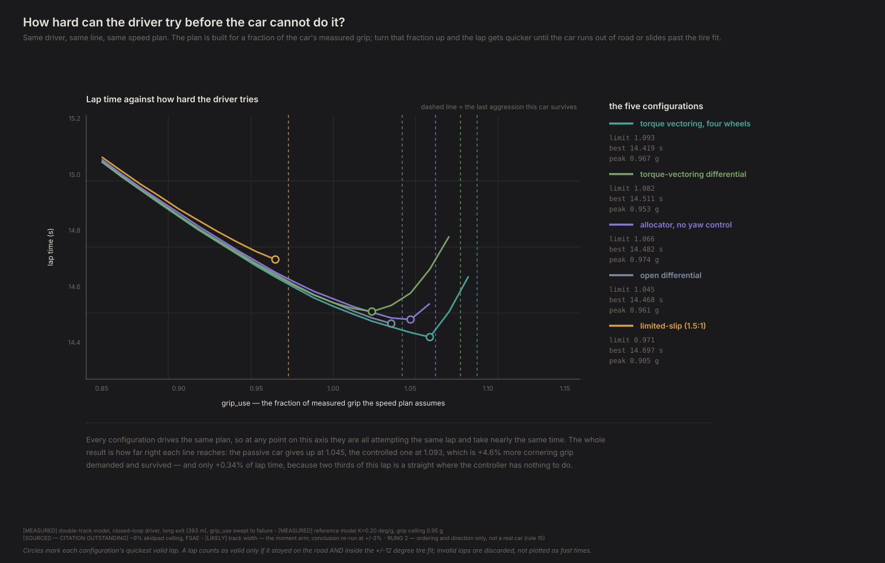
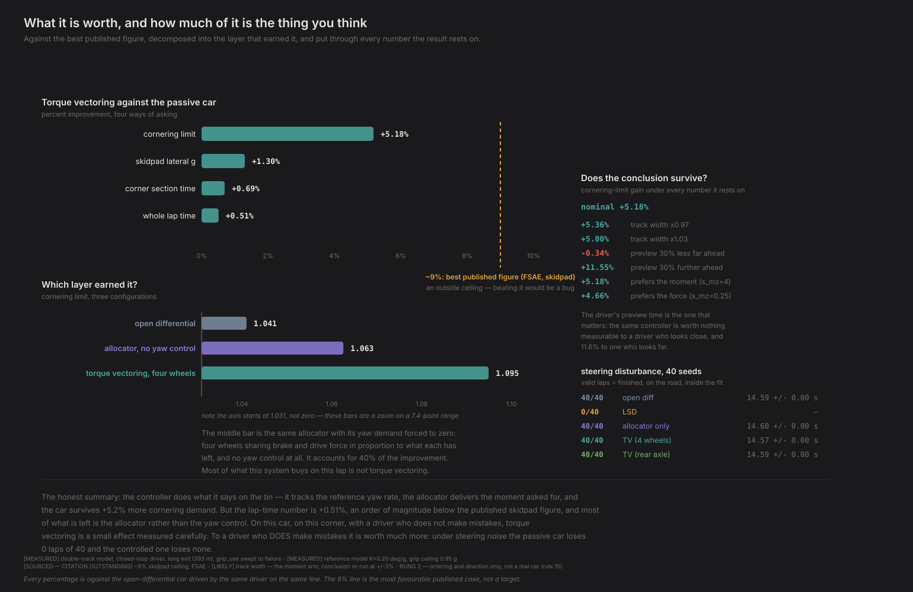
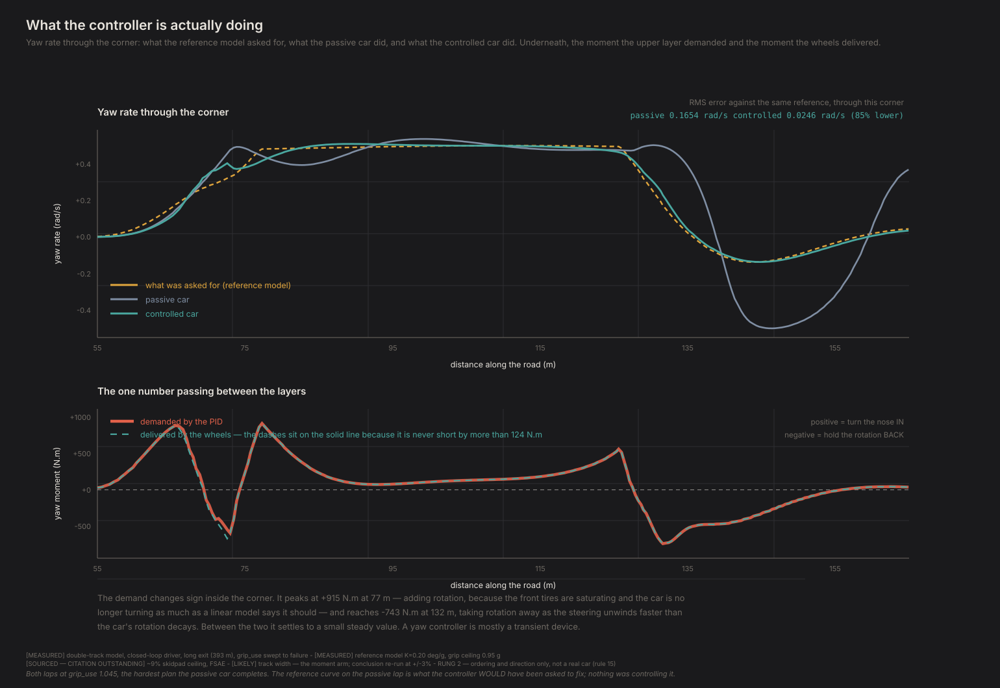
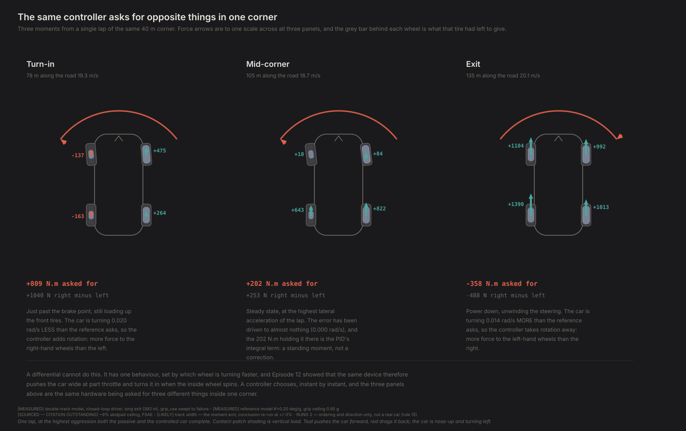

# How engineers built a car that steers with its wheels

*Contact Patch, Episode 13. Season 4: Torque vectoring.*

---

## The question

Episode 12 ended with a device that cannot think. A differential feels the two
driven wheels turning at different speeds, applies one fixed rule to that
difference — torque flows from the faster wheel to the slower — and whatever
happens to the car's rotation happens as a side effect. It pushes you wide at part
throttle and turns you in when the inside wheel spins, and it has no idea which of
those you wanted.

But the side effect is real. Push harder on the right-hand wheels than the left and
the car rotates left. That is not subtle: on our car, moving 3000 N from one rear
wheel to the other is worth about 2240 N·m of yaw moment — more than a rad/s² of
yaw acceleration on this car's 1950 kg·m² of polar moment. (Our model did not even
have that term until this season; adding it is what made Season 4 possible.) It is
a genuine steering input that has nothing to do with the steering wheel.

So: **if pushing one wheel harder rotates the car, why not just do that?**

Deliberately, on purpose, whenever the car is not rotating the way the driver
asked.

If you have ever felt a modern car pinch one brake mid-corner — that faint tug
as the stability control tidies a slide you had barely registered — you have
felt the crude version. This episode builds the refined one.

## Two layers

The classical answer has the same shape wherever it appears, and has for about
twenty years. It is worth stating before any of the physics, because the shape *is*
the engineering:

> **One layer decides how much you want to rotate. Another decides which wheels
> pay for it.**

The upper layer takes the steering angle and the speed, works out what the car
*should* be doing, compares that with what it *is* doing, and emits a single
number: a desired yaw moment, in newton-metres. It knows nothing about wheels.

The lower layer takes that one number, plus the total longitudinal force the
driver asked for, and turns it into four per-wheel forces — subject to no tire
being asked for more than it has left. It knows nothing about yaw rate, reference
models or drivers.



That split is the reason the architecture has lasted. The upper layer is where
vehicle-dynamics judgement lives, and it is two-dimensional — yaw rate in, moment
out — so it can be tuned, plotted, and argued about over a table. The lower layer
is a convex optimisation with a unique answer. Neither half needs to know how the
other one works, which means two people can build them.

### The upper layer: what *should* the car be doing?

The reference model is the textbook relation Episode 3 built:

```
r_ref = v · δ / (L + K · v²)
```

Steering angle `δ`, speed `v`, wheelbase `L`, and `K` — the understeer gradient,
the same number Episode 3 introduced in deg/g and Episode 5 measured on four
wheels. Our car's measures **0.204 deg/g**, which is tiny; a real car is near 4.1, and
roughly 3 of those come from suspension effects this model does not include. More
on that below.

Feed it the driver's steering angle and it says what yaw rate that angle *ought*
to produce. A PID closes the gap. Its output is the moment demand.

**The saturation matters more than the gains.** The reference model is linear, and
a linear model does not know that tires run out. Ask it what 25 degrees of steering
should do at 20 m/s and it answers **3.21 rad/s** — which implies **6.5 g** on a car
that makes 0.95. The PID would then see an error that can never be
closed, the allocator would saturate against it, and the driver aid would drag the
car into a spin trying to satisfy a number no tire can produce.

So the reference is capped at what the tires can actually sustain,
`r_max = a_y_max / v`, with `a_y_max` a measured **0.951 g** on this car — 0.466
rad/s at that speed, a factor of seven below what the linear model asked for. That
is not a detail. It is the difference between a stability controller and a hazard.

### The lower layer: who pays?

Four wheels, two demands. Deliver the total longitudinal force the driver wanted,
and deliver the moment the upper layer asked for. That is two equations and four
unknowns, so there are two degrees of freedom left over — and the classical answer
is to spend them minimising **tire workload**, so that no tire is asked for a much
larger share of what it has left than its neighbours.

Written out, it is a quadratic program:

```
minimise   s_fx · (Fx_total − Fx_demand)²
         + s_mz · (Mz − Mz_demand)² / (track/2)²
         + ε · Σ (Fx_i / cap_i)²

subject to  −cap_i ≤ Fx_i ≤ cap_i
```

`cap_i` is what that tire has left longitudinally given what it is already doing
laterally — Episode 4's friction ellipse, evaluated
per wheel on the previous instant's forces, because that is what a real controller's
sensors could know.

The two demands enter as weighted terms rather than hard constraints, and that is
not a shortcut. **At the limit they routinely cannot both be met.** A hard
formulation has to answer "which one do I give up?" with a branch; this answers it
with a ratio, `s_fx` against `s_mz`, which is one number that can be swept. It is
swept below.

**One thing worth noticing before any results.** If you only have a
torque-vectoring differential — one axle, a left/right split — then you have two
demands and *two* effectors, and there is nothing left to optimise. The allocation
is determined; the second layer collapses to a division. The QP only earns its
place when there are more effectors than demands, which on a car means a motor or
a brake at every corner. We ran both.

## The experiment

A controller can only be judged in closed loop, so this episode needed something
Seasons 1 and 2 did not have: **a driver who reacts.**

Not the minimum-time solver. Hand a solver four independent wheel forces and it
will use them optimally, which answers "what is torque vectoring worth to a driver
who knows the future?" — and Episode 8 already answered that class of question with
"almost nothing", because a solver that cannot be surprised simply plans
around whatever the car does. Not the learned policy either: that would confound
the controller with the training run.

What is left is the thing chassis engineers actually use — a repeatable,
unintelligent driver model, run with the aid on and with the aid off.

Ours steers by pure pursuit at a point about half a second ahead, and tracks a
quasi-steady-state speed profile: cornering limit everywhere, a backward pass for
how early to brake, a forward pass for how hard it can accelerate. It knows nothing
about racing lines and cannot trade entry for exit. **Every configuration therefore
drives the same geometric path**, which is what makes this a comparison — a lap
time difference cannot be a different line, because there is only one line.

The profile is built for an **aggression setting** — a multiplier on the car's
measured grip. That is the knob. Turn it up past 1.0 and the driver is asking for
more than the tires have.

### The metric, chosen before anything was measured

Because every configuration drives the same plan, at any given aggression they are
all attempting an *identical* lap and take an almost identical time. **What differs
is whether the car can do it.** So the result is:

1. **the highest aggression that still produces a valid lap** — on the road, and
   inside the ±12° region the tire file was actually fitted over;
2. **the quickest valid lap**, which is a monotone consequence of the first, and is
   reported only because a lap time is something a reader can hold on to.

Those two are not independent evidence. They are one measurement stated twice.

Five configurations, one driver:

| | what it is |
|---|---|
| **open differential** | what Episodes 9–11 drove |
| **limited-slip** | Episode 12's passive device, 1.5:1 and 0.5 locking |
| **allocator only** | the four-wheel allocator with its yaw demand forced to **zero** |
| **TV, four wheels** | the full two-layer controller |
| **TV, rear axle** | a torque-vectoring differential — one degree of freedom |

The third one is the important one, and it is the reason this episode can say
anything at all. Both it and the full controller replace the differential, so both
get grip-proportional braking and traction distribution for free. **Only one of
them also asks for yaw.** Without that control condition, "torque vectoring is
worth X" would be a claim about two things at once.

## The result



| | cornering limit | best valid lap | corner section |
|---|---|---|---|
| open differential | 1.041 | 14.508 s | 5.483 s |
| limited-slip | **0.969** | **14.719 s** | 5.635 s |
| allocator only | 1.063 | 14.516 s | 5.515 s |
| **TV, four wheels** | **1.095** | **14.434 s** | **5.445 s** |
| TV, rear axle | 1.073 | 14.562 s | 5.531 s |

One closed-loop driver, the long-exit corner from Episode 4, every number measured.

**It works.** The controlled car survives **4.6% more cornering demand** than the
passive one, and the direct evidence that both layers are doing their jobs is
better than the lap time: the allocator delivers the moment the PID asks for to
within 60 N·m of a 996 N·m peak, and RMS yaw-rate error through the corner falls
from **0.1662 rad/s to 0.0197 — 88% lower**, both cars driving the
same plan at the hardest aggression the passive one completes.

**And it is worth 0.51% of lap time.** Half a percent. The corner section — brake
point to full exit — improves by 0.69%. Both are an order of magnitude below the
"1–4%" the series plan expected, and the reason is not subtle: 260 of this lap's
393 m are a straight, and on it the car is power-limited, not grip-limited. A yaw
controller has nothing to do there. The lap-time number is diluted by construction,
which is why the cornering limit is the one that describes what actually changed.

Which is also why the skidpad matters.

## The skidpad, and the number from outside

The best published figure for a torque-vectoring gain is about **9%**, for an FSAE
car on a skidpad. **A caveat before it does any work: I have not traced that
number to its paper.** It comes from this project's planning notes, which state it
without a reference. Until someone goes back to the source it is a remembered
figure, and it is flagged as one rather than dressed up as verified.

A skidpad is the most favourable manoeuvre there is — constant radius, steady
state, nothing but cornering — so that 9% is a **ceiling**, not a target. Beating it would be evidence of a bug, not of a good
controller. That is a standing rule here doing its job: the yardstick comes from
outside the project, so our own model never gets to grade itself.

Same driver, constant-radius circle, aggression turned up until it fell off:

| | sustained lateral acceleration |
|---|---|
| open differential | 0.939 g |
| limited-slip | 0.893 g |
| allocator only | **0.932 g** |
| torque vectoring, four wheels | **0.951 g** |
| torque-vectoring differential | 0.949 g |

Same driver, 40 m radius, aggression bisected to 0.002.
**+1.30%**, comfortably under the ceiling.



## What the controller actually does with its time



The demand **changes sign inside the corner**. It peaks at +996 N·m at 77 m —
adding rotation, because the front tires are saturating and the car is no longer
turning as much as a linear model says it should — and reaches −526 N·m at 131 m,
taking rotation away as the steering unwinds faster than the car's rotation decays.

Between those two it settles to a small steady value. In the middle of a steady
corner the car already turns roughly the way the linear model says it should — that
is what the reference model was built from — so the error is nearly zero and the few
hundred newton-metres still being commanded are the PID's integral term holding it
there.

**A yaw controller is mostly a transient device.** It earns its keep where the car
is changing what it is doing, which is exactly where a passive differential is
applying one fixed rule with no idea which transient it is in.



## Most of it is not torque vectoring

Here is the finding I did not expect, and it exists only because of the control
condition.

The allocator **with its yaw demand forced to zero** — four wheels sharing brake and
drive force in proportion to what each has left, no yaw control whatsoever — gets
**40%** of the whole cornering-limit improvement on the lap.

That share is the least stable number in this episode. It moved from 77% to 40% when
the allocator went from being re-solved inside the integrator to holding its command
for the control interval, as a real ECU does, and across the six sensitivity runs it
spans 38–56%. So this is a "roughly half" claim and it is stated as one. **The
ordering is what survives**: open differential worse than allocator-only,
allocator-only worse than the full controller, in every run.

And on the skidpad the split **inverts**. Look at the table above: the allocator
alone is 0.932 g against the passive car's 0.939. On a steady circle there is no
braking to distribute and almost no drive force to spread, so the lower layer has
nothing to be clever with and lands slightly *below* the passive car — and the whole
skidpad gain is yaw control. The same two layers split the credit in opposite
proportions in the two manoeuvres.

The lesson generalises past this car. When a system replaces a mechanical device
with a computer, some of what you measure is the *decision-making* and some is
simply that a computer can meter four things separately where a lump of gears could
only meter one. Those are different claims with different consequences for Episode
15, and only a control condition separates them.

## The number that depends on the driver, not the car

One of this episode's twelve checks fails. It is the one that asks whether the
result survives the driver being tuned differently, and it is the most useful thing
in the run.

The driver's preview time — how far ahead it aims — is a number we chose: 0.55 s. Change
it by 30% in each direction, change nothing else, and:

| driver preview | passive limit | controlled limit | gain |
|---|---|---|---|
| 30% less | 1.054 | 1.054 | **0.00%** |
| nominal | 1.045 | 1.093 | **+4.64%** |
| 30% more | 0.982 | 1.111 | **+13.18%** |

Nothing changed between those rows except the preview time. A single chosen number
**in the driver** — not in the car, not in the controller —
moves the headline from "nothing at all" to "+13.2%". At 30% less preview the two
limits are now *identical* — not a near-wash, an exact one.

> **The closed-loop brake cap is set at 0.985 g**, the tire's own demonstrated
> limit. That matters here specifically because this experiment *bisects*
> the aggression setting to the cornering limit: a cap below what the tire delivers would
> spend the whole measurement in a regime where the cap, not the tire, sets the
> braking demand. Braking authority is not a neutral parameter for this table —
> it moves both the nominal gain (the passive car benefits too) and the spread
> across preview times.

The mechanism is not mysterious. A shorter preview makes the driver steer later and
harder, which suits the passive car and hands the yaw controller a reference signal
full of the driver's own transients to chase. A longer preview makes the driver
smoother and slower to correct, which the passive car cannot recover from and the
controller can.

**A driver aid is developed against a driver, and the pair gets tuned together
whether or not anyone says so.** Any measurement of what such a system is worth has
a driver model inside it. The check stays failed and the threshold has not been
moved.

## What it is worth to a driver who makes mistakes

All of the above is a driver who does exactly the same thing every lap. So: add
steering noise and run 40 seeded laps of each configuration.

**The magnitude has to be calibrated against what a driver's hands actually do**,
or the answer is about something else. Through a 13.5:1 steering ratio, that means
`sigma = 0.01` (an attentive driver, 1.6° at the steering wheel) and `sigma = 0.03`
(a distracted one, 4.7°). For scale, `sigma = 0.15` would be 23 degrees of RMS
motion at the wheel — a continuous quarter-turn saw, closer to a fault than to a
mistake.

Same 40 seeded laps, same configurations, same aggression, at both levels:

| | attentive (σ=0.01) | distracted (σ=0.03) |
|---|---|---|
| open differential | **40/40** · 14.555 ± 0.002 s | **40/40** · 14.556 ± 0.006 s |
| limited-slip | 0/40 · — | 0/40 · — |
| allocator only | 40/40 · 14.567 ± 0.001 s | 40/40 · 14.567 ± 0.003 s |
| **torque vectoring, four wheels** | 40/40 · 14.542 ± 0.001 s | 40/40 · 14.542 ± 0.002 s |
| torque-vectoring differential | 40/40 · 14.554 ± 0.003 s | 40/40 · 14.553 ± 0.008 s |

**At a disturbance level that means something, the open
differential is not measurably more fragile than any TV configuration.** Every
configuration that can drive this lap at all completes 100% of it at both
realistic noise levels, and the lap-time scatter across seeds (0.001–0.008 s) is
far below the deterministic gap the configurations already had unperturbed.

**So the intuition that TV is worth much more to a driver who makes mistakes does
not survive at a realistic mistake.** The effect is real at 23° of continuous
steering-wheel motion and absent at anything a driver actually produces — which
makes it a statement about fault tolerance, not about driving.

(The limited-slip car's 0/40 at both levels is not a new problem. At this
aggression it is already past its own limit of 0.969 — the same caveat as before —
and at large noise it occasionally survives by being randomly nudged off a
knife-edge it cannot hold deterministically. At realistic noise there is nothing
to nudge it, so it fails consistently instead of intermittently.
That is evidence about a device already asked to do something it cannot do cleanly,
not a new claim about noise.)

## The differential loses to no differential

Look again at the second row of that table. **The limited-slip differential is the
slowest configuration tested** — slower than an open differential by 0.211 s, and
0.072 lower in cornering limit (0.969 against 1.041).

That is Episode 12's push-wide appearing in a lap time for the first time. A locking
device drags the outside wheel and yaws the car out of the corner, and our driver,
which brakes in a straight line and turns in at a fixed point, pays for that at
entry with no way to recover it. A real driver would adapt. Ours cannot, and that is
a limitation of this experiment as much as a property of the device — but the
direction is the same one every driver of a welded car reports.

## What this can't tell you

**This is still the four-wheel model, not a real car.** Four independently
commanded wheel forces is a four-motor electric car, not our reference car's
rear-drive combustion driveline. The
rear-axle version is the one RV-1 could actually have, and it is worth about 60% as
much: +3.61% of cornering limit against +4.64%. Underneath both is a double-track model with no roll camber, no roll steer and
no compliance steer — the terms that make up about three quarters of a real car's
understeer. **We reproduce roughly 5% of a real car's understeer gradient**, so a
percentage here is a trend, not a specification.

**Track width is the least certain dimension in the model, and it is the moment
arm every yaw figure scales with.** At −3% the gain is
+4.82% and at +3% it is +4.82%, against +4.64% nominal. The conclusion is
robust — torque vectoring is worth +4.6% to +4.8% of cornering limit across
the whole plausible range of a number we only know approximately, which is
what this check exists to establish.

> **What this check cannot do is measure the moment arm.** The three values
> are **not monotonic in track width** — +4.82% / +4.64% / +4.82% — and the
> spread across ±3% is 0.01 percentage points against a bisection resolution
> worth ~0.27. Yaw moment scales with the arm as a matter of physics, and the
> magnitude surely does move with it, but **this experiment cannot resolve
> that**: any ordering read off three numbers this close together is reading
> signal out of one resolution step. What the check establishes is the
> robustness of the headline, not the shape of its dependence on track width.

**The driver is a tracker, not a racing driver**, and its preview time changes the
answer by more than the controller is worth. See the section above; that is the
biggest caveat in this episode by a distance. It also cannot trade line for exit and
never brakes in a corner, so its absolute lap times are slower than the
optimal-control episodes' and are not comparable with them — absolute times
never survive a change of method; only orderings do.

**One corner, one car, one tire.** And the aggression knob scales cornering and
braking limits together, so the aggression setting is a plan the driver believes in, not a
property of the road.

**The two headline numbers are one measurement.** Stated above, repeated here,
because it is the sort of thing that gets quoted as two.

**One of twelve checks fails** and the run says so: the driver-tuning one above.
It is the only one, and it is the one that matters most.

## The crack

The controller works. It also did exactly what we told it to.

Look back at the upper layer: we handed it a linear reference model and said *this
is what the car should be doing*. Every moment it demanded was in service of making
a real, saturating, load-transferring car behave like a textbook equation.

That is a **choice**, and it is buried in one coefficient. Ask for a pointier car
than the car is, and the answer changes:

| target understeer gradient | cornering limit |
|---|---|
| 0.204 deg/g (the car's own) | 1.095 |
| 0.100 deg/g | 1.097 |
| 0.000 deg/g — neutral | 1.100 |
| −0.150 deg/g | 1.102 |

Monotone, and small — 0.007 across the whole range against a
bisection resolution of 0.002 — so read it as a weak trend and not as a result.

Published work on optimising torque vectoring for lap time is said to report the
same direction more strongly: that the best times come from *allowing* deviations
from neutral yaw-rate tracking, which would make the reference model — the thing
twenty years of engineering consensus is built around — itself a constraint on how
fast the car can go. **That claim has the same outstanding citation as the 9%**: it
comes from this project's planning note and I have not traced it. Our own sweep
points the same way and is far too small to be evidence for it.

So the obvious question is the one this whole series has been walking toward.

Give something the same four wheels, the same physics, the same stopwatch, and **no
reference model at all**. Do not tell it what the car should be doing. Let it find
out.

Does it agree with us?

---

## Reproducing this

```bash
python -m experiments.ep13.run
```

About twelve minutes: roughly 1,100 closed-loop laps across two noise studies, no
solver and no training. `--figures-only` redraws from `results.json`;
`--quick` runs a coarser sweep.

**New code this episode.** `physics/torque_vectoring.py` (reference model, PID,
allocator) and `physics/driver.py` (the closed-loop driver). The backend's
per-wheel longitudinal split is now a hook: with nothing attached it is exactly the
differential of Episode 12, which is pinned by a test, so every result in Episodes
1–12 is untouched.

**Checks.** The run generates its own write-up at `diagnostics/out/D-ep13.md` —
twelve checks, one of which fails on purpose. Alongside it, three of the thirty
tests in `tests/test_torque_vectoring.py` and `tests/test_driver.py` are external
rather than self-consistent, which is the kind this project has learned to value
(rule 11): the allocator's idea of the moment a force makes is checked against the
*simulator's* yaw-moment code, the QP's answer is checked against brute-force
sampling of the feasible box, and the driver's position fix is checked against the
drawing map's inverse. The third one is how F81 was found — a defect that had been
sitting in the track geometry since Episode 4.

**On the yaw moment all of this rests on.** Until this season the model had no
drivetrain yaw term at all: moving the entire drive force from one wheel to the
other changed the computed yaw by exactly zero. A torque-vectoring controller run
on that model would have produced a perfect null result and nothing would have
errored. That is F72, and it is why Season 4 needed a physics fix before it could
have an episode.
