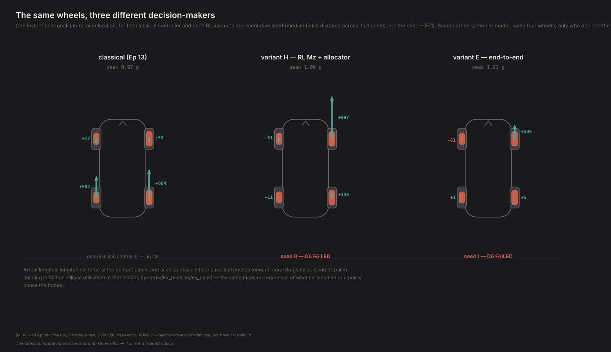
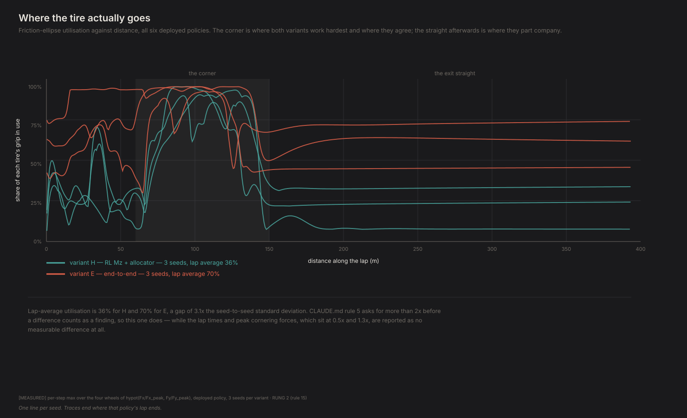
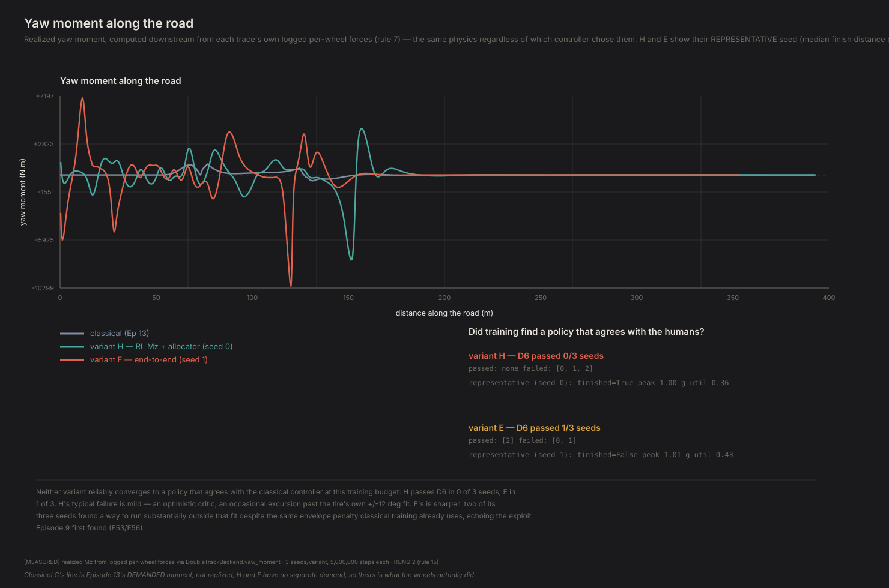
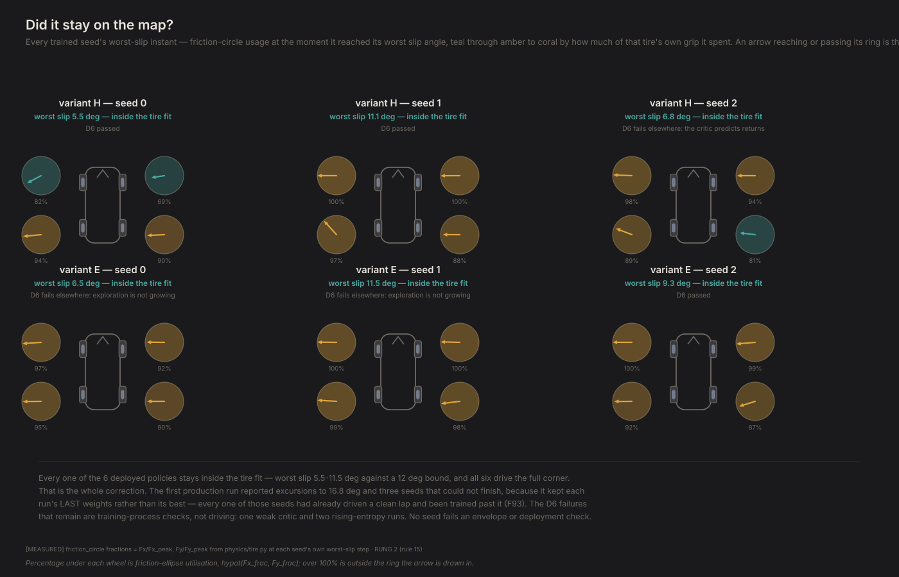
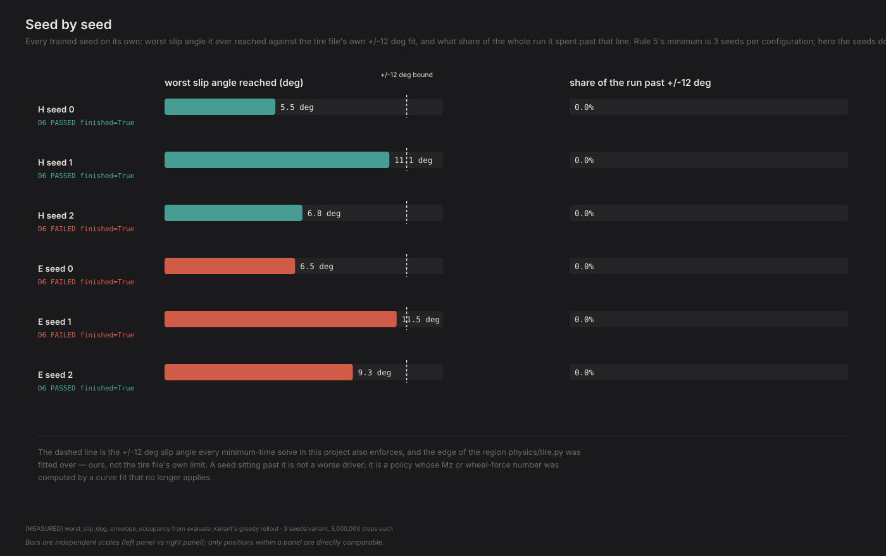

# What the machine found instead

*Contact Patch, Episode 14. Season 4: Torque vectoring.*

---

## The question

Episode 13 built the classical answer to torque vectoring and it worked. It is
also, provably, a **choice**: a reference model tells the controller what the
car should be doing, and every newton-metre it produces serves that
instruction. Change one coefficient — ask for a pointier car — and the answer
changes.

So: give a learner the same four wheels, the same physics, the same stopwatch,
and **no reference model at all**. Don't tell it what the car should be doing.

**Does it agree with us?**

## Three ways to decide

| | Who decides *how much* to rotate | Who decides *which wheels pay* |
|---|---|---|
| **C** (Episode 13) | reference model + PID → a yaw moment `Mz` | QP allocator |
| **H** (hybrid) | **an RL policy** outputs `Mz` | **the same QP allocator** |
| **E** (end-to-end) | **an RL policy** — no `Mz` exists | **nobody** |

H is the smallest possible change from C: swap the hand-built upper layer for a
learned one and keep the lower layer bit-for-bit identical. Any difference is
attributable to the upper layer alone.

E deletes the allocator. Four learned numbers per step, scaled by each wheel's
own grip-based capacity, and nothing arbitrates between them but training.

Three seeds each, 5,000,000 steps, `envelope_penalty=0.5` — the same soft cost
for leaving the ±12° tire fit that Episode 10's protocol uses. Every number
below is the **deployed** policy: the mean action, not a sampled one.

## The answer: yes, and it costs you something specific

**All six policies drive the corner.** Full 393 m, 100% finish rate, every one
of them inside the ±12° region the tire model was actually fitted over — worst
case 11.5°.



So the headline is not "RL fails" and not "RL wins." Both formulations learn to
drive the corner at the limit without ever being told what a yaw moment is for.
The interesting result is *where they differ*, and it is sharper than expected.

### Where they differ, and where they only appear to

| | H (allocator kept) | E (allocator deleted) | separation |
|---|---|---|---|
| Lap time | 19.80 ± 0.45 s | 18.89 ± 2.71 s | 0.5× seed sd — **not a finding** |
| Peak lateral acceleration | 0.915 ± 0.059 g | 0.976 ± 0.028 g | 1.3× seed sd — **not a finding** |
| Tire utilisation **in the corner** | 0.70 ± 0.07 | 0.85 ± 0.10 | 1.8× seed sd — **not a finding** |

All `[MEASURED]`, 3 seeds each, deployed policy. Rule 5 asks for more than twice
the seed standard deviation before a difference counts, and **not one of these
clears it.**

**So the answer to "does it agree with us" is: in the corner, yes — and there is
no measurable difference between doing the allocation by hand and not doing it
at all.** Both variants get round in the same time, at the same peak grip,
working the tires equally hard where the tires are actually being worked.



The six traces sit on top of each other through the corner. They separate the
moment it ends — and that separation is the subject of the next section, because
it is not what it looks like.

### The difference on the straight is a hole in our own reward

Over the *whole lap*, H averages 0.36 utilisation and E averages 0.70, a gap of
3.1× the seed standard deviation. That looks like the headline — the allocator's
workload-minimising objective, visible in the data. **It isn't, and where the
number comes from is worth more than the claim would have been.**

The gap lives entirely on the exit straight, which is 260 of this lap's 393 m
and therefore dominates any lap average. And on that straight, the reward is
`progress` and nothing else: the car is on the road, so there is no off-track
penalty, and the worst slip angle across all six policies is **0.02°–1.08°**
against a 12° envelope bound, so there is no envelope penalty either.

Meanwhile the summed per-wheel *lateral* force on that same straight ranges from
**80 N to 3,174 N** depending on the seed — a factor of 40 — for **identical
reward**. Wheels shoving against each other on a straight line costs the policy
absolutely nothing.

That is an underdetermined objective: a flat direction the reward cannot see,
which each seed settles into differently. It explains every symptom at once —
H's own three seeds spread 0.08, 0.25, 0.35 on that straight; utilisation does
not correlate with net drive force (H seed 2 makes 775 N of drive on 0.08
utilisation, H seed 1 makes 526 N on 0.35); and *both* variants show it, because
it is a property of the reward rather than of the action space. H's allocator
does not prevent it either: it faithfully delivers whatever yaw moment its policy
asks for, and asking for yaw on a straight is free.

**So the seed-to-seed instability is not a training failure. It is correct
behaviour against an objective that does not care**, and reading it as "E is
wasteful" would be reading structure into noise.

That is the trap worth naming, because a measurement can be coherent and still
be about the wrong thing. Six seeds, real numbers, a clean 3.1× separation and a
mechanism that sounds right — nothing about reading the aggregate tells you it is
summing over 260 m of straight where the objective is blind. A lap average is a
sum over places the car is doing different things, and it is worth nothing until
you ask which of those places it came from.

### The learners are far more aggressive than the engineers



Realized yaw moment, computed identically for all three from each trajectory's
own logged per-wheel forces:

| | median | 90th percentile | peak |
|---|---|---|---|
| **C** classical (delivered) | 11 N·m | 376 N·m | 995 N·m |
| **H** hybrid | 11 N·m | 1,477 N·m | 4,355 N·m |
| **E** end-to-end | 48 N·m | 1,393 N·m | 3,219 N·m |

All `[MEASURED]`, representative seed per variant.

Most of the time all three do almost nothing — the medians are tiny. But **when
the learners act, they act about four times harder than the classical
controller does.** The reference-model-plus-PID architecture is conservative by
construction: it asks for the moment that would make a real, saturating car
behave like a linear equation, and that demand is small. Neither learner was
told to want that, and neither chose it.

This is the "difference map between control surfaces" the research plan asked
for, and it points the same direction published work is said to report: the
best behaviour involves *deviating* from neutral yaw-rate tracking, which a
linear reference model structurally cannot express. Our version of that claim is
a comparison of two control surfaces on one corner, not a lap-time optimisation,
so it is corroboration in direction only.

### Did it stay on the map?



Every seed's friction circles at the exact step it reached its own worst slip
angle. All six deployed policies are inside the ring.



D6 — the training-health battery — passes 2 of 3 H seeds and 1 of 3 E seeds.
The three remaining failures are **training-process** checks, not driving ones:
one weak critic, two runs whose exploration entropy rose instead of falling. No
seed fails an envelope check or a deployment check.

## What this can't tell you

**Fidelity: rung 2** (CLAUDE.md rule 15). Double-track model, no roll camber, no
roll steer, no compliance steer. We reproduce roughly 5% of a real car's
understeer gradient. Trends and orderings, never magnitudes.

**Four independently commanded wheel forces is a four-motor electric car**, not
RV-1's rear-drive combustion driveline.

**H and E are their own drivers; C is not.** The classical car is driven by the
hand-built closed-loop driver from Episode 13, whose preview time moves Episode
13's own headline by more than the controller is worth (F84). The realized-`Mz`
comparison sidesteps the worst of this — it is a control-surface comparison
computed identically for all three, not a lap-time race — but the three
trajectories are not identical and the utilisation comparison between H and E is
the cleaner one, because those two share everything except the allocator.

**One corner, three seeds.** Rule 5's minimum, not its preference of five. The
utilisation gap clears the bar by 3.1×; the grip difference does not clear it at
all and is reported as no difference.

**Training budget was roughly 2× oversized** — the median seed peaked at ~54% of
5,000,000 steps, and the best checkpoints are scattered across 15%, 44%, 46%,
61%, 77% and 100% of training. There is no late point where these runs are
reliably good, which is why the result is the *selected* checkpoint rather than
the final weights.

## What it means

The engineers split the problem in two: one layer decides how much to rotate,
another decides which wheels pay. Twenty years of practice says that split is
the right one.

A learner given no reference model reproduces the first half readily. Both
variants worked out how much rotation to ask for, and both ask for about four
times more of it than the classical controller ever does — nobody told them to
want that, and neither chose the conservative reference-model demand.

As for the second half: **deleting the allocator entirely cost nothing
measurable.** Same lap time, same peak grip, same tire usage through the corner.
The convex little optimiser that twenty years of practice puts underneath the
controller turns out, on this corner, to be doing a job the policy above it can
absorb.

That is a smaller claim than the lap averages first suggest, and it is smaller
for a reason worth keeping. The bigger claim — that E burns twice the tire —
comes from a lap average, and a lap average is a sum over places where the car is
doing different things. Decomposed, the difference sits entirely on a straight,
in a direction our reward function cannot see. The measurement is real; what it
measures is our own objective's indifference.

**The honest shape of the result, then:** on the part of the lap this episode is
actually about, the machine agrees with the engineers, and does not need their
allocator to do it. On the part it is not about, it does whatever it likes,
because we never told it not to.

---

## Reproducing this

```bash
python -m experiments.ep14.run --pilot                 # ~5 min, validates the pipeline
python -m experiments.ep14.run --variant=H --seed=0    # repeat for seed=1,2 and variant=E
python -m experiments.ep14.run --aggregate             # collects the 6 runs, builds figures
python -m experiments.ep14.run --figures-only          # redraw from cached results
```

One `(variant, seed)` per process so the six run in parallel. Measured cost on
an 11-core machine: **H ≈ 4.3 CPU-hours per seed, E ≈ 2.5**, and **96% of that
is the environment** — 1,219 steps/s through the physics, against 2.4% for the
policy forward pass and 1.9% for the PPO update itself. The learning is nearly
free; simulating the car is the entire cost. H is slower than E despite a
*smaller* action space because it solves the QP allocator every step.

**New this episode.** `PPOConfig.eval_every` scores the deployed policy on
held-out seeds during training and keeps the best checkpoint;
`PPOConfig.entropy_anneal` decays the entropy bonus. Both default off, so every
Season 3 result is reproduced bit-for-bit by the path that produced it, and
`tests/test_ppo.py` pins that, including that switching evaluation on does not
perturb the run it watches.

**Still open.** Two seeds fail `exploration_is_not_growing`: annealing the
entropy coefficient to zero helped only marginally, so the policy gradient
itself is not sharpening the exploration scale. Season 3 (Episodes 9–11) reports
final rather than selected checkpoints, so **those results are likely understated
by the same margin.** Recorded, not yet re-run.
