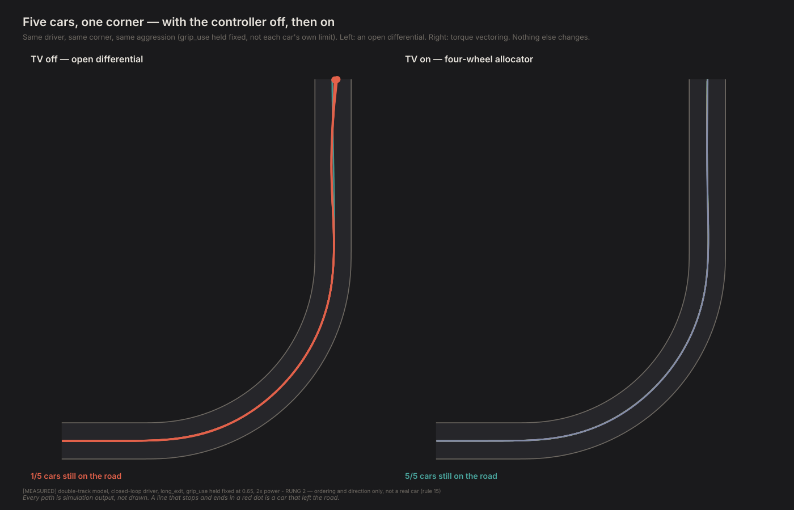
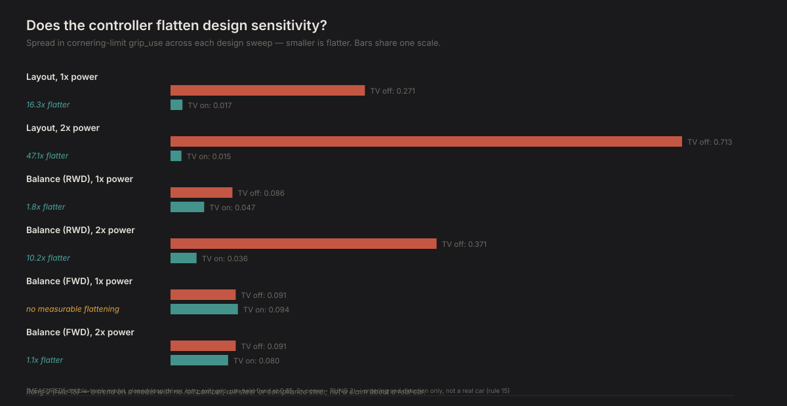

# Is chassis tuning about to be automated away?

*Contact Patch, Episode 15. Season 4: Torque vectoring.*

---

## The question

Season 2 spent three episodes on where the weight sits and where the engine goes.
Balance swings the understeer gradient by more than a degree per g. Engine position
changes how long the car takes to settle after you turn in. Both are real, and
Season 2 measured them on a car that could not do anything about them mid-corner.

Season 4 built a car that can. Episode 13's controller asks how much the wheels
should be turning and decides, moment to moment, which wheel pays for the
difference. So: if the car can compensate for its own layout in real time, does the
layout still matter?

## Why this episode had to wait

Season 2's design sweeps were measured at one power level, and a review that
re-ran them across a range of engine power found that mattered more than anyone
had checked. Both design axes are real but small at the reference car's
own power and grow 2 to 8 times larger by twice it — a sensitivity baseline that
actually varies, which a single measurement could not show. Torque vectoring's own
worth grows the same way, from a few percent of cornering limit to more than
doubling it, for a specific, checked reason: a passive differential is overwhelmed
by real engine torque in a way an actively managed one is not.

This episode is those two findings put together. Every design point below is driven
by the same closed-loop driver, on the same corner, with the differential swapped
for the four-wheel allocator — at the reference car's own power, and at twice it,
where the previous two findings said the story would be different.

## The result



Same driver, same corner, same aggression demand — not each car's own
limit, so the four archetypes that fail are failing at a demand the fifth one meets
easily. With an open differential, four of five leave the road. With the allocator,
all five stay on it. Nothing else changed.



The number behind the picture: **layout's cornering-limit spread across the five
archetypes drops from 0.271 to 0.017 at the reference car's own power — a 16-fold
reduction — and from 0.713 to 0.015 at twice it, a 47-fold one.** Balance for a
rear-driven car flattens the same way, 10-fold at the higher power. **The thing
that made a 911 a 911** — where the engine sits — **is something this controller
has already made irrelevant to whether the car holds a line, on this model, at this
power.**

## The exception, and it is a finding, not a gap

Balance for a front-driven car does not flatten. With the controller off the
spread is 0.091 at both powers — identical, so power was never what constrained
it — and switching the controller on leaves it at 0.094 and 0.080, either side of
where it started rather than collapsed. That is not a hole in the result. It is
checked, not assumed.

The archetype behind that row puts 62% of the car's mass over its own driven
wheels, which are also its steered ones. Its drive force **fully saturates
whichever power cap it is given** — 4,500 N at the reference power, 9,000 N at
twice it, so the scaling genuinely reaches the wheels — and its cornering limit
sits at the same 1.100 either way. Worst slip angle: 11.9°, at both power levels,
one tenth of a degree from the ±12° fit this whole project enforces. **This car's
limit is a front-tire slip-angle ceiling, not a torque-management problem**, and an
allocator built to redistribute torque has nothing to redistribute when torque was
never what was failing. It even makes this one sweep marginally less uniform (0.094
against 0.091 at the reference power) — plausible, not alarming: reallocating force
that was already fine is not guaranteed to be free.

So the honest form of "does the controller flatten sensitivity" is: **it flattens
whichever mechanism the design axis actually threatens the car through.** A passive
differential overwhelmed by torque — every layout archetype, a rear-driven car's
balance — gets fixed, more so as power rises. A tire's own slip-angle ceiling does
not, because there is nothing to allocate.

## What this can't tell you

**The same scale warning as every episode since 5.** This is the four-wheel
model with no roll camber, roll steer or
compliance steer — the terms that make up most of a real car's understeer — driven
by a tracker that never brakes in a corner or trades line for exit. Whether a real
911 owner would stop caring where the engine sits is not a claim this project can
make. Whether this rung-2 model's own cornering limit stops caring, under this
controller, is exactly what was measured, and on four of five axes tested, it did.

**One corner, one driver, two power levels.** The corner is `long_exit`'s 90°
right-hander, the driver never varies, and "twice the reference power" is a modelled
step, not a real engine. The flattening factor is a property of this test, not a
universal constant — a different corner or a different driver could move the
number without moving the direction.

**The front-driven exception is one archetype.** It is a real, checked mechanism —
not every front-driven layout necessarily shares it — and it is exactly the kind of
result this project keeps finding once it starts checking things that used to be
assumed flat.

## The crack

Every episode in this series so far has been about what a fixed car does, or what a
driver — human, optimiser, or learned — can do with one. This is the first result
that says a design choice can stop being a design choice: given the right
controller, where the engine goes stops being something the car has to live with.

That was always the promise Season 4 was built to test, and it took the whole power
review to ask it properly — a flat, single-power measurement would have shown a
small effect on top of a small baseline and called it a wash. It is not a wash. It
is a controller doing exactly what an allocator is for, at the torque level a real
engine actually produces.

---

**One corner, one driver, one modelled power step — on a model that reproduces
trends, not magnitudes.** The front-driven balance exception is a real
mechanism, not a hedge — see above.

## Reproducing this

```bash
python -m experiments.ep15.run
```

About 70 minutes: 60 closed-loop grip_use searches (balance × 2 drivetrains ×
layout, TV off and on, at two power levels), each bisected to 0.002, plus one
shared-aggression comparison for the pictorial figure. `--figures-only` redraws
from `results.json`; `--quick` runs a coarser grid.

**Built on, not new this episode.** `physics/driver.py`'s power-model support
(`drive_max`/`brake_max`/`drive_power`, added for the power review) and
`experiments/power_review/phase2_sweep.py`'s driver-construction helpers, reused
directly rather than duplicated.

**Checks.** The run generates its own write-up at `diagnostics/out/D-ep15.md` —
7 checks, all passing; the flattening checks are recorded rather than gated, since
the direction (not a pass/fail) is the finding.
